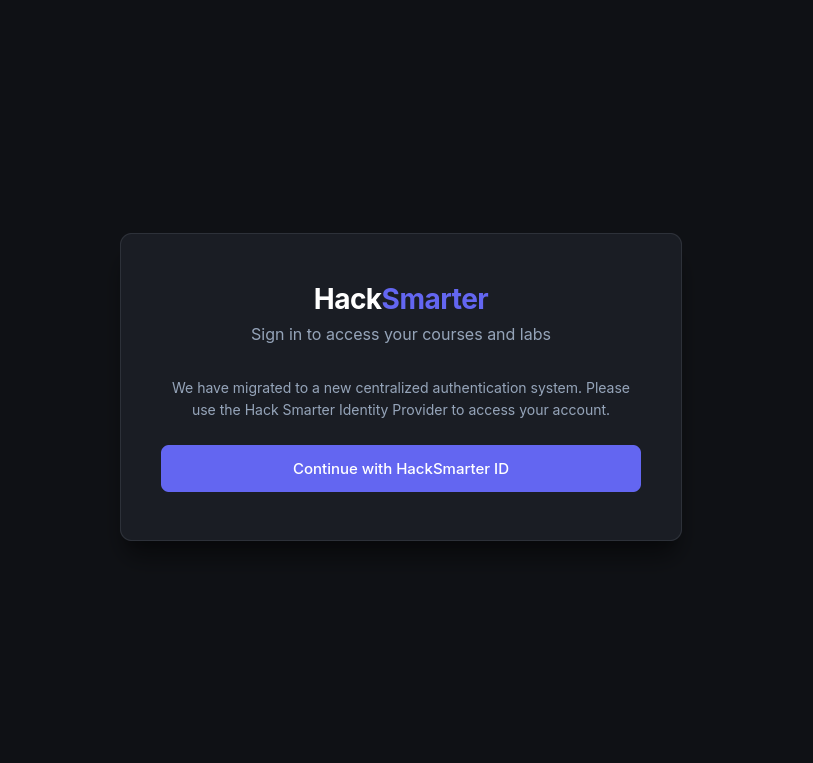
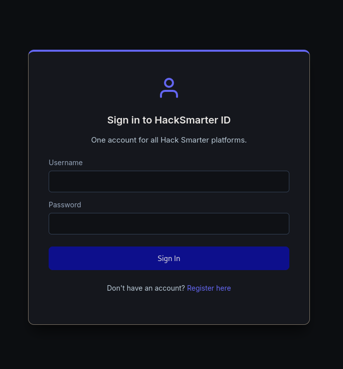
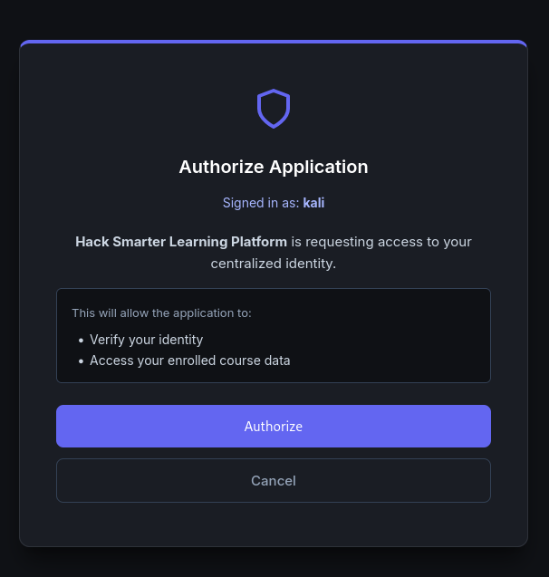
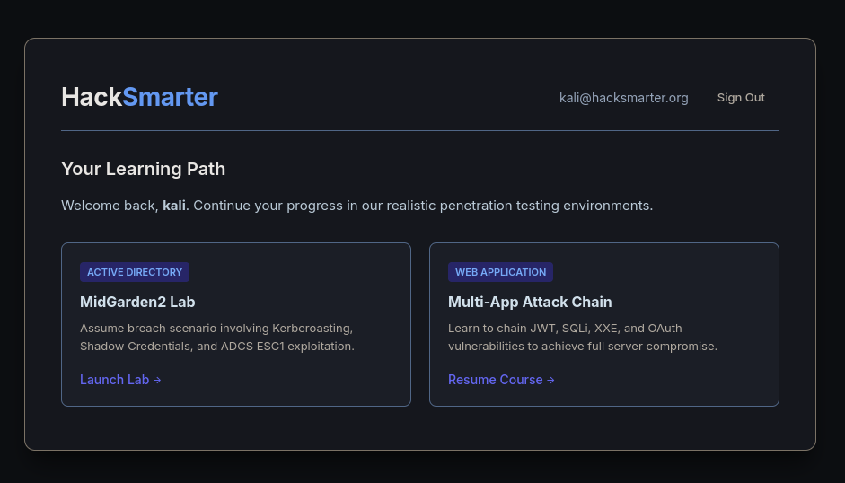
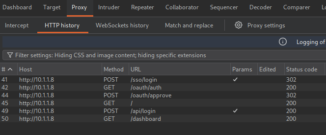
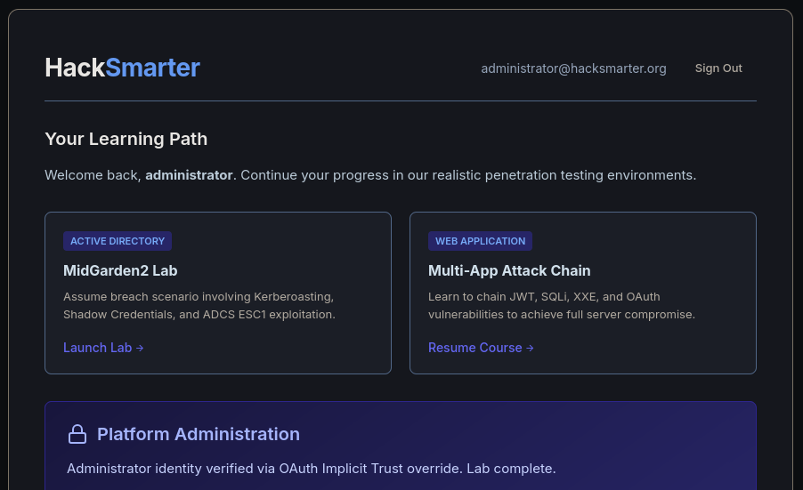
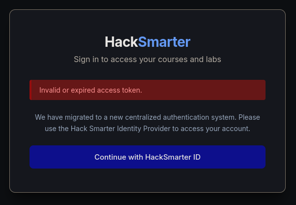

# Writeup: Implicit (HackSmarter — Easy / Medium)

Implicit es una máquina diseñada para simular un entorno con un flujo de autenticación **OAuth Implicit Grant** implementado de forma insegura. La aplicación permite a los usuarios autenticarse mediante un proveedor SSO, pero la validación del token es deficiente. El recorrido comienza con el registro de un usuario legítimo y la obtención de un token de acceso. Al analizar el flujo, se descubre que la aplicación solo verifica la existencia del token, pero no valida que este pertenezca al usuario que lo presenta. Aprovechando esta falla, se puede suplantar la identidad del usuario `administrator` simplemente cambiando el nombre de usuario en la solicitud. En la segunda parte del reto (Secure Code Review), se identifica la vulnerabilidad en el código fuente y se aplica una corrección que valida que el token pertenezca al usuario antes de establecer la sesión.

---

## 🎯 Objetivo #1: Penetration Test (Easy)

El equipo de ingeniería está implementando **"HackSmarter ID"**, una solución centralizada de Single Sign-On (SSO) diseñada para proporcionar acceso sin problemas a todas las plataformas internas. Para admitir aplicaciones ligeras basadas en navegador, los desarrolladores han implementado un flujo de tipo **OAuth Implicit Grant**.

Se ha contratado al equipo de pentesting para realizar una prueba dirigida contra esta nueva integración antes de que llegue a producción. El objetivo es **iniciar sesión como el usuario `administrator`** y demostrar el impacto de la vulnerabilidad.

---

## 🔍 Fase 1: Reconocimiento de la aplicación web

### 1.1 Acceso a la aplicación

La aplicación web está disponible en el puerto `80`. Se presenta una página principal con un botón para iniciar sesión a través de un mecanismo similar a OAuth.



### 1.2 Panel de login y registro

Al hacer clic en el botón de login, se redirige a un panel de autenticación donde se puede iniciar sesión o registrarse.



La aplicación permite el registro de nuevos usuarios sin restricciones. Creamos una cuenta con las credenciales `kali:password123`.


### 1.3 Flujo de autorización

Tras autenticarnos, la aplicación nos redirige a una página de autorización donde se solicita consentimiento para que la aplicación cliente acceda a nuestros datos. Aceptamos la autorización.



Una vez aceptada la autorización, la aplicación nos redirige de vuelta a la página principal.



---

## 🔬 Fase 2: Análisis del tráfico HTTP

### 2.1 Intercepción con Burp Suite

Configuramos Burp Suite para interceptar todo el tráfico entre el navegador y la aplicación. Revisamos el historial HTTP para entender el flujo de autenticación.



### 2.2 Análisis de la respuesta de `/api/login`

Tras el registro y la autorización, la aplicación realiza una solicitud POST al endpoint `/api/login` que devuelve el token de acceso y el nombre de usuario:

**Petición:**

```
POST /api/login HTTP/1.1
Host: 10.1.1.8
Content-Type: application/json
Content-Length: 69

{"access_token":"5f52fc4011bc4568b93e920f39b8fa40","username":"kali"}
```

**Respuesta:**

La aplicación devuelve el `access_token` y el `username` que serán utilizados en las siguientes solicitudes.

---

## 🔑 Fase 3: Identificación de la vulnerabilidad

### 3.1 Contexto: OAuth Implicit Grant

El flujo de autenticación implementado es un **Implicit Grant** de OAuth. En este flujo, el token de acceso se devuelve directamente al cliente después de que el usuario otorga su consentimiento, sin un paso intermedio de intercambio de código.

**Características del Implicit Grant:**
- No hay canal seguro back-channel entre el cliente y el servidor de autorización.
- El token de acceso se transmite a través del navegador (URL o fragmento).
- Es menos seguro que el flujo de Authorization Code, ya que el token está más expuesto.

**Vulnerabilidad identificada:** La aplicación solo verifica que el `access_token` exista en el sistema, pero **no valida que el token pertenezca al nombre de usuario proporcionado en la solicitud**. Esto permite que un atacante use el token de su propia cuenta para autenticarse como cualquier otro usuario, simplemente cambiando el valor de `username`.

### 3.2 Prueba de suplantación

Cerramos sesión y volvemos a iniciarla, pero esta vez interceptamos la solicitud `/api/login` con Burp Suite y modificamos el cuerpo:

**Solicitud original:**

```json
{"access_token":"b0f0545a10d9493188648ec9900af585","username":"kali"}
```

**Solicitud modificada (ataque):**

```json
{"access_token":"b0f0545a10d9493188648ec9900af585","username":"administrator"}
```

Enviamos la solicitud modificada. La aplicación acepta la petición y nos autentica como `administrator`.

### 3.3 Resultado

Tras el ataque, accedemos al panel de administración y obtenemos la flag:



**Flag:** Se ha demostrado el compromiso de la cuenta de administrador.

---

## 🔧 Objetivo #2: Secure Code Review (Medium)

### 4.1 Análisis del código fuente

Accedemos al repositorio Git interno en `http://10.1.1.8:3000` con las credenciales proporcionadas:

- **Usuario**: `student`
- **Contraseña**: `HackSmarter2026!`

Revisamos el archivo `app.py` para identificar la causa raíz de la vulnerabilidad.

**Código vulnerable (línea 103 aproximadamente):**

```python
if client_token in valid_tokens:
    session['username'] = client_username
```

**Explicación de la vulnerabilidad:**

La aplicación verifica que el token (`client_token`) exista en el diccionario `valid_tokens`, que almacena los tokens válidos generados por el sistema. Sin embargo, **no verifica que el token pertenezca al usuario (`client_username`) que lo está presentando**.

Esto significa que un atacante puede tomar su propio token válido y enviarlo con el nombre de usuario de otra persona (por ejemplo, `administrator`). Como el token existe en `valid_tokens`, la condición se cumple y la sesión se establece con el nombre de usuario proporcionado, sin importar a quién pertenezca realmente el token.

### 4.2 Aplicación de la corrección

Para solucionar la vulnerabilidad, debemos modificar la condición para que verifique **tanto la existencia del token como su asociación con el nombre de usuario**.

**Código corregido:**

```python
if client_token in valid_tokens and valid_tokens[client_token] == client_username:
    session['username'] = client_username
```

**Explicación de la corrección:**

- `client_token in valid_tokens`: Verifica que el token exista en el sistema.
- `valid_tokens[client_token] == client_username`: Verifica que el token esté asociado al nombre de usuario proporcionado.

Ambas condiciones deben cumplirse para que la sesión sea establecida. Esto impide que un atacante use un token que no le pertenece para suplantar a otro usuario.

### 4.3 Verificación de la corrección

Tras aplicar el cambio en `app.py`, el pipeline de CI/CD despliega automáticamente la nueva versión (tarda aproximadamente 2-4 minutos). Intentamos repetir el ataque con la misma solicitud modificada:

```json
{"access_token":"b0f0545a10d9493188648ec9900af585","username":"administrator"}
```

La solicitud es rechazada y la autenticación falla:



La vulnerabilidad ha sido corregida exitosamente.

---

## 📌 Conclusión

Implicit es una máquina que combina dos objetivos:

1. **Penetration Test (Easy)**: Explotación de un flujo OAuth Implicit Grant mal configurado, donde la falta de validación entre el token y el usuario permite suplantar la cuenta de administrador.

2. **Secure Code Review (Medium)**: Identificación de la vulnerabilidad en el código fuente (`app.py`) y aplicación de una corrección que valida que el token pertenezca al usuario antes de establecer la sesión.

---

## 📚 Lecciones aprendidas


1. **El flujo Implicit Grant no debe utilizarse en nuevas aplicaciones**

   El flujo expone el token directamente en el navegador y está desaconsejado por las guías actuales de seguridad OAuth. Debe utilizarse Authorization Code Flow con PKCE. [rfc-editor](https://www.rfc-editor.org/rfc/rfc9700.pdf)

2. **Los tokens deben estar vinculados a una identidad verificable**

   No basta con comprobar que el token existe. El servidor debe validar su firma o consultar su estado y obtener de él la identidad asociada, sin confiar en un `username` proporcionado por el cliente.

3. **La identidad debe derivarse del token, no de los parámetros de la solicitud**

   La aplicación debía utilizar el usuario asociado al token y rechazar cualquier discrepancia. La corrección ideal sería evitar completamente que el cliente indique el usuario objetivo.

4. **La validación del token debe comprobar todos sus atributos relevantes**

   Además de verificar su existencia, deben comprobarse su expiración, emisor, audiencia, scopes, estado de revocación y asociación con la aplicación cliente.

5. **Autenticación y autorización deben estar separadas**

   Validar un token demuestra quién es el usuario, pero no que pueda acceder a una función administrativa. El rol `administrator` debe comprobarse mediante controles de autorización independientes y basados en una identidad validada.

6. **Los paneles administrativos requieren controles reforzados**

   Las funciones sensibles deberían utilizar autorización basada en roles, reautenticación o MFA cuando sea apropiado. Estos controles deben complementar, no sustituir, la correcta validación del token.

7. **La sesión solo debe contener datos confiables**

   El servidor no debe construir la sesión a partir de valores arbitrarios enviados por el cliente. Debe almacenar únicamente la identidad y los privilegios derivados de una validación correcta.

8. **El código de autenticación debe revisarse antes del despliegue**

   Una revisión del código detectó que se comprobaba el token, pero no su relación con el usuario. Las pruebas deberían incluir token válido con usuario incorrecto, token expirado, token revocado y modificación de claims.

9. **Los tokens y secretos deben protegerse durante todo su ciclo de vida**

   Los tokens no deben aparecer en logs, URLs, capturas o repositorios. Deben ser de corta duración, revocables y transportarse mediante canales seguros.

10. **El despliegue debe incluir pruebas de seguridad automatizadas**

    El pipeline debería ejecutar pruebas que validen la correspondencia entre token e identidad, los controles de autorización y los casos de suplantación antes de publicar una nueva versión.Aunque el pipeline de CI/CD permitió desplegar rápidamente la corrección, también debe incluir pruebas de seguridad automatizadas para detectar este tipo de fallos antes de llegar a producción.

