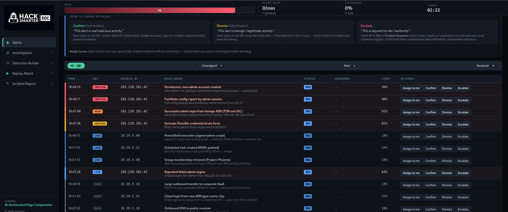
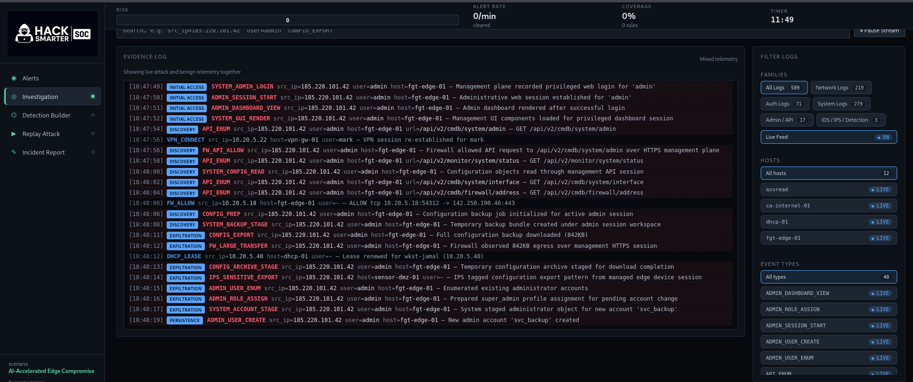
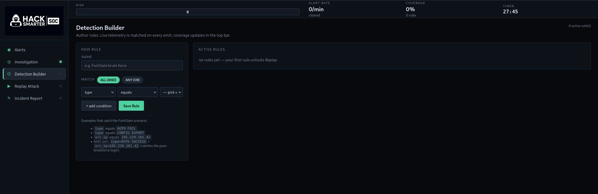
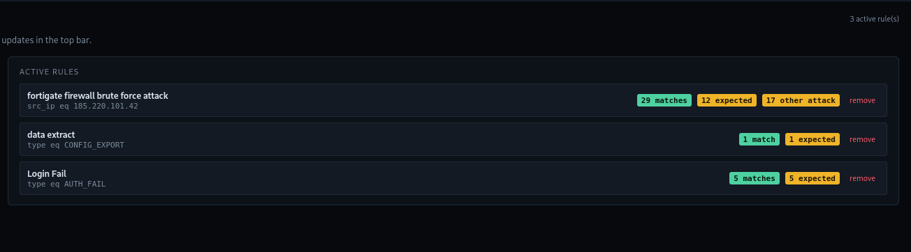
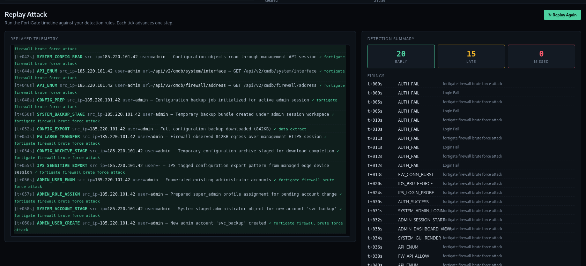

# Writeup: AI-Accelerated Edge Compromise (HackSmarter — SOC Simulator)

Este laboratorio simula una cadena de ataque real contra un firewall FortiGate expuesto. Un atacante utilizando una herramienta de fuerza bruta aumentada con IA ataca el panel de administración desde un nodo de salida TOR conocido (`185.220.101.42`), logra acceder, lee la configuración del dispositivo a través de la API de gestión, exfiltra la configuración completa y crea una cuenta de administrador persistente (`svc_backup`).

Como analista de SOC, la tarea consiste en:

1. Triagear la cola de alertas en vivo
2. Investigar el registro de evidencias
3. Construir reglas de detección
4. Validar mediante un ataque de replay
5. Completar y enviar el informe de incidente

---

## 🎯 Objetivo del Simulador

El objetivo de este laboratorio es simular el trabajo de un analista de SOC ante un incidente real. El escenario presenta un firewall FortiGate comprometido por un atacante que utiliza inteligencia artificial para acelerar un ataque de fuerza bruta desde un nodo de salida TOR. El analista debe triagear las alertas, investigar la cadena de ataque, crear reglas de detección y completar un informe de incidente.

---

## 📊 Fase 1 — Triage de la Cola de Alertas

Al acceder al panel de **Alert Queue**, nos encontramos con **31 alertas en vivo** con una cadencia de ~4 segundos. El indicador de riesgo muestra **70** (alto), y hay **8 alertas sin asignar** que requieren atención.



### 3.1 Acciones por alerta

El simulador ofrece tres acciones por cada alerta:

| Acción | Descripción |
|--------|-------------|
| **Dismiss** | Falso Positivo — actividad benigna/legítima |
| **Confirm** | Confirmar — actividad maliciosa real |
| **Escalate** | Escalar — más allá del nivel de autoridad (ej. ransomware confirmado, exfiltración de datos) |

También se puede utilizar **Assign to me** para reclamar un ticket sin resolverlo aún — útil cuando se necesita investigar antes de decidir.

### 3.2 Análisis de la cola de alertas

Al escanear la cola, las alertas se dividen en dos grupos claros:

**Benignas (Dismiss):**

| Hora | Severidad | Regla | Razón |
|------|-----------|-------|-------|
| 14:30:19 | BAJA | Ejecución de PowerShell (script admin firmado) | Script de TI firmado por Jamal vía MDM |
| 14:29:51 | BAJA | Tarea programada creada (MDM-pushed) | Tarea de mantenimiento rutinaria de MDM |
| 14:30:34 | INFORMATIVA | Transferencia saliente grande a SaaS corporativo | Sincronización de OneDrive (38MB) por Helen — destino autorizado |
| 14:29:58 | INFORMATIVA | Defender puso en cuarentena instalador firmado | Falso positivo en binario firmado de Adobe Reader |
| 14:29:35 | INFORMATIVA | Certificado interno renovado | ca-internal-01 renovó certificado para vpn-gw-01 |
| 14:29:32 | INFORMATIVA | Inicio de sesión en la nube desde nuevo ASN (misma ciudad) | Inicio de sesión M365 por pooja, ISP residencial, MFA satisfecho |
| 14:29:20 | INFORMATIVA | DNS saliente a resolver público | Workstation consultó 1.1.1.1 — común, señal baja |

**Maliciosas (Confirmar/Escalar) — todas desde `185.220.101.42`:**

| Hora | Severidad | Regla | Confianza | Acción |
|------|-----------|-------|-----------|--------|
| 14:29:42 | ALTA | Inicio de sesión admin exitoso desde ASN extranjero (TOR exit IOC) | 91% | Confirmar |
| 14:29:16 | BAJA | Intentos de inicio de sesión admin fallidos repetidos | 64% | Confirmar |
| 14:30:21 | CRÍTICA | Exportación de configuración de FortiGate por sesión admin | 96% | Escalar |
| 14:30:34 | CRÍTICA | Persistencia: nueva cuenta admin creada | 94% | Escalar |

**Clave identificativa:** Toda la actividad maliciosa se agrupa en torno a una única IP externa `185.220.101.42` — un nodo de salida TOR conocido. Todo lo que proviene de esa IP en `fgt-edge-01` es parte de la misma cadena de ataque.


Después de asignar y triagear las alertas, la cola de alertas también mostró una alerta de **Suricata: Posible fuerza bruta de credenciales** (MEDIA, 82%) desde la misma fuente — patrón de fuerza bruta detectado con 62 peticiones POST en 30 segundos.

---

## 🔍 Fase 2 — Investigación (Registro de Evidencias)

Con las alertas triageadas, nos dirigimos a la pestaña **Investigation** y consultamos:




```bash
src_ip=185.220.101.42
```

El registro de evidencias muestra una cronología completa del ataque. Aquí está lo que hizo el atacante, paso a paso:

### 2.1 Etapa 1: Reconocimiento y Fuerza Bruta

| Hora | Evento | Descripción |
|------|--------|-------------|
| 14:29:06 | AUTH_FAIL | src_ip=185.220.101.42 user=admin host=fgt-edge-01 — fallo 1/N |
| 14:29:11 | AUTH_FAIL | src_ip=185.220.101.42 user=admin host=fgt-edge-01 — fallo 2/N |
| 14:29:16 | AUTH_FAIL | src_ip=185.220.101.42 user=admin host=fgt-edge-01 — fallo 3/N |
| 14:29:17-19 | AUTH_FAIL | Fallos 4, 5, 6... |
| 14:29:19 | FW_CONN_BURST | Firewall observó 62 conexiones HTTPS de gestión desde una sola fuente en 30s |
| 14:29:30 | IDS_BRUTEFORCE | ET POLICY Posible fuerza bruta de credenciales (62 POSTs / 30s) |
| 14:29:34 | IPS_LOGIN_PROBE | IPS detectó intentos repetidos de inicio de sesión admin contra portal de gestión |

La herramienta de fuerza bruta aumentada con IA está atacando la interfaz web de gestión del FortiGate desde un nodo de salida TOR. Suricata detecta el patrón.

### 2.2 Etapa 2: Acceso Inicial

| Hora | Evento | Descripción |
|------|--------|-------------|
| 14:29:42 | AUTH_SUCCESS | Autenticación exitosa para 'admin' desde 185.220.101.42 |
| 14:29:44 | SYSTEM_ADMIN_LOGIN | El plano de gestión registró inicio de sesión web privilegiado para 'admin' |
| 14:29:46 | ADMIN_SESSION_START | Sesión web administrativa establecida para 'admin' |
| 14:29:48 | ADMIN_DASHBOARD_VIEW | Panel de administración renderizado tras inicio de sesión exitoso |
| 14:29:50 | SYSTEM_GUI_RENDER | Componentes de UI de gestión cargados para sesión de panel privilegiado |

La fuerza bruta tiene éxito. El atacante ahora ha iniciado sesión como `admin` en `fgt-edge-01`.

### 2.3 Etapa 3: Descubrimiento (Enumeración de API)

| Hora | Evento | Descripción |
|------|--------|-------------|
| 14:29:52 | API_ENUM | GET /api/v2/cmdb/system/admin |
| 14:29:56 | FW_API_ALLOW | Firewall permitió petición API a /api/v2/cmdb/system/admin sobre HTTPS |
| 14:30:00 | API_ENUM | GET /api/v2/monitor/system/status |
| 14:30:04 | SYSTEM_CONFIG_READ | Objetos de configuración leídos a través de sesión API de gestión |
| 14:30:06 | API_ENUM | GET /api/v2/cmdb/system/interface |

El atacante cambia de la interfaz gráfica al modo API, enumerando sistemáticamente usuarios administradores, estado del sistema y configuración de interfaces.

### 2.4 Etapa 4: Exfiltración

| Hora | Evento | Descripción |
|------|--------|-------------|
| 14:30:21 | CONFIG_EXPORT | Copia de seguridad completa de configuración descargada (842KB) |
| 14:30:28 | FW_LARGE_TRANSFER | Firewall observó 842KB de salida sobre sesión HTTPS de gestión |
| 14:30:31 | CONFIG_ARCHIVE_STAGE | Archivo de configuración temporal preparado para finalizar descarga |
| 14:30:35 | IPS_SENSITIVE_EXPORT | IPS detectó patrón de exportación de configuración desde sesión de dispositivo gestionado |

La configuración completa del FortiGate — 842KB — es extraída. Esto contiene reglas de firewall, credenciales VPN, tablas de enrutamiento, hashes de administradores y posiblemente claves pre-compartidas.

### 2.5 Etapa 5: Persistencia

| Hora | Evento | Descripción |
|------|--------|-------------|
| 14:30:56 | ADMIN_USER_ENUM | Cuentas de administrador existentes enumeradas |
| 14:30:57 | ADMIN_ROLE_ASSIGN | Perfil de super-administrador preparado para cambio de cuenta pendiente |
| 14:30:58 | SYSTEM_ACCOUNT_STAGE | Objeto de administrador preparado para nueva cuenta 'svc_backup' |
| 14:31:00 | ADMIN_USER_CREATE | Nueva cuenta admin 'svc_backup' creada |

El atacante crea una cuenta de administrador oculta llamada `svc_backup` — disfrazada para parecer una cuenta de servicio legítima. Este es su mecanismo de persistencia; incluso si la contraseña de `admin` se rota, mantienen acceso.

---

## 🛡️ Fase 3 — Construcción de Reglas de Detección



Con la cadena de ataque completamente comprendida, nos dirigimos al **Detection Builder** para escribir reglas que cubran el escenario. Se construyeron **3 reglas activas** — cada una dirigida a una fase distinta de la cadena de ataque.

### 3.1 Regla 1 — `fortigate firewall brute force attack`

**Condición:**

```
src_ip equals 185.220.101.42
```

Esta es la regla más amplia — captura todo lo que se origina desde la IP del IOC del atacante. Dado que todos los eventos del atacante en la telemetría provinieron de `185.220.101.42`, esta única condición por sí sola ofreció una cobertura completa. Piensa en ella como la red de captura para esta fuente maliciosa conocida. Las 17 "otras coincidencias de ataque" son eventos más allá de los 12 esperados — mostrando que la regla también está capturando actividad lateral post-compromiso desde la misma IP.

### 3.2 Regla 2 — `data extract`

**Condición:**

```
type equals CONFIG_EXPORT
```

Una regla de alta fidelidad y alcance ajustado dirigida a la fase de exfiltración. `CONFIG_EXPORT` no es un evento normal en las operaciones diarias — cada vez que se exporta una configuración completa de FortiGate merece su propia alerta, independientemente de la IP que lo haya desencadenado. Esta regla seguiría activándose incluso si el atacante rotara a un nodo de salida TOR diferente a mitad del ataque.

### 3.3 Regla 3 — Regla de fuerza bruta (AUTH_FAIL)

**Condición:**

```
type equals AUTH_FAIL
```

Centrada en la fase de reconocimiento de fuerza bruta. Observar `AUTH_FAIL` como señal de comportamiento, esta regla detecta intentos de fuerza bruta y robo de credenciales desde **cualquier IP** — no solo el IOC conocido del atacante. Coincidió perfectamente con los 5 eventos de fallo esperados en la telemetría sin ruido.

### 3.4 Resumen de Reglas Activas



**¿Por qué 3 reglas en lugar de 1?**

Una única regla de `src_ip` funciona perfectamente cuando conoces la IP del atacante — pero los nodos de salida TOR rotan. Colocar reglas por **comportamiento** (ráfagas de AUTH_FAIL, CONFIG_EXPORT) junto con un **IOC fijo** proporciona defensa en profundidad:

- **Regla 1**: Atrapa a **este atacante específico** por IP
- **Regla 2**: Atrapa **cualquier exfiltración de configuración** independientemente de quién la haga
- **Regla 3**: Atrapa **cualquier fuerza bruta** independientemente de la fuente

Juntas, las 3 reglas logran una **cobertura del 100%** — y dos de ellas se activarían incluso si el atacante cambiara completamente de IP.

---

## 🎮 Fase 4 — Validación por Replay del Ataque

La sección **Replay Attack** vuelve a ejecutar la telemetría del ataque contra las reglas de detección activas en modo acelerado, puntuando cada detección como:

- **EARLY** — detectado antes/en el evento desencadenante
- **LATE** — detectado después del hecho
- **MISSED** — no detectado



### 4.1 Resultados

| Métrica | Cantidad |
|---------|----------|
| Early   | 20       |
| Late    | 15       |
| Missed  | 0        |

**0 detecciones perdidas.** Cada evento en la cadena de ataque — desde el primer `AUTH_FAIL` hasta `ADMIN_USER_CREATE` — fue marcado por la regla. La regla se activó correctamente desde `t+000s` (primer intento de fuerza bruta) hasta `t+060s` (creación de cuenta de backdoor).

Barra de cobertura: **100% · 3 reglas activas**

---

## 📄 Fase 5 — Informe de Incidente

Con la investigación completa, se completó el informe de incidente:

### 5.1 Hallazgos

| Campo | Valor | Puntos |
|-------|-------|--------|
| IP del atacante | 185.220.101.42 | 15pt |
| Host comprometido | fgt-edge-01 | 10pt |
| Cuenta de usuario comprometida | admin | 10pt |
| Ruta API utilizada durante el compromiso | /api/v2/cmdb/system/interface | 15pt |
| Cuenta creada por el atacante (persistencia) | svc_backup | 10pt |
| Clasificación del ataque | edge_device_compromise | 15pt |
| Severidad final | critical | 10pt |
| Veredicto final | confirmed_incident | 10pt |

### 5.2 IOCs Adicionales

| Tipo | Valor |
|------|-------|
| IP | 185.220.101.42 |
| Host | fgt-edge-01 |
| URL/Path | fgt-edge-01//api/v2/cmdb/system/interface |
| Usuario | admin |

### 5.3 Narrativa del Incidente

> El host **`fgt-edge-01`** fue comprometido por **`185.220.101.42`** utilizando la cuenta **`admin`**. El atacante abusó de las rutas API **`/api/v2/cmdb/system/admin`**, **`/api/v2/monitor/system/status`**, **`/api/v2/cmdb/system/interface`** y **`/api/v2/cmdb/firewall/address`** durante el compromiso del dispositivo, estableciendo luego persistencia mediante la creación de la cuenta administrativa **`svc_backup`**. Esta actividad indica un compromiso de **severidad Crítica** del dispositivo.
>
> Las acciones de contención recomendadas incluyen: aislar el dispositivo, deshabilitar las cuentas **`admin`** y **`svc_backup`**, rotar todas las credenciales administrativas, revisar las configuraciones del firewall para detectar cambios no autorizados y bloquear la IP de origen **`185.220.101.42`**.

---

## 🔗 Mapeo MITRE ATT&CK

| Fase | Técnica | Lo que Ocurrió |
|------|---------|----------------|
| Reconocimiento | T1595 — Active Scanning | Fuerza bruta aumentada con IA vía TOR, 62 intentos / 30s |
| Acceso Inicial | T1110.001 — Brute Force: Password Guessing | Credenciales de admin descifradas en portal de gestión de FortiGate |
| Descubrimiento | T1087 — Account Discovery | Enumeración API de /api/v2/cmdb/system/admin |
| Colección | T1005 — Data from Local System | Configuración completa de 842KB exportada vía API de gestión |
| Exfiltración | T1048 — Exfiltration Over Alternative Protocol | Configuración descargada sobre canal HTTPS de gestión |
| Persistencia | T1136.001 — Create Account: Local Account | Cuenta de backdoor admin `svc_backup` creada |

---

## 📌 Conclusiones y Lecciones Aprendidas

1. **El agrupamiento de IP es tu primer pivot**  
   Cuando múltiples alertas se iluminan con la misma IP de origen, extrae ese hilo inmediatamente en tu SIEM. Una sola consulta — `src_ip=185.220.101.42` — reveló toda la cadena de ataque.

2. **Los nodos de salida TOR en interfaces de gestión = escalación inmediata**  
   Un inicio de sesión admin exitoso desde un nodo de salida TOR conocido en un firewall nunca es un falso positivo. Escalar de inmediato.

3. **Vigila las cuentas de persistencia disfrazadas**  
   `svc_backup` parece plausible — los atacantes nombran cuentas de backdoor para mezclarse con cuentas de servicio legítimas. Cualquier cuenta admin creada durante o después de una ventana de compromiso sospechosa es un IOC hasta que se demuestre lo contrario.

4. **Las exportaciones de configuración son señales de exfiltración de alta fidelidad**  
   Una descarga de 842KB a través de la API de gestión es la joya de la corona — reglas de firewall, PSKs de VPN, tablas de enrutamiento, todo. Trata esto como un evento de rotación completa de credenciales para el dispositivo.

5. **Coloca IOC fijos con reglas de comportamiento para una cobertura real**  
   En lugar de depender de una única regla basada en IP, construye tres capas: una fijando la IP maliciosa conocida (`src_ip equals 185.220.101.42`), otra detectando fuerza bruta (`type equals AUTH_FAIL`), y otra detectando exfiltración (`type equals CONFIG_EXPORT`). Dos de las tres se activan solo por comportamiento y detectarían este ataque incluso si el atacante cambiara a una IP completamente diferente.

6. **La cadena no necesitó un bug catastrófico — necesitó fallos ordinarios, apilados**  
   Fuerza bruta en un puerto de gestión expuesto, una credencial admin no rotada, endpoints API sin autorización secundaria, y un privilegio de creación de cuentas que no fue auditado en tiempo real. Cada paso fue individualmente "menor". Juntos entregaron un firewall.

---

## 📋 Lista de Verificación de Contención

Si estuvieras respondiendo a esto en el mundo real:

- [ ] Aislar `fgt-edge-01` de la red inmediatamente
- [ ] Deshabilitar y eliminar la cuenta `svc_backup`
- [ ] Forzar reinicio de contraseña para `admin` y todas las cuentas de administrador de FortiGate
- [ ] Revocar todas las sesiones de gestión activas en el dispositivo
- [ ] Bloquear `185.220.101.42` en el perímetro (y upstream si es posible)
- [ ] Extraer logs de auditoría de FortiGate para todos los cambios realizados durante la ventana de sesión (14:29:42–14:31:00)
- [ ] Comparar la configuración actual en ejecución con la última copia de seguridad conocida para identificar cambios no autorizados
- [ ] Notificar a Nivel 2 / Respuesta a Incidentes para revisión forense completa
- [ ] Archivar un informe de inteligencia de amenazas sobre el IOC del nodo de salida TOR
- [ ] Revisar todos los demás dispositivos perimetrales en busca de patrones de acceso similares desde la misma IP

---

**Writeup completado.** El simulador fue resuelto exitosamente.
